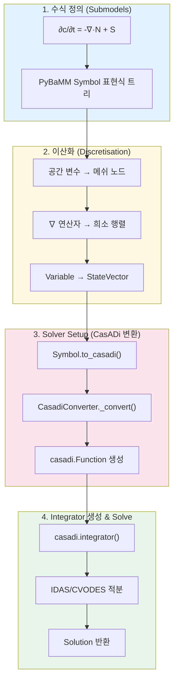
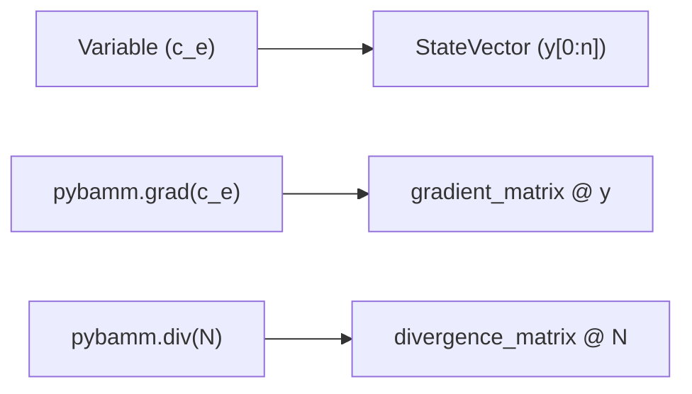
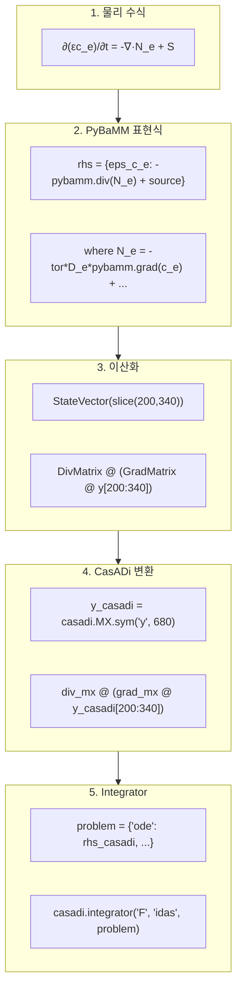

# DFN 모델 수식 → 이산화 → CasADi 변환 → Solve 상세 분석

이 문서는 PyBaMM DFN(Doyle-Fuller-Newman) 모델의 **핵심 수식**들이 어떻게 **표현식 트리로 정의**되고, **이산화**되어 **행렬 연산**으로 변환되며, 최종적으로 **CasADi 솔버**로 해석되는지를 상세히 분석합니다.

---

## 전체 프로세스 개요



---

# Part 1: DFN 모델 핵심 수식 정의

## 1.1 전해질 농도 확산 (Electrolyte Diffusion)

**파일**: [full_diffusion.py](file:///c:/Users/Ryu/Python_project/data/PyBaMM-develop/src/pybamm/models/submodels/electrolyte_diffusion/full_diffusion.py)

### 물리적 수식 (Stefan-Maxwell)

$$\varepsilon \frac{\partial c_e}{\partial t} = -\nabla \cdot \mathbf{N}_e + \frac{1-t_+}{F} \sum_k a_k j_k$$

여기서 전해질 플럭스 $\mathbf{N}_e$는:

$$\mathbf{N}_e = -\tau D_e^{eff} \nabla c_e + \frac{t_+}{F} \mathbf{i}_e + c_e \mathbf{v}_{box}$$

- **확산** (Diffusion): $-\tau D_e^{eff} \nabla c_e$
- **이동** (Migration): $t_+ \mathbf{i}_e / F$
- **대류** (Convection): $c_e \mathbf{v}_{box}$

### PyBaMM 코드에서의 정의

```python
# full_diffusion.py (lines 72-76)
N_e_diffusion = -tor * self.param.D_e(c_e, T) * pybamm.grad(c_e)
N_e_migration = self.param.t_plus(c_e, T) * i_e / self.param.F
N_e_convection = c_e * v_box

N_e = N_e_diffusion + N_e_migration + N_e_convection
```

### RHS 정의 (lines 89-99)

```python
def set_rhs(self, variables):
    eps_c_e = variables["Porosity times concentration [mol.m-3]"]
    N_e = variables["Electrolyte flux [mol.m-2.s-1]"]
    source_terms = sum_s_a_j / self.param.F
    
    # 핵심 RHS 정의: d(εc_e)/dt = -∇·N_e + source
    self.rhs = {eps_c_e: -pybamm.div(N_e) + source_terms - c_e * div_Vbox}
```

> [!IMPORTANT]
> `pybamm.grad(c_e)`와 `pybamm.div(N_e)`는 아직 **심볼릭 연산자**입니다. 실제 행렬로 변환되는 것은 **이산화 단계**에서 수행됩니다.

---

## 1.2 고체상 입자 확산 (Particle Fickian Diffusion)

**파일**: [fickian_diffusion.py](file:///c:/Users/Ryu/Python_project/data/PyBaMM-develop/src/pybamm/models/submodels/particle/fickian_diffusion.py)

### 물리적 수식

구형 좌표계에서의 Fick 법칙:

$$\frac{\partial c_s}{\partial t} = \frac{1}{r^2} \frac{\partial}{\partial r} \left( r^2 D_s \frac{\partial c_s}{\partial r} \right)$$

표면 경계 조건 (Butler-Volmer 반응에서 결정):
$$-D_s \frac{\partial c_s}{\partial r} \bigg|_{r=R} = \frac{j}{F}$$

### PyBaMM 코드에서의 정의

```python
# fickian_diffusion.py (lines 199-213)
def get_coupled_variables(self, variables):
    D_eff = self._get_effective_diffusivity(c_s, T, current)
    N_s = -D_eff * pybamm.grad(c_s)  # 입자 내부 플럭스
    
    variables.update({
        # 구형 좌표계: (1/R²) * div(N_s)
        f"{Domain} particle rhs [mol.m-3.s-1]": -(1 / R_broad_nondim**2) * pybamm.div(N_s),
        # 표면 경계 조건
        f"{Domain} particle bc [mol.m-4]": -j * R_nondim / self.param.F / pybamm.surf(D_eff),
    })
```

### RHS 정의 (lines 240-264)

```python
def set_rhs(self, variables):
    c_s = variables[f"{Domain} particle concentration [mol.m-3]"]
    # RHS = -(1/R²) * ∇·(D * ∇c_s)
    self.rhs = {c_s: variables[f"{Domain} particle rhs [mol.m-3.s-1]"]}
```

---

## 1.3 Butler-Volmer 반응 속도론

**파일**: [butler_volmer.py](file:///c:/Users/Ryu/Python_project/data/PyBaMM-develop/src/pybamm/models/submodels/interface/kinetics/butler_volmer.py)

### 물리적 수식

**대칭 Butler-Volmer**:
$$j = 2 j_0 \sinh\left( \frac{n_e F \eta_r}{2RT} \right)$$

**비대칭 Butler-Volmer**:
$$j = j_0 \left[ \exp\left(\frac{\alpha n_e F \eta_r}{RT}\right) - \exp\left(-\frac{(1-\alpha) n_e F \eta_r}{RT}\right) \right]$$

여기서:
- $j_0$: 교환 전류 밀도
- $\eta_r = \phi_s - \phi_e - U_{OCP}$: 반응 과전위
- $n_e$: 전자 수
- $\alpha$: 전하 이동 계수

### PyBaMM 코드에서의 정의

```python
# butler_volmer.py
class SymmetricButlerVolmer(BaseKinetics):
    def _get_kinetics(self, j0, ne, eta_r, T, u):
        Feta_RT = self.param.F * eta_r / (self.param.R * T)
        # j = 2 * j0 * sinh(ne * F * η / 2RT)
        return 2 * u * j0 * pybamm.sinh(ne * 0.5 * Feta_RT)

class AsymmetricButlerVolmer(BaseKinetics):
    def _get_kinetics(self, j0, ne, eta_r, T, u):
        alpha = self.phase_param.alpha_bv
        Feta_RT = self.param.F * eta_r / (self.param.R * T)
        arg_ox = ne * alpha * Feta_RT
        arg_red = -ne * (1 - alpha) * Feta_RT
        # j = j0 * [exp(α*...) - exp(-(1-α)*...)]
        return u * j0 * (pybamm.exp(arg_ox) - pybamm.exp(arg_red))
```

---

## 1.4 수식 → 표현식 트리 구조

PyBaMM에서 모든 수식은 **표현식 트리(Expression Tree)**로 표현됩니다.

### 예시: 전해질 확산 플럭스

```
N_e = -tor * D_e(c_e, T) * grad(c_e)
```

이 수식은 다음과 같은 트리 구조를 가집니다:

```
         Multiplication (*)
            /          \
       Negate (-)    Gradient (grad)
          |              |
    Multiplication    c_e (Variable)
       /      \
    tor    Function(D_e)
             /    \
           c_e     T
```

---

# Part 2: 이산화 (Discretisation)

## 2.1 이산화 과정 개요

**파일**: [discretisation.py](file:///c:/Users/Ryu/Python_project/data/PyBaMM-develop/src/pybamm/discretisations/discretisation.py)



### Discretisation.process_model() 핵심 단계

```python
# discretisation.py (lines 117-299)
def process_model(self, model, inplace=True, ...):
    # 1. 변수 슬라이스 설정
    self.set_variable_slices(model.rhs.keys())
    
    # 2. 경계 조건 처리
    self.bcs = self.process_boundary_conditions(model)
    
    # 3. RHS와 대수 방정식 이산화
    rhs, algebraic = self.process_rhs_and_algebraic(model)
    
    # 4. 초기 조건 이산화
    initial_conditions = self.process_initial_conditions(model)
```

---

## 2.2 변수 → StateVector 변환

각 변수는 전체 상태 벡터 `y`의 특정 슬라이스에 매핑됩니다.

### 예시: DFN 모델의 변수 슬라이스

| 변수 | 도메인 | 상태 벡터 슬라이스 |
|------|--------|------------------|
| 음극 입자 농도 $c_{s,n}$ | negative particle | `y[0:200]` |
| 전해질 농도 $\varepsilon c_e$ | whole cell | `y[200:340]` |
| 양극 입자 농도 $c_{s,p}$ | positive particle | `y[340:540]` |
| 전해질 전위 $\phi_e$ | whole cell | `y[540:680]` (대수변수) |

### 코드에서의 매핑

```python
# discretisation.py (lines 344-450)
def set_variable_slices(self, variables):
    offset = 0
    for var in variables:
        size = self._get_variable_size(var)
        self.y_slices[var] = [slice(offset, offset + size)]
        offset += size
```

이산화 후, `c_e` 변수는 다음과 같이 변환됩니다:

```python
# 이산화 전
c_e = pybamm.Variable("Electrolyte concentration", domain="electrolyte")

# 이산화 후
c_e_discretised = pybamm.StateVector(slice(200, 340))
```

---

## 2.3 공간 연산자 → 행렬 변환 (FiniteVolume)

**파일**: [finite_volume.py](file:///c:/Users/Ryu/Python_project/data/PyBaMM-develop/src/pybamm/spatial_methods/finite_volume.py)

### Gradient Matrix (∇ 연산자)

**수학적 정의**:
$$\nabla c \approx \frac{c_{i+1} - c_i}{\Delta x_{i+1/2}}$$

**행렬 형태**:
```
        [-1   1   0   0   0 ]         [1/Δx₁    0      0      0   ]
G = 1/Δx * [ 0  -1   1   0   0 ]  =>   [  0    1/Δx₂    0      0   ] @ 
        [ 0   0  -1   1   0 ]         [  0      0    1/Δx₃    0   ]
        [ 0   0   0  -1   1 ]         [  0      0      0    1/Δx₄ ]
```

**PyBaMM 구현** (lines 196-236):

```python
def gradient_matrix(self, domain, domains):
    submesh = self.mesh[domain]
    e = 1 / submesh.d_nodes  # 1/Δx
    
    n = submesh.npts
    # [-1, 1] 대각행렬 생성
    sub_matrix_minus = pybamm.Matrix(diags([-1], [0], shape=(n - 1, n)))
    sub_matrix_plus = pybamm.Matrix(diags([1], [1], shape=(n - 1, n)))
    sub_matrix = (sub_matrix_minus + sub_matrix_plus) * e
    
    return pybamm.kronecker_product(eye(repeats), sub_matrix)
```

### Divergence Matrix (∇· 연산자)

**수학적 정의**:
$$\nabla \cdot \mathbf{N} \approx \frac{N_{i+1/2} - N_{i-1/2}}{\Delta x_i}$$

**구형 좌표계** (입자 내부):
$$\nabla \cdot \mathbf{N} = \frac{1}{r^2} \frac{d(r^2 N)}{dr} \approx \frac{r_{i+1/2}^2 N_{i+1/2} - r_{i-1/2}^2 N_{i-1/2}}{(r_{i+1/2}^3 - r_{i-1/2}^3)/3}$$

**PyBaMM 구현** (lines 238-318):

```python
def divergence_matrix(self, domains):
    submesh = self.mesh[domains["primary"]]
    
    # 구형 좌표계 처리
    if submesh.coord_sys == "spherical polar":
        r_edges_left = submesh.edges[:-1]
        r_edges_right = submesh.edges[1:]
        d_edges = (r_edges_right**3 - r_edges_left**3) / 3
    else:
        d_edges = submesh.d_edges
    
    e = 1 / d_edges
    n = submesh.npts + 1
    # [-1, 1] 대각행렬 생성
    sub_matrix_minus = pybamm.Matrix(diags([-1], [0], shape=(n - 1, n)))
    sub_matrix_plus = pybamm.Matrix(diags([1], [1], shape=(n - 1, n)))
    sub_matrix = (sub_matrix_minus + sub_matrix_plus) * e
    
    return pybamm.kronecker_product(eye(repeats), sub_matrix)
```

---

## 2.4 이산화 결과 예시

### 전해질 확산 수식의 변환

**이산화 전** (연속 수식):
```python
rhs = {eps_c_e: -pybamm.div(N_e) + source_terms}
```

**이산화 후** (행렬 연산):
```python
rhs = {
    StateVector(slice(200, 340)):  # eps_c_e
        DivergenceMatrix @ N_e_discretised + source_terms_discretised
}
```

### 표현식 트리 변환

```
=== 이산화 전 ===
           Addition (+)
              /     \
        Negate     source
           |
       Divergence
           |
         N_e
           
=== 이산화 후 ===
              Addition (+)
                /     \
           Negate    source_vec
              |
       MatrixMultiplication (@)
           /        \
    DivMatrix      N_e_vec
    (sparse)     (StateVector)
```

---

# Part 3: CasADi 변환

## 3.1 변환 진입점

**파일**: [base_solver.py](file:///c:/Users/Ryu/Python_project/data/PyBaMM-develop/src/pybamm/solvers/base_solver.py)

`BaseSolver.set_up()` (lines 151-318)에서 `process()` 함수를 호출하여 이산화된 표현식을 CasADi로 변환합니다.

### process() 함수 (lines 1674-1842)

```python
def process(symbol, name, vars_for_processing, ...):
    model = vars_for_processing["model"]
    
    if model.convert_to_format == "casadi":
        t_casadi = vars_for_processing["t_casadi"]
        y_casadi = vars_for_processing["y_casadi"]
        p_casadi = vars_for_processing["p_casadi"]
        
        # 핵심: Symbol → CasADi 표현식 변환
        casadi_expression = symbol.to_casadi(t_casadi, y_casadi, inputs=p_casadi)
        
        # CasADi Function으로 래핑
        func = casadi.Function(
            name, 
            [t_casadi, y_casadi, p_casadi_stacked], 
            [casadi_expression]
        )
```

---

## 3.2 Symbol.to_casadi() 메서드

**파일**: [symbol.py](file:///c:/Users/Ryu/Python_project/data/PyBaMM-develop/src/pybamm/expression_tree/symbol.py) (lines 977-989)

```python
def to_casadi(self, t=None, y=None, y_dot=None, inputs=None, casadi_symbols=None):
    """Convert the expression tree to a CasADi expression tree."""
    return pybamm.CasadiConverter(casadi_symbols).convert(self, t, y, y_dot, inputs)
```

---

## 3.3 CasadiConverter 상세 분석

**파일**: [convert_to_casadi.py](file:///c:/Users/Ryu/Python_project/data/PyBaMM-develop/src/pybamm/expression_tree/operations/convert_to_casadi.py)

### 변환 알고리즘

`CasadiConverter._convert()` (lines 59-303)는 **재귀적으로** 표현식 트리를 탐색합니다:

```python
def _convert(self, symbol, t, y, y_dot, inputs):
    # 1. Scalar, Array, Time → casadi.MX(value)
    if isinstance(symbol, pybamm.Scalar | pybamm.Array | pybamm.Time):
        return casadi.MX(symbol.evaluate(t, y, y_dot, inputs))
    
    # 2. StateVector → y[slice] (CasADi 슬라이싱)
    elif isinstance(symbol, pybamm.StateVector):
        return casadi.vertcat(*[y[y_slice] for y_slice in symbol.y_slices])
    
    # 3. Binary/Unary Operators → 자식 변환 후 연산
    elif isinstance(symbol, pybamm.BinaryOperator):
        converted_left = self.convert(symbol.left, t, y, y_dot, inputs)
        converted_right = self.convert(symbol.right, t, y, y_dot, inputs)
        return symbol._binary_evaluate(converted_left, converted_right)
    
    # 4. 수학 함수 → CasADi 함수
    elif isinstance(symbol, pybamm.Function):
        if symbol.function == np.exp:
            return casadi.exp(*converted_children)
        elif symbol.function == np.sinh:
            return casadi.sinh(*converted_children)
        # ... 기타 함수들
```

### 변환 규칙 요약

| PyBaMM 타입 | CasADi 변환 | 예시 |
|-------------|------------|------|
| `Scalar(2.5)` | `casadi.MX(2.5)` | 상수 |
| `StateVector(slice(0,10))` | `y[0:10]` | 상태 변수 |
| `Addition(a, b)` | `a_casadi + b_casadi` | 덧셈 |
| `MatrixMultiplication(M, v)` | `M_mx @ v_casadi` | 행렬곱 |
| `exp(x)` | `casadi.exp(x_casadi)` | 지수함수 |
| `sinh(x)` | `casadi.sinh(x_casadi)` | 쌍곡사인 |
| `Interpolant` | `casadi.interpolant(...)` | 보간 |

---

## 3.4 변환 예시: Butler-Volmer

### PyBaMM 표현식

```python
j = 2 * j0 * pybamm.sinh(ne * 0.5 * F * eta_r / (R * T))
```

### 표현식 트리

```
        Multiplication
           /        \
    Scalar(2)    Multiplication
                    /       \
                  j0       sinh
                             |
                       Multiplication
                          /      \
                    Scalar(0.5)   Division
                                   /    \
                           Multiplication  Multiplication
                              /    \          /    \
                            ne    Feta_r     R      T
```

### CasADi 변환 결과

```python
# j0, eta_r, T는 casadi.MX 심볼
j_casadi = 2 * j0_casadi * casadi.sinh(
    ne * 0.5 * F * eta_r_casadi / (R * T_casadi)
)
```

---

# Part 4: Integrator 생성 및 Solve

## 4.1 CasadiSolver.create_integrator()

**파일**: [casadi_solver.py](file:///c:/Users/Ryu/Python_project/data/PyBaMM-develop/src/pybamm/solvers/casadi_solver.py) (lines 496-598)

### DAE 문제 정의

```python
def create_integrator(self, model, inputs, t_eval=None, ...):
    # CasADi 심볼 변수 정의
    t = casadi.MX.sym("t")
    p = casadi.MX.sym("p", inputs.shape[0])
    y_diff = casadi.MX.sym("y_diff", rhs_size)  # 미분 변수
    y_alg = casadi.MX.sym("y_alg", alg_size)     # 대수 변수
    y_full = casadi.vertcat(y_diff, y_alg)
    
    # 모델의 CasADi 함수 가져오기
    rhs = model.casadi_rhs        # dy/dt = f(t, y)
    algebraic = model.casadi_algebraic  # 0 = g(t, y, z)
    
    # DAE 문제 정의
    problem = {
        "t": t,
        "x": y_diff,
        "ode": rhs(t_scaled, y_full, p),
        "p": p_with_tlims,
    }
    
    # 대수 방정식이 있으면 추가
    if not algebraic.is_empty():
        method = "idas"  # DAE 솔버 (SUNDIALS IDAS)
        problem.update({
            "z": y_alg,
            "alg": algebraic(t_scaled, y_full, p),
        })
    else:
        method = "cvodes"  # ODE 솔버 (SUNDIALS CVODES)
    
    # Integrator 생성
    options = {"reltol": self.rtol, "abstol": self.atol}
    integrator = casadi.integrator("F", method, problem, options)
```

---

## 4.2 DFN 모델의 DAE 구조

DFN 모델은 **DAE (Differential-Algebraic Equations)** 시스템입니다:

```
dy/dt = f(t, y, z)   (미분 방정식)
  0   = g(t, y, z)   (대수 방정식)
```

| 미분 변수 (y) | 대수 변수 (z) |
|--------------|--------------|
| 음극 입자 농도 $c_{s,n}$ | 전해질 전위 $\phi_e$ |
| 전해질 농도 $\varepsilon c_e$ | 고체상 전위 $\phi_s$ |
| 양극 입자 농도 $c_{s,p}$ | |
| 온도 $T$ (열 모델 시) | |

---

## 4.3 Integrator 실행

**파일**: [casadi_solver.py](file:///c:/Users/Ryu/Python_project/data/PyBaMM-develop/src/pybamm/solvers/casadi_solver.py) (lines 600-726)

```python
def _run_integrator(self, model, y0, inputs_dict, inputs, t_eval, ...):
    # 초기 조건 분리
    y0_diff = y0[:len_rhs]       # 미분 변수 초기값
    y0_alg = y0[len_rhs:]        # 대수 변수 초기값
    
    # Integrator 호출
    casadi_sol = integrator(
        x0=y0_diff,              # 미분 변수 초기값
        z0=y0_alg,               # 대수 변수 초기값
        p=inputs_with_tmin,      # 파라미터
    )
    
    # 결과 추출
    x_sol = casadi.horzcat(y0_diff, casadi_sol["xf"])  # 미분 변수 시간 이력
    z_sol = casadi.horzcat(y0_alg, casadi_sol["zf"])   # 대수 변수 시간 이력
    y_sol = casadi.vertcat(x_sol, z_sol)
    
    return pybamm.Solution(t_eval, y_sol, model, inputs_dict)
```

---

## 4.4 SUNDIALS 솔버 알고리즘

CasADi는 내부적으로 **SUNDIALS** 라이브러리를 사용합니다:

| 솔버 | 용도 | 알고리즘 |
|------|------|---------|
| **CVODES** | ODE | BDF (Backward Differentiation Formula) 또는 Adams |
| **IDAS** | DAE | BDF |

### BDF 알고리즘 개요

$$y_{n+1} = \sum_{i=0}^{k} \alpha_i y_{n-i} + h \beta f(t_{n+1}, y_{n+1})$$

- **암시적 방법**: 비선형 시스템을 Newton 반복으로 해결
- **적응형 시간 스텝**: 오차 추정 기반 자동 스텝 조정
- **오차 제어**: `rtol=1e-6`, `atol=1e-6` (기본값)

---

# Part 5: 전체 데이터 흐름 요약

## 5.1 전해질 확산 수식의 전체 변환



---

## 5.2 디버깅 팁

### 표현식 트리 시각화

```python
model = pybamm.lithium_ion.DFN()
sim = pybamm.Simulation(model)
sim.build()

# RHS 표현식 확인
rhs = sim._built_model.concatenated_rhs
rhs.visualise("rhs_tree.png")
```

### 상태 벡터 슬라이스 확인

```python
print(sim._disc.y_slices)
# {Variable(...): [slice(0, 200)], ...}
```

### CasADi 함수 확인

```python
sim.solve([0, 100])
built_model = sim._built_model

print("RHS function:", built_model.casadi_rhs)
print("Algebraic function:", built_model.casadi_algebraic)
```

---

## 5.3 주요 파일 참조

| 단계 | 파일 | 핵심 함수/클래스 |
|------|------|-----------------|
| 수식 정의 | [full_diffusion.py](file:///c:/Users/Ryu/Python_project/data/PyBaMM-develop/src/pybamm/models/submodels/electrolyte_diffusion/full_diffusion.py) | `set_rhs()` |
| 수식 정의 | [fickian_diffusion.py](file:///c:/Users/Ryu/Python_project/data/PyBaMM-develop/src/pybamm/models/submodels/particle/fickian_diffusion.py) | `set_rhs()` |
| 수식 정의 | [butler_volmer.py](file:///c:/Users/Ryu/Python_project/data/PyBaMM-develop/src/pybamm/models/submodels/interface/kinetics/butler_volmer.py) | `_get_kinetics()` |
| 이산화 | [discretisation.py](file:///c:/Users/Ryu/Python_project/data/PyBaMM-develop/src/pybamm/discretisations/discretisation.py) | `process_model()` |
| 공간 이산화 | [finite_volume.py](file:///c:/Users/Ryu/Python_project/data/PyBaMM-develop/src/pybamm/spatial_methods/finite_volume.py) | `gradient_matrix()`, `divergence_matrix()` |
| CasADi 변환 | [convert_to_casadi.py](file:///c:/Users/Ryu/Python_project/data/PyBaMM-develop/src/pybamm/expression_tree/operations/convert_to_casadi.py) | `CasadiConverter._convert()` |
| Solver Setup | [base_solver.py](file:///c:/Users/Ryu/Python_project/data/PyBaMM-develop/src/pybamm/solvers/base_solver.py#L1674) | `process()` |
| Integrator | [casadi_solver.py](file:///c:/Users/Ryu/Python_project/data/PyBaMM-develop/src/pybamm/solvers/casadi_solver.py#L496) | `create_integrator()` |
