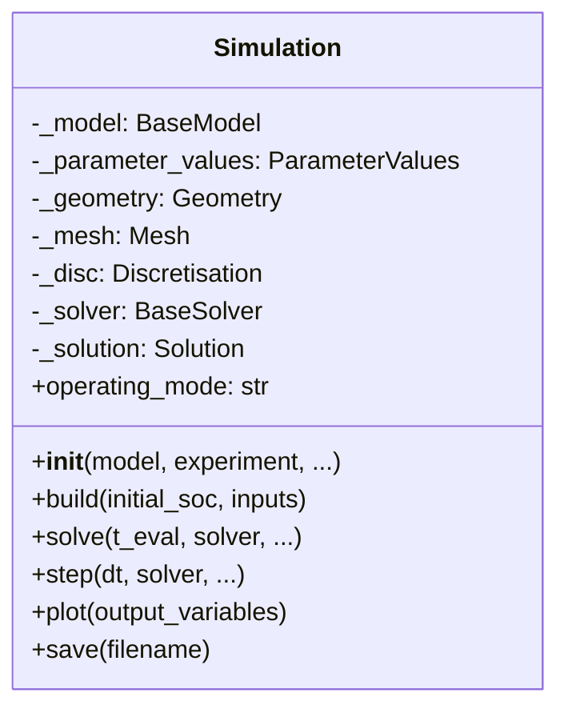
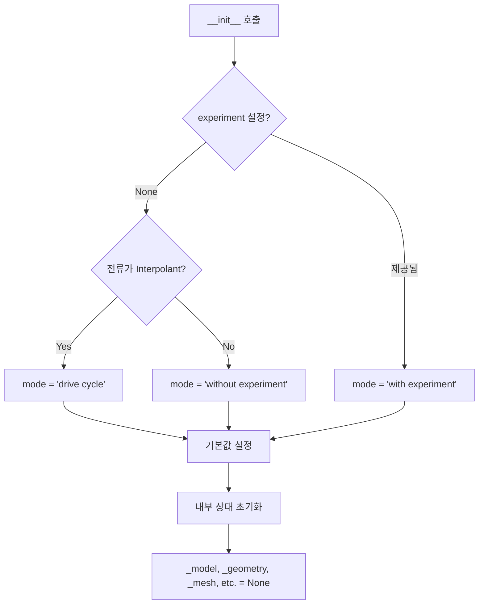
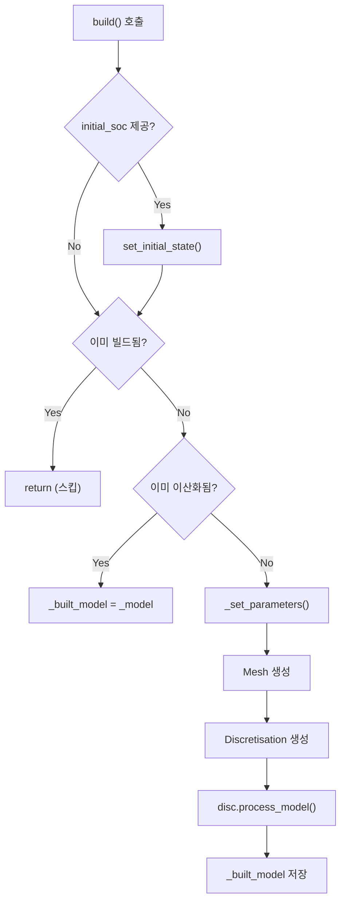
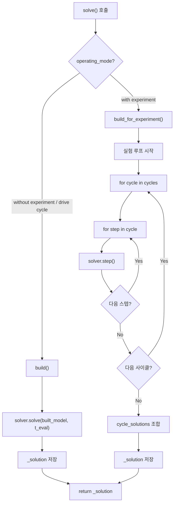
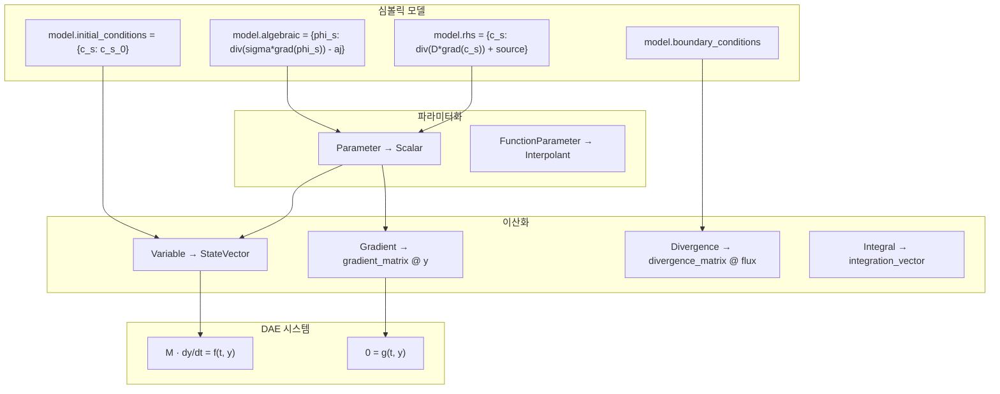
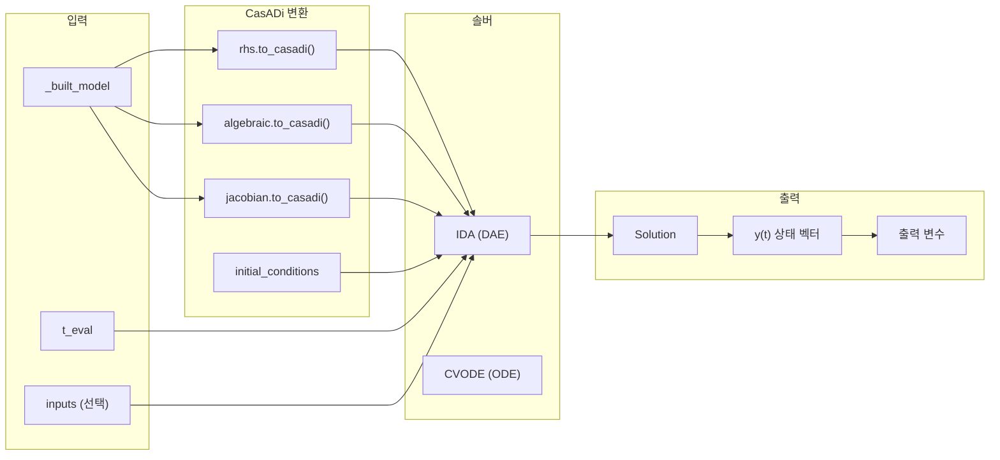
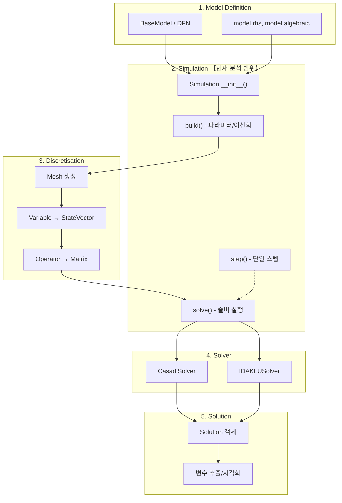
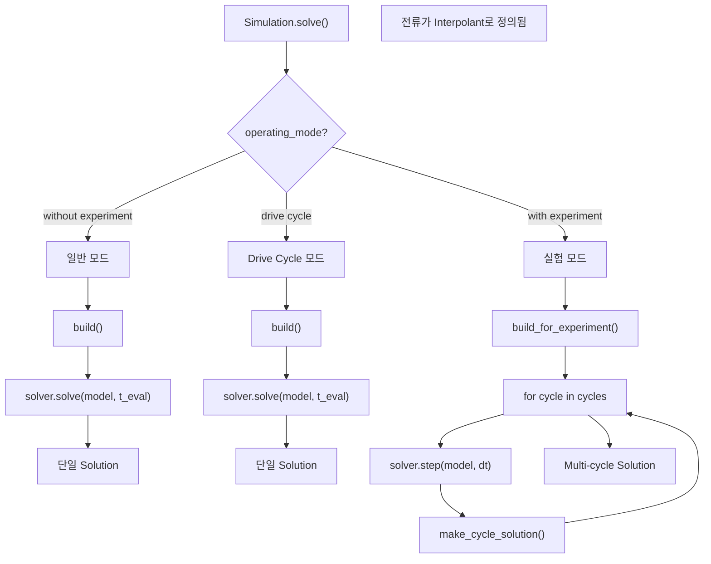

# PyBaMM 소스 코드 분석 - Phase 1: Simulation 클래스

**분석일**: 2026-01-12
**파일**: [simulation.py](file:///c:/Users/Ryu/Python_project/data/PyBaMM-develop/src/pybamm/simulation.py)
**크기**: 1,365줄, 57,295 bytes

---

## 1. Simulation 클래스 개요

`Simulation` 클래스는 PyBaMM의 **핵심 인터페이스**로, 모델 빌드, 파라미터 설정, 솔버 실행을 통합합니다.

### 1.1 클래스 구조



### 1.2 Operating Modes

| 모드 | 조건 | 설명 |
|------|------|------|
| `"without experiment"` | `experiment=None`, 일반 전류 | 기본 시뮬레이션 |
| `"drive cycle"` | 전류가 `Interpolant` | 주행 사이클 시뮬레이션 |
| `"with experiment"` | `experiment` 제공 | 실험 프로토콜 시뮬레이션 |

---

## 2. `__init__` 메서드 상세 분석

**위치**: lines 70-152

### 2.1 시그니처

```python
def __init__(
    self,
    model,                    # BaseModel 인스턴스
    experiment=None,          # Experiment 또는 문자열/리스트
    geometry=None,            # 기하학 (기본: model.default_geometry)
    parameter_values=None,    # 파라미터 (기본: model.default_parameter_values)
    submesh_types=None,       # 서브메쉬 타입
    var_pts=None,             # 변수별 포인트 수
    spatial_methods=None,     # 공간 이산화 방법
    solver=None,              # 솔버 (기본: model.default_solver)
    output_variables=None,    # 출력 변수 리스트
    C_rate=None,              # C-rate (전류 설정)
    discretisation_kwargs=None,
):
```

### 2.2 초기화 흐름



### 2.3 핵심 초기화 코드

```python
# lines 84-127
self._parameter_values = parameter_values or model.default_parameter_values

# 실험 모드 결정
if experiment is None:
    current = self._parameter_values.get("Current function [A]")
    if isinstance(current, pybamm.Interpolant):
        self.operating_mode = "drive cycle"
    else:
        self.operating_mode = "without experiment"
else:
    self.operating_mode = "with experiment"
    self.experiment = experiment.copy()

# 모델 복사 (원본 보존)
model = model.new_copy()
self._unprocessed_model = model
self._model = model

# 기본값 설정
self._geometry = geometry or self._model.default_geometry
self._solver = solver or self._model.default_solver
```

> [!IMPORTANT]
> 모델은 `new_copy()`로 복사되어 원본이 수정되지 않음.

---

## 3. `build` 메서드 상세 분석

**위치**: lines 348-385

### 3.1 시그니처

```python
def build(self, initial_soc=None, direction=None, inputs=None):
    """모델을 수치 계산 가능한 행렬/벡터 시스템으로 빌드"""
```

### 3.2 빌드 흐름



### 3.3 핵심 빌드 코드

```python
# lines 368-385
if self._built_model:
    return  # 이미 빌드됨

if self._model.is_discretised:
    self._built_model = self._model
else:
    # 1. 파라미터 설정
    self._set_parameters()
    
    # 2. 메쉬 생성
    self._mesh = pybamm.Mesh(self._geometry, self._submesh_types, self._var_pts)
    
    # 3. 이산화 객체 생성
    self._disc = pybamm.Discretisation(
        self._mesh, self._spatial_methods, **self._discretisation_kwargs
    )
    
    # 4. 모델 이산화 (핵심!)
    self._built_model = self._disc.process_model(
        self._model_with_set_params,
        inplace=False,
        delayed_variable_processing=True,
    )
```

### 3.4 빌드 단계별 결과

| 단계 | 입력 | 출력 |
|------|------|------|
| `_set_parameters()` | `_unprocessed_model` | `_model_with_set_params` |
| `Mesh()` | `geometry`, `submesh_types` | `_mesh` |
| `Discretisation()` | `mesh`, `spatial_methods` | `_disc` |
| `disc.process_model()` | 파라미터화된 모델 | `_built_model` (이산화 완료) |

---

## 4. `solve` 메서드 상세 분석

**위치**: lines 434-1045 (600줄 이상!)

### 4.1 시그니처

```python
def solve(
    self,
    t_eval=None,              # 시간 포인트 배열 또는 [t0, tf]
    solver=None,              # 솔버 오버라이드
    save_at_cycles=None,      # 저장할 사이클 (실험 모드)
    calc_esoh=None,           # eSOH 계산 여부
    starting_solution=None,   # 이어서 풀기
    initial_soc=None,         # 초기 SOC
    direction=None,           # 방향 (charge/discharge)
    callbacks=None,           # 콜백 함수들
    showprogress=False,       # 진행률 표시
    inputs=None,              # 입력 파라미터
    t_interp=None,            # 보간 시간
    initial_conditions=None,  # 초기 조건
    **kwargs,                 # 추가 솔버 인자
):
```

### 4.2 solve() 흐름도



### 4.3 일반 모드 (`without experiment`)

```python
# lines 535-611
if self.operating_mode in ["without experiment", "drive cycle"]:
    self.build(initial_soc=initial_soc, direction=direction, inputs=inputs)
    
    # t_eval 검증
    if t_eval is None:
        raise pybamm.SolverError("'t_eval' must be provided...")
    
    # 솔버 호출 (핵심!)
    self._solution = solver.solve(
        self._built_model,
        t_eval,
        inputs=inputs,
        t_interp=t_interp,
        initial_conditions=initial_conditions,
        **kwargs,
    )
```

### 4.4 실험 모드 (`with experiment`)

```python
# lines 613-1044
elif self.operating_mode == "with experiment":
    callbacks.on_experiment_start(logs)
    self.build_for_experiment(initial_soc, direction, inputs, solve_kwargs=kwargs)
    
    # 사이클 루프
    for cycle_num, cycle_length in enumerate(self.experiment.cycle_lengths):
        logs["cycle number"] = (cycle_num + cycle_offset, num_cycles)
        callbacks.on_cycle_start(logs)
        
        steps = []
        for step_num in range(1, cycle_length + 1):
            step = self.experiment.steps[idx]
            model = self.steps_to_built_models[step.basic_repr()]
            solver = self.steps_to_built_solvers[step.basic_repr()]
            
            # 스텝 실행 (핵심!)
            step_solution = solver.step(
                current_solution,
                model,
                dt,
                t_eval,
                save=False,
                inputs=inputs,
                **kwargs,
            )
            
            steps.append(step_solution)
            current_solution = current_solution + step_solution
            
        # 사이클 솔루션 생성
        cycle_solution = pybamm.make_cycle_solution(steps, esoh_solver, ...)
```

### 4.5 실험 종료 조건

| 조건 | 체크 방법 |
|------|----------|
| 전압 도달 | `min_voltage <= voltage_stop` |
| 시간 도달 | `experiment_time >= time_stop` |
| 용량 도달 | `capacity_now <= capacity_stop` |
| 실행 불가능 | 이벤트 발생 또는 에러 |

### 4.6 DAE 시스템 수학 형태

PyBaMM 모델은 **Differential-Algebraic Equation (DAE)** 시스템으로 표현됩니다:

$$
M(t) \cdot \frac{dy}{dt} = f(t, y, p)
$$

여기서:
- $y$ : 상태 벡터 (State Vector)
- $M(t)$ : Mass 행렬 (Singular 가능)
- $f$ : RHS 함수
- $p$ : 파라미터

#### DAE 인덱스 분류

| Mass 행렬 형태 | DAE 유형 | 예시 |
|:--------------|:---------|:-----|
| $M = I$ (단위행렬) | ODE | 입자 확산만 |
| $M$ 대각, $M_{ii} \in \{0, 1\}$ | Semi-explicit DAE | DFN 전체 |
| $M$ 일반 | Fully implicit DAE | 복잡한 모델 |

#### 상태 변수 분할

$$
y = \begin{pmatrix} y_d \\ y_a \end{pmatrix}
$$

- $y_d$ : 미분 변수 (Differential) - $c_s$, $c_e$, $T$
- $y_a$ : 대수 변수 (Algebraic) - $\phi_s$, $\phi_e$, $j$

#### 시스템 형태

$$
\frac{dy_d}{dt} = f_d(t, y_d, y_a)
$$
$$
0 = g(t, y_d, y_a)
$$

#### CasADi 함수 변환

```python
# PyBaMM → CasADi 변환
casadi_rhs = model.rhs.to_casadi(t, y, inputs)
casadi_algebraic = model.algebraic.to_casadi(t, y, inputs)
casadi_jac = model.jacobian.to_casadi(t, y, inputs)
```

#### 야코비안 행렬

솔버 수렴을 위한 야코비안:

$$
J = \begin{pmatrix}
\displaystyle\frac{\partial f_d}{\partial y_d} & \displaystyle\frac{\partial f_d}{\partial y_a} \\[1em]
\displaystyle\frac{\partial g}{\partial y_d} & \displaystyle\frac{\partial g}{\partial y_a}
\end{pmatrix}
$$

---

## 5. `step` 메서드 분석

**위치**: lines 1067-1122

### 5.1 시그니처

```python
def step(
    self,
    dt,                 # 시간 스텝 크기
    solver=None,        # 솔버 오버라이드
    t_eval=None,        # 평가 시간들
    save=True,          # 솔루션 저장 여부
    starting_solution=None,
    inputs=None,
    **kwargs,
):
```

### 5.2 핵심 코드

```python
# lines 1103-1122
if self.operating_mode in ["without experiment", "drive cycle"]:
    self.build()

if solver is None:
    solver = self._solver

if starting_solution is None:
    starting_solution = self._solution

# 한 스텝 실행
self._solution = solver.step(
    starting_solution,
    self._built_model,
    dt,
    t_eval=t_eval,
    save=save,
    inputs=inputs,
    **kwargs,
)

return self._solution
```

---

## 6. 프로퍼티 메서드들

**위치**: lines 1191-1237

| 프로퍼티 | 반환값 | 설명 |
|---------|-------|------|
| `model` | `_model` | 현재 모델 |
| `model_with_set_params` | `_model_with_set_params` | 파라미터 설정된 모델 |
| `built_model` | `_built_model` | 이산화된 모델 |
| `geometry` | `_geometry` | 기하학 객체 |
| `parameter_values` | `_parameter_values` | 파라미터 값들 |
| `mesh` | `_mesh` | 메쉬 객체 |
| `solver` | `_solver` | 솔버 객체 |
| `solution` | `_solution` | 솔루션 객체 |

---

## 7. 유틸리티 메서드들

### 7.1 plot()

```python
def plot(self, output_variables=None, **kwargs):
    """빠른 시각화"""
    if self._solution is None:
        raise ValueError("Model has not been solved...")
    
    self.quick_plot = pybamm.dynamic_plot(
        self._solution, output_variables=output_variables, **kwargs
    )
    return self.quick_plot
```

### 7.2 save() / load_sim()

```python
def save(self, filename):
    """Pickle로 시뮬레이션 저장"""
    with open(filename, "wb") as f:
        pickle.dump(self, f)

def load_sim(filename):
    """저장된 시뮬레이션 로드"""
    with open(filename, "rb") as f:
        return pickle.load(f)
```

### 7.3 create_gif()

```python
def create_gif(self, number_of_images=80, duration=0.1, output_filename="plot.gif"):
    """시뮬레이션 결과를 GIF로 생성"""
```

---

## 8. 전체 흐름 요약

### 8.1 일반 시뮬레이션

```python
# 사용자 코드
model = pybamm.lithium_ion.DFN()
sim = pybamm.Simulation(model)
sol = sim.solve([0, 3600])  # 1시간 시뮬레이션
sim.plot()
```

내부 흐름:
```
Simulation.__init__() → operating_mode = "without experiment"
         ↓
    solve(t_eval)
         ↓
    build() → _set_parameters() → Mesh() → Discretisation() → process_model()
         ↓
    solver.solve(_built_model, t_eval) → Solution
         ↓
    plot() → QuickPlot → dynamic_plot()
```

### 8.2 실험 시뮬레이션

```python
experiment = pybamm.Experiment([
    "Discharge at 1C until 3.0V",
    "Charge at C/2 until 4.2V",
    "Hold at 4.2V until C/50",
])
sim = pybamm.Simulation(model, experiment=experiment)
sol = sim.solve()
```

내부 흐름:
```
Simulation.__init__() → operating_mode = "with experiment"
         ↓
    solve()
         ↓
    build_for_experiment() → 스텝별 모델 빌드
         ↓
    for cycle in cycles:
        for step in cycle:
            solver.step() → step_solution
        make_cycle_solution(steps)
         ↓
    Solution (cycles 포함)
```

---

## 9. 핵심 포인트

1. **Lazy Build**: `solve()` 호출 시 자동으로 `build()` 실행
2. **Operating Modes**: 3가지 모드에 따른 분기 처리
3. **Model Immutability**: `new_copy()`로 원본 모델 보존
4. **Experiment Loop**: 사이클/스텝 단위로 solver.step() 반복 호출
5. **Callbacks**: 실험 진행 상황 모니터링 가능

## 10. Mathematical Mapping (수학적 매핑)

### 10.1 Simulation 파이프라인의 수학적 변환

Simulation 클래스가 수행하는 핵심 변환:

| 단계 | 입력 | 출력 | 수학적 변환 |
|:----|:-----|:-----|:-----------|
| `_set_parameters()` | `Parameter("D")` | `Scalar(1e-14)` | 심볼 → 수치값 치환 |
| `Mesh()` | `Geometry` | 그리드 $x_i$ | 공간 이산화 |
| `Discretisation()` | `Variable("c")` | `StateVector(y[i:j])` | 함수 → 벡터 |
| `process_model()` | $\nabla \cdot (D \nabla c)$ | $M_{div} \cdot (D \cdot M_{grad} \cdot \mathbf{c})$ | 미분연산자 → 행렬 |
| `to_casadi()` | PyBaMM 표현식 | CasADi MX/SX | 솔버용 변환 |

### 10.2 build() 메서드의 수학적 변환 상세



### 10.3 경계 조건 처리

`model.boundary_conditions` 딕셔너리가 이산화에서 처리되는 방식:

| 경계 조건 유형 | PyBaMM 설정 | 수학적 형태 | 이산화 처리 |
|:-------------|:-----------|:----------|:-----------|
| Dirichlet | `{"left": (c_0, "Dirichlet")}` | $c\big|_{x=0} = c_0$ | 경계 노드 값 고정 |
| Neumann | `{"right": (flux, "Neumann")}` | $-D\frac{\partial c}{\partial x}\big|_{x=L} = N$ | Ghost node 방법 |
| Symmetric | `{"left": (0, "Neumann")}` | $\frac{\partial c}{\partial x}\big|_{x=0} = 0$ | 대칭 조건 |

---

## 11. Core Methods & Logic (핵심 메서드 로직)

### 11.1 build() 메서드 내부 동작

```python
def build(self, initial_soc=None, direction=None, inputs=None):
    # 1. 초기 SOC 설정 (선택적)
    if initial_soc is not None:
        self.set_initial_state(initial_soc, direction)
    
    # 2. 이미 빌드된 경우 스킵
    if self._built_model:
        return
    
    # 3. 파라미터 설정 (Parameter → Scalar)
    self._set_parameters()
    
    # 4. 메쉬 생성 (공간 이산화 그리드)
    self._mesh = pybamm.Mesh(
        self._geometry,          # 기하학 정보
        self._submesh_types,     # 서브메쉬 유형
        self._var_pts            # 각 차원 포인트 수
    )
    
    # 5. 이산화 객체 생성
    self._disc = pybamm.Discretisation(
        self._mesh,
        self._spatial_methods    # FVM, Spectral 등
    )
    
    # 6. 모델 이산화 (핵심!)
    self._built_model = self._disc.process_model(
        self._model_with_set_params,
        inplace=False
    )
```

### 11.2 solve() 메서드의 DAE 솔버 호출

```python
# 일반 모드
solution = solver.solve(
    model,           # 이산화된 모델
    t_eval,          # 시간 포인트
    inputs=inputs    # 외부 입력
)

# 내부적으로:
# 1. model.rhs → CasADi 함수 f(t, y, p)
# 2. model.algebraic → CasADi 함수 g(t, y, p)  
# 3. model.jacobian → CasADi 함수 J(t, y, p)
# 4. IDA/CVODE 솔버 호출
```

### 11.3 solve() 메서드의 변수 의존성



---

## 12. PyBaMM Architecture Context (아키텍처 컨텍스트)

### 12.1 전체 파이프라인에서 Simulation의 위치



### 12.2 Simulation이 담당하는 역할

| 역할 | 메서드 | 설명 |
|:----|:------|:-----|
| **통합 인터페이스** | `__init__` | 모델, 파라미터, 솔버 통합 |
| **Lazy Build** | `build` | 필요할 때만 이산화 수행 |
| **솔버 추상화** | `solve` | 모드별 솔버 자동 선택 |
| **실험 관리** | `solve` (with experiment) | 사이클/스텝 루프 관리 |
| **상태 관리** | `step` | 연속 시뮬레이션 지원 |
| **시각화** | `plot` | QuickPlot 래퍼 |

### 12.3 Operating Mode별 내부 흐름



---

## 13. 다음 분석 대상

- **Phase 2**: `models/base_model.py` - BaseModel 클래스
- **Phase 3**: `discretisations/discretisation.py` - Discretisation 클래스
- **Phase 3**: `solvers/base_solver.py` - BaseSolver 클래스

---

## 파일 참조 요약

| 메서드 | 라인 범위 | 핵심 기능 |
|-------|----------|----------|
| [__init__](file:///c:/Users/Ryu/Python_project/data/PyBaMM-develop/src/pybamm/simulation.py#L70-L152) | 70-152 | 초기화, 모드 결정 |
| [build](file:///c:/Users/Ryu/Python_project/data/PyBaMM-develop/src/pybamm/simulation.py#L348-L385) | 348-385 | 모델 빌드 |
| [solve](file:///c:/Users/Ryu/Python_project/data/PyBaMM-develop/src/pybamm/simulation.py#L434-L1045) | 434-1045 | 핵심 solve 로직 |
| [step](file:///c:/Users/Ryu/Python_project/data/PyBaMM-develop/src/pybamm/simulation.py#L1067-L1122) | 1067-1122 | 단일 스텝 실행 |
| [plot](file:///c:/Users/Ryu/Python_project/data/PyBaMM-develop/src/pybamm/simulation.py#L1135-L1163) | 1135-1163 | 시각화 |
