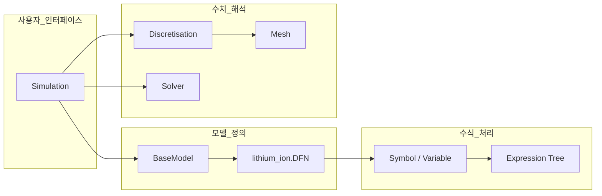
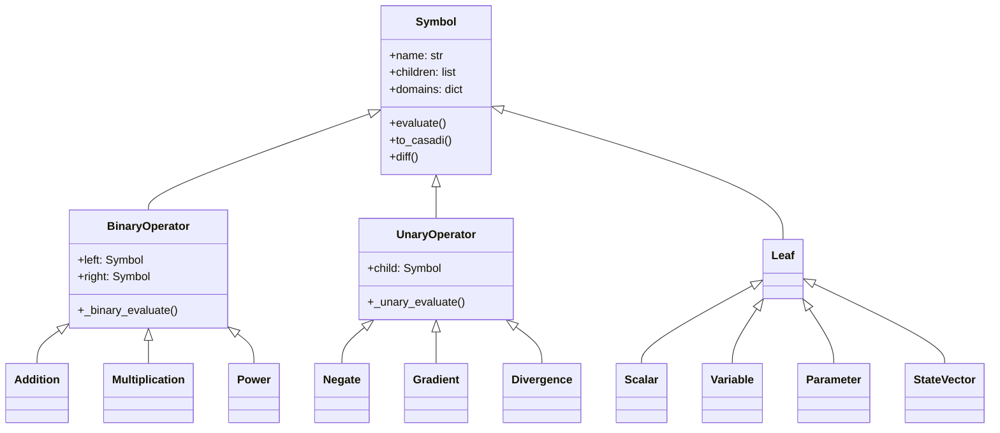
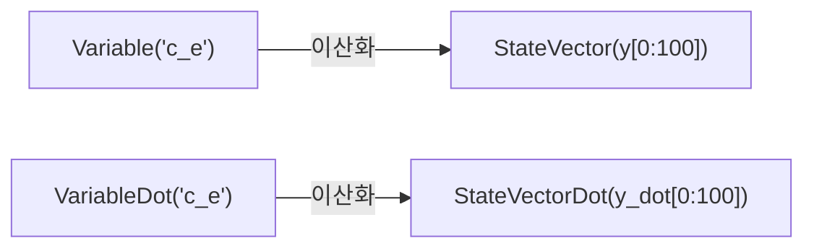
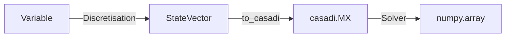
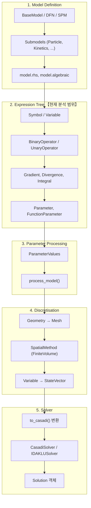
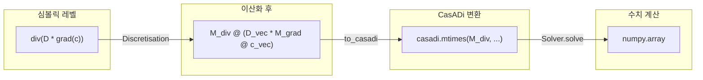
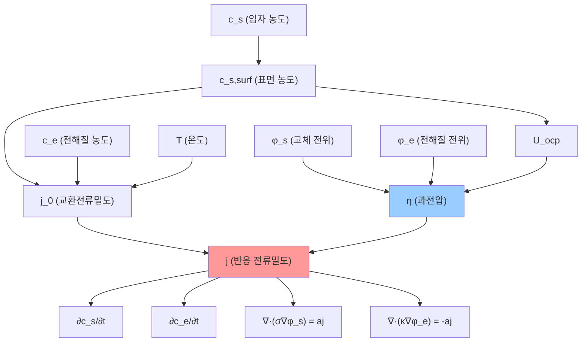

# PyBaMM 소스 코드 분석 - Phase 1: 패키지 구조 및 Expression Tree

**분석일**: 2026-01-12  
**분석 범위**: 패키지 진입점 (`__init__.py`) 및 Expression Tree 핵심 모듈

---

## 목차
1. [패키지 구조 개요](#1-패키지-구조-개요)
2. [__init__.py 분석](#2-__init__py-분석)
3. [Expression Tree 개요](#3-expression-tree-개요)
4. [Symbol 클래스](#4-symbol-클래스)
5. [BinaryOperator 클래스](#5-binaryoperator-클래스)
6. [UnaryOperator 클래스](#6-unaryoperator-클래스)
7. [Variable 클래스](#7-variable-클래스)
8. [핵심 개념 정리](#8-핵심-개념-정리)

---

## 1. 패키지 구조 개요

### 1.1 PyBaMM src 디렉토리 구조

```
src/pybamm/
├── __init__.py          # 공개 API 진입점 (256줄)
├── simulation.py        # 시뮬레이션 실행 (1,365줄)
│
├── expression_tree/     # 수식 표현 트리 (23개 모듈)
├── models/              # 배터리 모델 (185개 파일)
├── discretisations/     # 공간 이산화
├── spatial_methods/     # 유한체적/유한요소법
├── meshes/              # 메쉬 생성
├── geometry/            # 배터리 기하학
├── solvers/             # 솔버 (18개 파일)
├── parameters/          # 파라미터 처리
├── experiment/          # 실험 프로토콜
└── plotting/            # 시각화
```

### 1.2 핵심 모듈 간 의존성



---

## 2. __init__.py 분석

**파일**: [__init__.py](file:///c:/Users/Ryu/Python_project/data/PyBaMM-develop/src/pybamm/__init__.py)  
**크기**: 256줄

### 2.1 Import 카테고리

| 카테고리 | 라인 | 주요 Export |
|:---------|:----:|:------------|
| Utility | 4-19 | `Timer`, `FuzzyDict`, `logger`, `settings` |
| Expression Tree | 22-62 | `Symbol`, `Variable`, `StateVector`, `BinaryOperator` |
| Models | 65-104 | `BaseModel`, `lithium_ion`, `lead_acid`, `sodium_ion` |
| Geometry | 107-111 | `Geometry`, `battery_geometry` |
| Parameters | 114-125 | `ParameterValues`, `LithiumIonParameters` |
| Mesh/Disc | 128-157 | `Mesh`, `Discretisation`, `SubMesh` |
| Spatial Methods | 163-169 | `FiniteVolume`, `SpectralVolume` |
| Solvers | 172-189 | `CasadiSolver`, `IDAKLUSolver`, `Solution` |
| Experiment | 192-194 | `Experiment`, `step` |
| Plotting | 197-205 | `QuickPlot`, `dynamic_plot` |
| Simulation | 208-211 | `Simulation`, `BatchStudy` |

### 2.2 CasADi 환경 설정

```python
# Lines 222-226: CasADi 경로 자동 설정
os.environ["CASADIPATH"] = str(
    pathlib.Path(sysconfig.get_path("purelib")) / "casadi"
)
```

---

## 3. Expression Tree 개요

**경로**: `src/pybamm/expression_tree/`  
**구성**: 23개 모듈 + 2개 하위 디렉토리

### 3.1 핵심 모듈

| 모듈 | 크기 | 핵심 클래스 |
|:-----|-----:|:-----------|
| `symbol.py` | 1,157줄 | `Symbol` (기본 클래스) |
| `binary_operators.py` | 1,700줄 | `Addition`, `Multiplication`, `Power` |
| `unary_operators.py` | 1,620줄 | `Gradient`, `Divergence`, `Negate` |
| `variable.py` | 276줄 | `Variable`, `VariableDot` |
| `state_vector.py` | 392줄 | `StateVector`, `StateVectorDot` |
| `functions.py` | 622줄 | `exp`, `log`, `sin`, `cos` |
| `parameter.py` | 202줄 | `Parameter`, `FunctionParameter` |
| `scalar.py` | 114줄 | `Scalar`, `Constant` |

### 3.2 클래스 계층 구조



---

## 4. Symbol 클래스

**파일**: [symbol.py](file:///c:/Users/Ryu/Python_project/data/PyBaMM-develop/src/pybamm/expression_tree/symbol.py)

### 4.1 핵심 속성

```python
class Symbol:
    name: str                    # 심볼 이름
    children: list[Symbol]       # 자식 노드 (트리 구조)
    domains: dict                # {primary, secondary, tertiary, quaternary}
    _id: int                     # 고유 해시 ID
    scale: float                 # 스케일링 값
    reference: float             # 참조 값
```

### 4.2 핵심 메서드

| 메서드 | 라인 | 설명 |
|:-------|-----:|:-----|
| `evaluate(t, y, inputs)` | 823-849 | 수치 평가 |
| `to_casadi(t, y, inputs)` | 977-989 | CasADi 표현식 변환 |
| `diff(variable)` | 736-757 | 심볼릭 미분 |
| `jac(variable)` | 765-782 | 야코비안 계산 |
| `visualise(filename)` | 517-542 | PNG 트리 시각화 |

### 4.3 연산자 오버로딩

```python
# Python 연산자 → PyBaMM 표현식
a + b   →  Addition(a, b)
a * b   →  Multiplication(a, b)
a ** b  →  Power(a, b)
a @ b   →  MatrixMultiplication(a, b)
-a      →  Negate(a)
abs(a)  →  AbsoluteValue(a)
a < b   →  NotEqualHeaviside(a, b)
```

> [!IMPORTANT]
> 연산자 오버로딩으로 `a + b`가 자동으로 `Addition(a, b)` 객체를 생성합니다.

---

## 5. BinaryOperator 클래스

**파일**: [binary_operators.py](file:///c:/Users/Ryu/Python_project/data/PyBaMM-develop/src/pybamm/expression_tree/binary_operators.py)

### 5.1 구조

```python
class BinaryOperator(Symbol):
    @property
    def left(self) -> Symbol:
        return self.children[0]
    
    @property  
    def right(self) -> Symbol:
        return self.children[1]
    
    def _binary_evaluate(self, left, right):
        """서브클래스에서 구현"""
        raise NotImplementedError
```

### 5.2 주요 연산자

| 클래스 | 연산 | 야코비안 규칙 |
|:-------|:----:|:-------------|
| `Addition` | `+` | `∂(a+b)/∂y = ∂a/∂y + ∂b/∂y` |
| `Subtraction` | `-` | `∂(a-b)/∂y = ∂a/∂y - ∂b/∂y` |
| `Multiplication` | `*` | `∂(ab)/∂y = a·∂b/∂y + ∂a/∂y·b` |
| `Division` | `/` | `∂(a/b)/∂y = (∂a/∂y·b - a·∂b/∂y) / b²` |
| `Power` | `**` | 체인 룰 적용 |
| `MatrixMultiplication` | `@` | 행렬 곱 |

---

## 6. UnaryOperator 클래스

**파일**: [unary_operators.py](file:///c:/Users/Ryu/Python_project/data/PyBaMM-develop/src/pybamm/expression_tree/unary_operators.py)

### 6.1 카테고리별 연산자

| 카테고리 | 클래스 | 수학 표현 |
|:---------|:-------|:---------|
| **기본** | `Negate` | $-x$ |
| **기본** | `AbsoluteValue` | $\|x\|$ |
| **공간** | `Gradient` | $\nabla x$ |
| **공간** | `Divergence` | $\nabla \cdot \mathbf{x}$ |
| **공간** | `Laplacian` | $\nabla^2 x$ |
| **적분** | `Integral` | $\int x \, dx$ |
| **경계** | `BoundaryValue` | $x\big|_{\text{boundary}}$ |

### 6.2 공간 연산자 수학 정의

#### 그래디언트 (Gradient)

1차원 (x 방향):
$$
\nabla c = \frac{\partial c}{\partial x}
$$

구형 좌표계 (입자 내 r 방향):
$$
\nabla c_s = \frac{\partial c_s}{\partial r}
$$

#### 다이버전스 (Divergence)

1차원:
$$
\nabla \cdot N = \frac{\partial N}{\partial x}
$$

구형 좌표계 (Fick 확산):
$$
\nabla \cdot (D \nabla c_s) = \frac{1}{r^2}\frac{\partial}{\partial r}\left(r^2 D \frac{\partial c_s}{\partial r}\right)
$$

#### 라플라시안 (Laplacian)

$$
\nabla^2 c = \nabla \cdot (\nabla c) = \frac{\partial^2 c}{\partial x^2}
$$

구형 좌표계:
$$
\nabla^2 c_s = \frac{1}{r^2}\frac{\partial}{\partial r}\left(r^2 \frac{\partial c_s}{\partial r}\right)
$$

### 6.3 적분 연산자

**공간 적분:**
$$
\int_{\Omega} c \, dV
$$

**x-평균 (SPM에서 사용):**
$$
\bar{c} = \frac{1}{L}\int_0^L c(x) \, dx
$$

**r-평균 (입자 평균 농도):**
$$
\bar{c}_s = \frac{3}{R^3}\int_0^R c_s(r) \cdot r^2 \, dr
$$

### 6.4 공간 연산자 특성

```python
class Gradient(SpatialOperator):
    def _evaluates_on_edges(self, dimension):
        return True   # edge에서 평가 (FVM)

class Divergence(SpatialOperator):
    def _evaluates_on_edges(self, dimension):
        return False  # node에서 평가
```

> [!NOTE]
> 공간 연산자는 **이산화 단계**에서 희소 행렬(`gradient_matrix`, `divergence_matrix`)로 변환됩니다.

### 6.5 이산화 후 행렬 형태

| 연산자 | 연속 수식 | 이산화 형태 |
|:-------|:---------|:-----------|
| Gradient | $\nabla c$ | $G \cdot \mathbf{c}$ |
| Divergence | $\nabla \cdot N$ | $D \cdot \mathbf{N}$ |
| Laplacian | $\nabla^2 c$ | $D \cdot G \cdot \mathbf{c}$ |

여기서 $G$는 그래디언트 행렬, $D$는 다이버전스 행렬입니다.

---

## 7. Variable 클래스

**파일**: [variable.py](file:///c:/Users/Ryu/Python_project/data/PyBaMM-develop/src/pybamm/expression_tree/variable.py)

### 7.1 클래스 구조

```python
class VariableBase(Symbol):
    bounds: tuple          # 물리적 범위 (min, max)
    scale: float           # 스케일링
    reference: float       # 참조값

class Variable(VariableBase):
    """이산화 후 StateVector로 변환"""
    
    def diff(self, variable):
        if variable == pybamm.t:
            return VariableDot(...)  # 시간 미분

class VariableDot(VariableBase):
    """변수의 시간 미분 (dy/dt)"""
```

### 7.2 이산화 변환



---

## 8. 핵심 개념 정리

### 8.1 표현식 트리 패턴

```
        Multiplication(*)
           /        \
      grad(c)      D_e
         |
    Variable(c)
```

- **내부 노드**: 연산자 (`BinaryOperator`, `UnaryOperator`)
- **리프 노드**: 값 (`Variable`, `Scalar`, `Parameter`)

### 8.2 수식 예시

```python
# PyBaMM 코드
flux = -D * pybamm.grad(c)

# 내부 표현식 트리
Multiplication(
    left=Negate(Parameter("D")),
    right=Gradient(Variable("c"))
)
```

### 8.3 데이터 변환 흐름



### 8.4 주요 메서드 용도

| 메서드 | 용도 |
|:-------|:-----|
| `evaluate()` | 수치 값 계산 |
| `to_casadi()` | CasADi 솔버용 변환 |
| `diff()` | 심볼릭 미분 |
| `jac()` | 야코비안 행렬 계산 |
| `visualise()` | 트리 구조 시각화 |

---

## 9. Mathematical Mapping (수학적 매핑)

Expression Tree의 PyBaMM 코드가 수학 수식으로 어떻게 변환되는지 상세 매핑입니다.

### 9.1 코드-수식 매핑 테이블

| PyBaMM 코드 | Expression Tree | 수학 수식 |
|:------------|:----------------|:----------|
| `pybamm.grad(c)` | `Gradient(Variable("c"))` | $\nabla c$ |
| `pybamm.div(N)` | `Divergence(Variable("N"))` | $\nabla \cdot \mathbf{N}$ |
| `pybamm.div(D * pybamm.grad(c))` | `Divergence(Multiplication(...))` | $\nabla \cdot (D \nabla c)$ |
| `pybamm.laplacian(c)` | `Divergence(Gradient(...))` | $\nabla^2 c$ |
| `pybamm.Integral(c, x)` | `Integral(Variable("c"), x)` | $\int_\Omega c \, dx$ |
| `pybamm.x_average(c)` | `XAverage(Variable("c"))` | $\bar{c} = \frac{1}{L}\int_0^L c \, dx$ |
| `pybamm.r_average(c_s)` | `RAverage(Variable("c_s"))` | $\bar{c}_s = \frac{3}{R^3}\int_0^R c_s r^2 \, dr$ |
| `pybamm.surf(c_s)` | `SurfaceValue(Variable("c_s"))` | $c_s\big|_{r=R}$ |
| `pybamm.BoundaryValue(c, "left")` | `BoundaryValue(..., "left")` | $c\big|_{x=0}$ |

### 9.2 심볼릭 미분 규칙 (diff 메서드)

`Symbol.diff(variable)` 메서드의 미분 규칙:

| 표현식 | `diff(y)` 결과 | 수학 규칙 |
|:-------|:--------------|:---------|
| `Scalar(k)` | `Scalar(0)` | $\frac{d}{dy}(k) = 0$ |
| `Variable("y")` | `Scalar(1)` | $\frac{d}{dy}(y) = 1$ |
| `Addition(a, b)` | `Addition(a.diff(y), b.diff(y))` | $\frac{d}{dy}(a+b) = \frac{da}{dy} + \frac{db}{dy}$ |
| `Multiplication(a, b)` | 곱의 법칙 적용 | $\frac{d}{dy}(ab) = a\frac{db}{dy} + \frac{da}{dy}b$ |
| `Division(a, b)` | 몫의 법칙 적용 | $\frac{d}{dy}\left(\frac{a}{b}\right) = \frac{\frac{da}{dy}b - a\frac{db}{dy}}{b^2}$ |
| `Power(a, n)` | 체인 룰 적용 | $\frac{d}{dy}(a^n) = na^{n-1}\frac{da}{dy}$ |
| `Exp(a)` | `Multiplication(Exp(a), a.diff(y))` | $\frac{d}{dy}(e^a) = e^a \frac{da}{dy}$ |
| `Log(a)` | `Division(a.diff(y), a)` | $\frac{d}{dy}(\ln a) = \frac{1}{a}\frac{da}{dy}$ |

### 9.3 시간 미분 (VariableDot)

```python
c = pybamm.Variable("c")
c_dot = c.diff(pybamm.t)  # VariableDot 객체 생성
```

$$
\frac{\partial c}{\partial t} \rightarrow \text{VariableDot("c")}
$$

이산화 후:
$$
\text{VariableDot} \rightarrow \text{StateVectorDot} \rightarrow \dot{y}[i:j]
$$

---

## 10. Variables & Parameters (변수 및 파라미터)

### 10.1 핵심 Variable 객체

| Variable 이름 | 물리적 의미 | 단위 | 도메인 |
|:-------------|:-----------|:-----|:-------|
| `c_s_n` | 음극 입자 내 리튬 농도 | mol/m³ | negative particle |
| `c_s_p` | 양극 입자 내 리튬 농도 | mol/m³ | positive particle |
| `c_e` | 전해질 리튬 이온 농도 | mol/m³ | electrolyte |
| `phi_s_n` | 음극 고체 전위 | V | negative electrode |
| `phi_s_p` | 양극 고체 전위 | V | positive electrode |
| `phi_e` | 전해질 전위 | V | electrolyte |
| `T` | 셀 온도 | K | cell |
| `j_n` | 음극 계면 전류밀도 | A/m² | negative electrode |
| `j_p` | 양극 계면 전류밀도 | A/m² | positive electrode |

### 10.2 핵심 Parameter 객체

| Parameter 이름 | 물리적 의미 | 단위 | 일반값 범위 |
|:--------------|:-----------|:-----|:-----------|
| `Negative electrode diffusivity [m2.s-1]` | 음극 확산 계수 | m²/s | $10^{-15}$ ~ $10^{-13}$ |
| `Positive electrode diffusivity [m2.s-1]` | 양극 확산 계수 | m²/s | $10^{-15}$ ~ $10^{-13}$ |
| `Electrolyte diffusivity [m2.s-1]` | 전해질 확산 계수 | m²/s | $10^{-11}$ ~ $10^{-9}$ |
| `Electrolyte conductivity [S.m-1]` | 전해질 이온 전도도 | S/m | 0.1 ~ 2 |
| `Negative electrode thickness [m]` | 음극 두께 | m | 50 ~ 100 μm |
| `Positive electrode thickness [m]` | 양극 두께 | m | 50 ~ 100 μm |
| `Separator thickness [m]` | 분리막 두께 | m | 10 ~ 25 μm |
| `Negative particle radius [m]` | 음극 입자 반경 | m | 2 ~ 10 μm |
| `Positive particle radius [m]` | 양극 입자 반경 | m | 2 ~ 10 μm |

### 10.3 무차원화 (Non-dimensionalization)

PyBaMM은 내부적으로 무차원 변수를 사용:

| 차원 변수 | 무차원화 | 스케일 |
|:---------|:--------|:-------|
| $c_s$ | $\tilde{c}_s = c_s / c_{s,max}$ | $c_{s,max}$ |
| $c_e$ | $\tilde{c}_e = c_e / c_{e,typ}$ | $c_{e,typ}$ |
| $\phi$ | $\tilde{\phi} = F\phi / (RT)$ | $RT/F$ |
| $t$ | $\tilde{t} = t / \tau$ | $\tau = L^2/D_{typ}$ |
| $x$ | $\tilde{x} = x / L$ | $L$ (셀 길이) |
| $r$ | $\tilde{r} = r / R$ | $R$ (입자 반경) |

```python
# 코드에서 스케일 접근
scale = variable.scale      # 스케일링 값
ref = variable.reference    # 참조값
bounds = variable.bounds    # 물리적 범위 (min, max)
```

---

## 11. PyBaMM Architecture Context (아키텍처 컨텍스트)

### 11.1 전체 파이프라인에서 Expression Tree의 위치



### 11.2 Expression Tree가 담당하는 역할

| 파이프라인 단계 | Expression Tree 역할 |
|:--------------|:--------------------|
| **Model Definition** | 지배방정식을 심볼릭 형태로 표현 |
| **Parameter Processing** | `Parameter` 객체를 실제 값으로 치환 |
| **Discretisation** | `Variable` → `StateVector`, 공간 연산자 → 희소 행렬 |
| **Solver** | `to_casadi()` 로 CasADi 표현식 생성 |
| **Post-processing** | `evaluate()` 로 Solution에서 변수 추출 |

### 11.3 핵심 변환 과정



### 11.4 Coupling 의존성 다이어그램



---

## 파일 참조

| 파일 | 라인 수 | 핵심 내용 |
|:-----|--------:|:----------|
| [__init__.py](file:///c:/Users/Ryu/Python_project/data/PyBaMM-develop/src/pybamm/__init__.py) | 256 | 공개 API |
| [symbol.py](file:///c:/Users/Ryu/Python_project/data/PyBaMM-develop/src/pybamm/expression_tree/symbol.py) | 1,157 | Symbol 기본 클래스 |
| [binary_operators.py](file:///c:/Users/Ryu/Python_project/data/PyBaMM-develop/src/pybamm/expression_tree/binary_operators.py) | 1,700 | 이항 연산자 |
| [unary_operators.py](file:///c:/Users/Ryu/Python_project/data/PyBaMM-develop/src/pybamm/expression_tree/unary_operators.py) | 1,620 | 단항/공간 연산자 |
| [variable.py](file:///c:/Users/Ryu/Python_project/data/PyBaMM-develop/src/pybamm/expression_tree/variable.py) | 276 | Variable/VariableDot |

---

**다음 분석**: [Phase1_Simulation_클래스_분석.md](file:///c:/Users/Ryu/Python_project/data/PyBaMM-develop/examples/ryu/Phase1_Simulation_클래스_분석.md)
