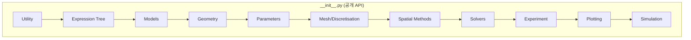
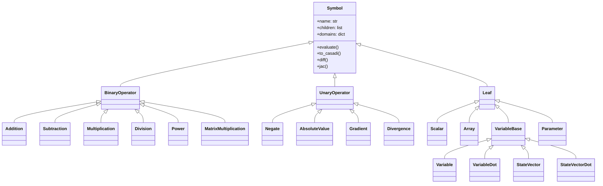
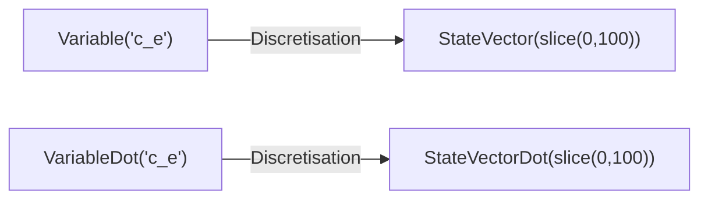

# PyBaMM 소스 코드 분석 - Phase 1

**분석일**: 2026-01-12
**분석 범위**: 패키지 진입점 (`__init__.py`) 및 Expression Tree 핵심 모듈

---

## 1. 패키지 진입점 분석

**파일**: [__init__.py](file:///c:/Users/Ryu/Python_project/data/PyBaMM-develop/src/pybamm/__init__.py)
**크기**: 256줄, 8,407 bytes

### 1.1 Import 구조 개요



### 1.2 카테고리별 Import 분석

| 카테고리 | 라인 | 주요 클래스/함수 |
|---------|------|----------------|
| **Utility** | 4-19 | `root_dir`, `Timer`, `FuzzyDict`, `logger`, `settings`, `Citations` |
| **Expression Tree** | 22-62 | `Symbol`, `BinaryOperator`, `UnaryOperator`, `Variable`, `StateVector` |
| **Models** | 65-104 | `BaseModel`, `BaseBatteryModel`, `lithium_ion`, `lead_acid` |
| **Geometry** | 107-111 | `Geometry`, `battery_geometry` |
| **Parameters** | 114-125 | `ParameterValues`, `LithiumIonParameters` |
| **Mesh/Discretisation** | 128-157 | `Discretisation`, `Mesh`, `SubMesh`, `FiniteVolume` |
| **Spatial Methods** | 163-169 | `SpatialMethod`, `FiniteVolume`, `SpectralVolume` |
| **Solvers** | 172-189 | `Solution`, `BaseSolver`, `CasadiSolver`, `IDAKLUSolver` |
| **Experiment** | 192-194 | `Experiment`, `step` |
| **Plotting** | 197-205 | `QuickPlot`, `plot`, `dynamic_plot` |
| **Simulation** | 208-211 | `Simulation`, `load_sim`, `BatchStudy` |

### 1.3 CasADi 환경 설정

```python
# lines 222-226
import os, pathlib, sysconfig
os.environ["CASADIPATH"] = str(pathlib.Path(sysconfig.get_path("purelib")) / "casadi")
```

> [!NOTE]
> 패키지 로드 시 CasADi 경로를 자동으로 설정하여 CasADi 라이브러리를 찾을 수 있도록 함.

---

## 2. Expression Tree 디렉토리 구조

**경로**: `src/pybamm/expression_tree/`
**파일 수**: 23개 모듈 + 2개 하위 디렉토리

### 2.1 모듈 구성

```
expression_tree/
├── symbol.py              (1,157줄) - 기본 Symbol 클래스
├── binary_operators.py    (1,700줄) - 이항 연산자 (+, -, *, /, **)
├── unary_operators.py     (1,620줄) - 단항 연산자 (-, grad, div)
├── variable.py            (276줄)   - Variable, VariableDot
├── state_vector.py        (392줄)   - StateVector, StateVectorDot
├── scalar.py              (114줄)   - Scalar, Constant
├── parameter.py           (202줄)   - Parameter, FunctionParameter
├── functions.py           (622줄)   - exp, log, sin, cos 등
├── concatenations.py      (623줄)   - Concatenation 연산
├── broadcasts.py          (623줄)   - Broadcast 연산
├── interpolant.py         (377줄)   - 보간 함수
└── operations/            (7 files) - Jacobian, CasADi 변환 등
```

### 2.2 클래스 계층 구조



---

## 3. Symbol 클래스 상세 분석

**파일**: [symbol.py](file:///c:/Users/Ryu/Python_project/data/PyBaMM-develop/src/pybamm/expression_tree/symbol.py)
**크기**: 1,157줄, 39,586 bytes

### 3.1 핵심 속성

| 속성 | 타입 | 설명 |
|-----|------|------|
| `name` | `str` | 심볼 이름 |
| `children` | `list[Symbol]` | 자식 노드들 |
| `domains` | `dict` | `{primary, secondary, tertiary, quaternary}` 도메인 |
| `_id` | `int` | 고유 식별자 (해시값) |
| `scale` | `float` | 스케일링 값 |
| `reference` | `float` | 참조 값 |

### 3.2 핵심 메서드

```python
class Symbol:
    # 평가
    def evaluate(self, t=None, y=None, y_dot=None, inputs=None):
        """수치적으로 심볼을 평가"""
    
    # 변환
    def to_casadi(self, t=None, y=None, y_dot=None, inputs=None):
        """CasADi 표현식으로 변환"""
    
    # 미분
    def diff(self, variable):
        """변수에 대해 미분"""
    
    def jac(self, variable, known_jacs=None):
        """상태 벡터에 대한 야코비안 계산"""
    
    # 시각화
    def visualise(self, filename):
        """표현식 트리를 PNG로 저장"""
    
    def render(self):
        """트리 구조를 콘솔에 출력"""
```

### 3.3 연산자 오버로딩

```python
# lines 610-715
def __add__(self, other) -> Addition: ...
def __sub__(self, other) -> Subtraction: ...
def __mul__(self, other) -> Multiplication: ...
def __truediv__(self, other) -> Division: ...
def __pow__(self, other) -> Power: ...
def __matmul__(self, other) -> MatrixMultiplication: ...
def __neg__(self) -> Negate: ...
def __abs__(self) -> AbsoluteValue: ...
def __lt__(self, other) -> NotEqualHeaviside: ...  # Heaviside 함수
def __le__(self, other) -> EqualHeaviside: ...
```

> [!IMPORTANT]
> Python 연산자를 오버로딩하여 `a + b`가 자동으로 `Addition(a, b)` 객체를 생성.

---

## 4. BinaryOperator 클래스 분석

**파일**: [binary_operators.py](file:///c:/Users/Ryu/Python_project/data/PyBaMM-develop/src/pybamm/expression_tree/binary_operators.py)
**크기**: 1,700줄, 61,524 bytes

### 4.1 클래스 구조

```python
class BinaryOperator(Symbol):
    """이항 연산자의 기본 클래스"""
    
    def __init__(self, name, left_child, right_child):
        # 왼쪽/오른쪽 자식을 children으로 저장
        super().__init__(name, children=[left_child, right_child])
    
    @property
    def left(self): return self.children[0]
    
    @property
    def right(self): return self.children[1]
    
    def _binary_evaluate(self, left, right):
        """실제 연산 수행 (서브클래스에서 오버라이드)"""
        raise NotImplementedError
    
    def _binary_jac(self, left_jac, right_jac):
        """야코비안 계산 (서브클래스에서 오버라이드)"""
        raise NotImplementedError
```

### 4.2 주요 연산자 클래스

| 클래스 | 연산 | `_binary_evaluate` |
|-------|------|-------------------|
| `Addition` | `+` | `left + right` |
| `Subtraction` | `-` | `left - right` |
| `Multiplication` | `*` | `left * right` |
| `Division` | `/` | `left / right` |
| `Power` | `**` | `left ** right` |
| `MatrixMultiplication` | `@` | `left @ right` |
| `EqualHeaviside` | `<=` | Heaviside 함수 |
| `NotEqualHeaviside` | `<` | Heaviside 함수 |
| `Modulo` | `%` | `left % right` |
| `Minimum` | `min` | `min(left, right)` |
| `Maximum` | `max` | `max(left, right)` |

### 4.3 야코비안 계산 예시

```python
class Addition(BinaryOperator):
    def _binary_jac(self, left_jac, right_jac):
        # d(a+b)/dy = da/dy + db/dy
        return left_jac + right_jac

class Multiplication(BinaryOperator):
    def _binary_jac(self, left_jac, right_jac):
        # d(a*b)/dy = a * db/dy + da/dy * b
        return self.left * right_jac + left_jac * self.right
```

---

## 5. UnaryOperator 클래스 분석

**파일**: [unary_operators.py](file:///c:/Users/Ryu/Python_project/data/PyBaMM-develop/src/pybamm/expression_tree/unary_operators.py)
**크기**: 1,620줄, 53,058 bytes

### 5.1 주요 연산자 클래스

| 카테고리 | 클래스 | 역할 |
|---------|-------|------|
| **기본** | `Negate` | `-x` |
| **기본** | `AbsoluteValue` | `abs(x)` |
| **공간 연산** | `Gradient` | `∇x` |
| **공간 연산** | `Divergence` | `∇·x` |
| **공간 연산** | `Laplacian` | `∇²x` |
| **적분** | `Integral` | `∫x dx` |
| **적분** | `IndefiniteIntegral` | 부정적분 |
| **경계** | `BoundaryValue` | 경계값 추출 |
| **경계** | `BoundaryGradient` | 경계 기울기 |
| **평균** | `SpatialAverage` | 공간 평균 |
| **인덱싱** | `Index` | 배열 인덱싱 |

### 5.2 공간 연산자 (Gradient, Divergence)

```python
class Gradient(SpatialOperator):
    """그래디언트 연산자 ∇"""
    
    def __init__(self, child):
        super().__init__("grad", child)
    
    def _evaluates_on_edges(self, dimension):
        # grad는 edge에서 평가됨 (finite volume)
        return True

class Divergence(SpatialOperator):
    """발산 연산자 ∇·"""
    
    def __init__(self, child):
        super().__init__("div", child)
    
    def _evaluates_on_edges(self, dimension):
        # div는 node에서 평가됨
        return False
```

> [!NOTE]
> `Gradient`와 `Divergence`는 이산화 단계에서 `gradient_matrix`와 `divergence_matrix`로 대체됨.

---

## 6. Variable 클래스 분석

**파일**: [variable.py](file:///c:/Users/Ryu/Python_project/data/PyBaMM-develop/src/pybamm/expression_tree/variable.py)
**크기**: 276줄, 10,226 bytes

### 6.1 클래스 구조

```python
class VariableBase(Symbol):
    """종속 변수의 기본 클래스"""
    
    def __init__(self, name, domain=None, bounds=None, scale=None, reference=None):
        self.bounds = bounds  # 물리적 범위 (min, max)
        self.scale = scale    # 스케일링
        self.reference = reference  # 참조값

class Variable(VariableBase):
    """이산화 후 StateVector로 변환되는 변수"""
    
    def diff(self, variable):
        if variable == pybamm.t:
            # 시간 미분 → VariableDot 반환
            return VariableDot(self.name + "'", ...)

class VariableDot(VariableBase):
    """변수의 시간 미분 (d/dt)"""
    
    def get_variable(self):
        # 대응하는 Variable 반환
        return Variable(self.name.replace("'", ""), ...)
```

### 6.2 이산화 변환



---

## 7. 유틸리티 함수

### 7.1 symbol.py 내 유틸리티

```python
# 상수 체크 함수들 (lines 85-162)
def is_constant(symbol): ...
def is_scalar_zero(expr): ...
def is_scalar_one(expr): ...
def is_matrix_zero(expr): ...

# 단순화 함수 (lines 165-201)
def simplify_if_constant(symbol):
    """상수로 평가 가능하면 Scalar/Array로 단순화"""
```

### 7.2 도메인 헬퍼

```python
DOMAIN_LEVELS = ["primary", "secondary", "tertiary", "quaternary"]
EMPTY_DOMAINS = {k: [] for k in DOMAIN_LEVELS}

def domain_size(domain):
    """도메인의 크기 반환 (표준 도메인은 미리 정의된 크기 사용)"""
```

---

## 8. 핵심 포인트 요약

### 8.1 표현식 트리 패턴

1. **모든 수식은 트리 구조**: 연산자(내부 노드) + 변수/상수(리프 노드)
2. **연산자 오버로딩**: Python 문법으로 자연스럽게 표현식 구성
3. **지연 평가**: 수식은 심볼릭으로 유지, `evaluate()` 호출 시 수치 계산
4. **도메인 추적**: 각 심볼이 속한 공간 도메인 정보 유지

### 8.2 주요 변환 흐름

```
Variable → Discretisation → StateVector → to_casadi() → casadi.MX
```

### 8.3 다음 분석 대상

- **simulation.py**: Simulation 클래스와 solve() 메서드
- **models/base_model.py**: BaseModel 클래스

---

## 파일 참조

| 파일 | 핵심 클래스 |
|-----|-----------|
| [__init__.py](file:///c:/Users/Ryu/Python_project/data/PyBaMM-develop/src/pybamm/__init__.py) | 공개 API |
| [symbol.py](file:///c:/Users/Ryu/Python_project/data/PyBaMM-develop/src/pybamm/expression_tree/symbol.py) | `Symbol` |
| [binary_operators.py](file:///c:/Users/Ryu/Python_project/data/PyBaMM-develop/src/pybamm/expression_tree/binary_operators.py) | `BinaryOperator`, `Addition`, `Multiplication` |
| [unary_operators.py](file:///c:/Users/Ryu/Python_project/data/PyBaMM-develop/src/pybamm/expression_tree/unary_operators.py) | `UnaryOperator`, `Gradient`, `Divergence` |
| [variable.py](file:///c:/Users/Ryu/Python_project/data/PyBaMM-develop/src/pybamm/expression_tree/variable.py) | `Variable`, `VariableDot` |
