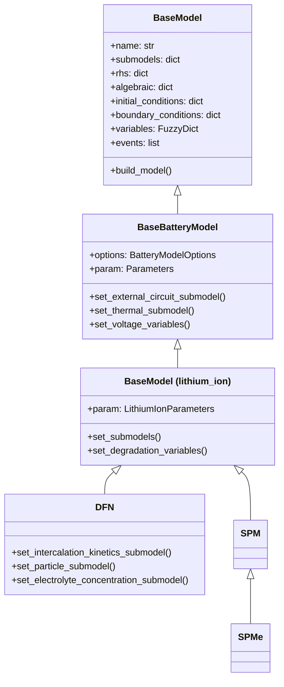
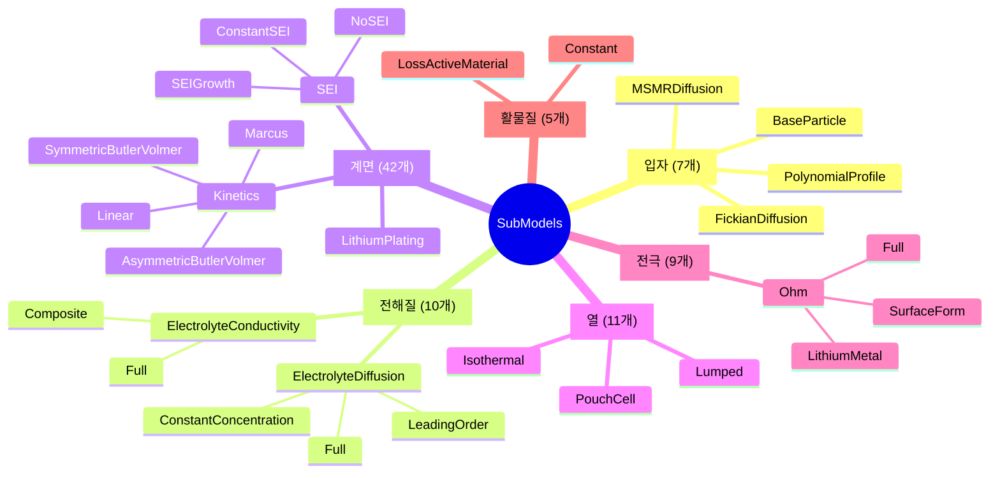
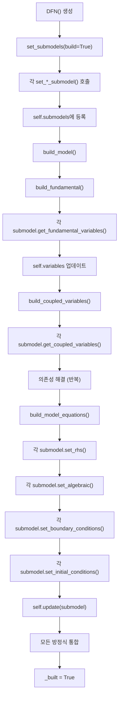
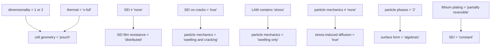
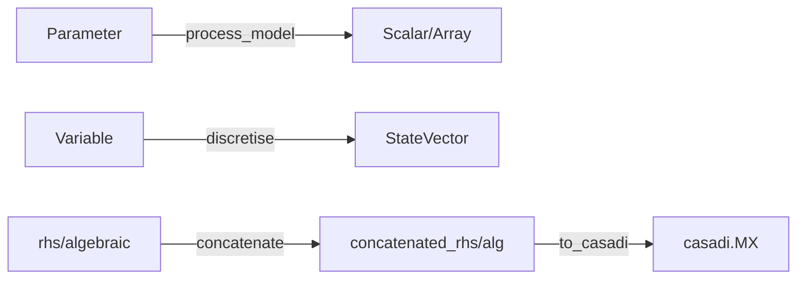
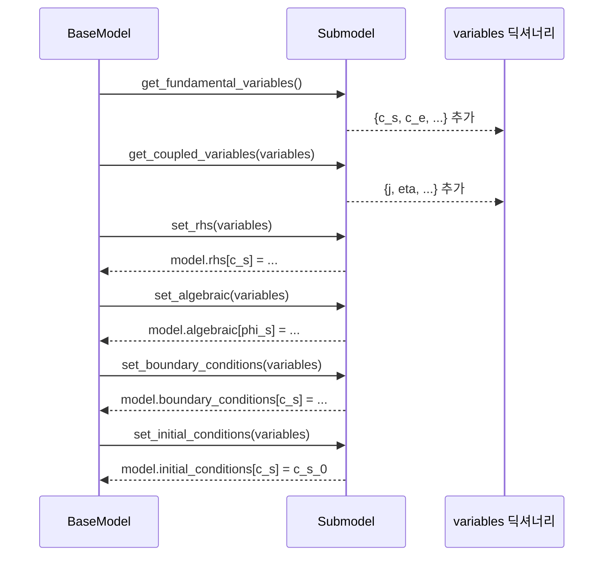
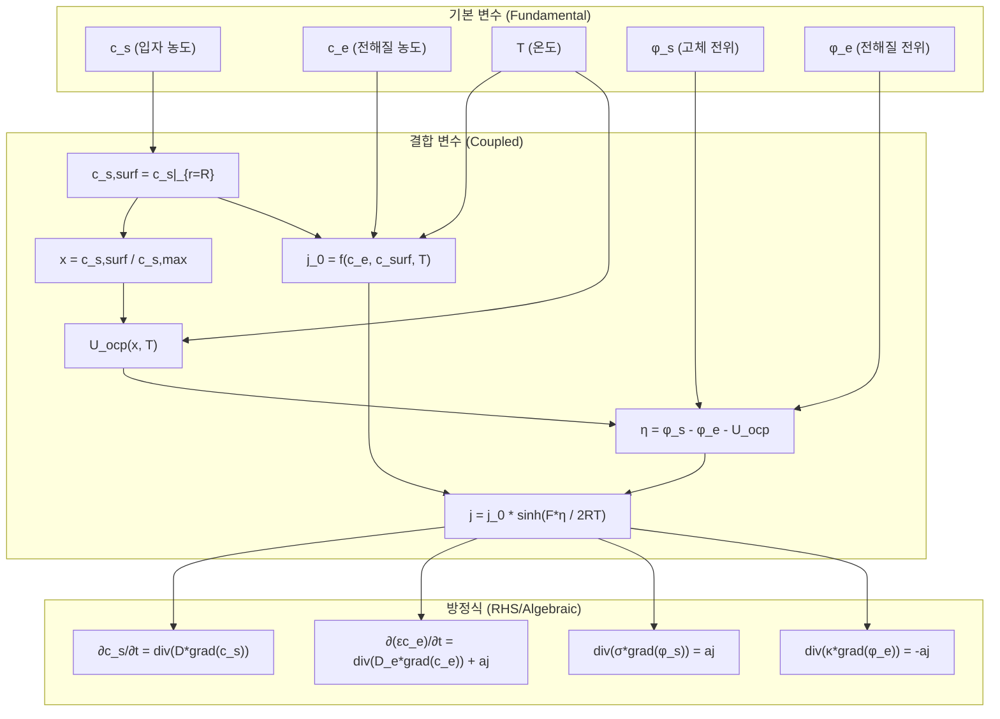
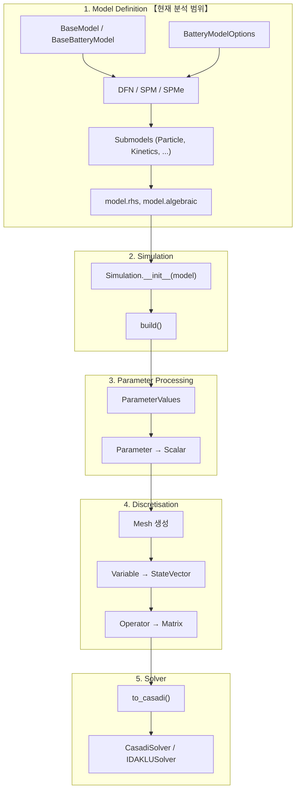
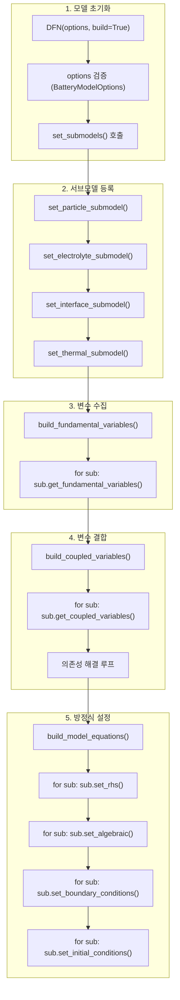
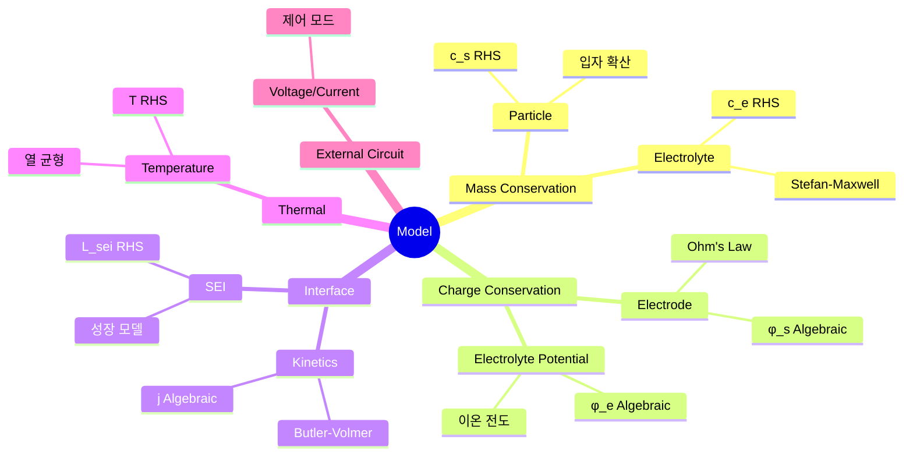

# PyBaMM 소스 코드 분석 - Phase 2: 모델 정의

**분석일**: 2026-01-12  
**분석 범위**: `models/` 디렉토리 전체 구조 및 핵심 클래스

---

## 목차
1. [모델 디렉토리 구조](#1-모델-디렉토리-구조)
2. [모델 클래스 계층 구조](#2-모델-클래스-계층-구조)
3. [BaseModel 클래스](#3-basemodel-클래스)
4. [BaseBatteryModel 클래스](#4-basebatterymodel-클래스)
5. [BaseModel (lithium_ion)](#5-basemodel-lithium_ion)
6. [DFN 모델 상세 분석](#6-dfn-모델-상세-분석)
7. [서브모델 시스템](#7-서브모델-시스템)
8. [모델 빌드 프로세스](#8-모델-빌드-프로세스)
9. [BatteryModelOptions](#9-batterymodeloptions)
10. [핵심 개념 정리](#10-핵심-개념-정리)

---

## 1. 모델 디렉토리 구조

**경로**: `src/pybamm/models/`

```
models/
├── base_model.py              (1,999줄) - 모든 모델의 기본 클래스
├── event.py                   (90줄)    - Event 클래스
├── symbol_processor.py        (4KB)     - 심볼 처리기
│
├── full_battery_models/       (35개 파일) - 완전한 배터리 모델
│   ├── base_battery_model.py  (1,668줄) - 배터리 모델 기본
│   ├── lithium_ion/           (21개 파일)
│   │   ├── base_lithium_ion_model.py (561줄)
│   │   ├── dfn.py             (139줄)  - DFN 모델
│   │   ├── spm.py             (192줄)  - SPM 모델
│   │   ├── spme.py            (85줄)   - SPMe 모델
│   │   └── ...
│   ├── lead_acid/             (5개 파일)
│   ├── sodium_ion/            (2개 파일)
│   └── equivalent_circuit/    (4개 파일)
│
└── submodels/                 (146개 파일) - 물리 현상별 서브모델
    ├── base_submodel.py       (252줄)
    ├── particle/              (7개)    - 입자 확산
    ├── electrolyte_diffusion/ (5개)    - 전해질 확산
    ├── interface/             (42개)   - 계면 반응
    │   ├── kinetics/          (14개)   - Butler-Volmer 등
    │   ├── sei/               (7개)    - SEI 성장
    │   └── lithium_plating/   (5개)    - 리튬 도금
    ├── thermal/               (11개)   - 열 모델
    └── ...
```

---

## 2. 모델 클래스 계층 구조



---

## 3. BaseModel 클래스

**파일**: [base_model.py](file:///c:/Users/Ryu/Python_project/data/PyBaMM-develop/src/pybamm/models/base_model.py)  
**크기**: 1,999줄, 78,409 bytes

### 3.1 핵심 속성

```python
class BaseModel:
    # 모델 식별
    name: str
    submodels: dict           # 서브모델 딕셔너리
    
    # 방정식 시스템 (이산화 전)
    _rhs: dict                # {Variable: RHS 표현식}
    _algebraic: dict          # {Variable: 대수 방정식}
    _initial_conditions: dict # {Variable: 초기값}
    _boundary_conditions: dict  # {Variable: {side: (value, type)}}
    
    # 변수
    _variables: FuzzyDict     # {이름: Symbol}
    _variables_processed: dict  # 처리된 변수
    _events: list              # Event 객체 리스트
    
    # 이산화 후
    _concatenated_rhs: Symbol
    _concatenated_algebraic: Symbol
    _concatenated_initial_conditions: Symbol
    _mass_matrix: scipy.sparse
    _jacobian: Symbol
    
    # 상태 플래그
    is_discretised: bool
    is_parameterised: bool
```

### 3.2 핵심 메서드

| 메서드 | 라인 | 설명 |
|:-------|-----:|:-----|
| `build_model()` | 1172-1175 | 전체 모델 빌드 |
| `build_fundamental()` | 1083-1096 | 기본 변수 수집 |
| `build_coupled_variables()` | 1098-1143 | 결합 변수 해결 |
| `build_model_equations()` | 1145-1170 | 방정식 설정 |
| `update(*submodels)` | 1061-1081 | 서브모델 통합 |
| `new_copy()` | 1043-1059 | 모델 복사 |

### 3.3 방정식 딕셔너리 구조

```python
# rhs 예시: dy/dt = f(y)
model.rhs = {
    Variable("c_e"): div(D_e * grad(c_e)),      # 전해질 농도
    Variable("c_s_n"): div(D_s * grad(c_s_n)),  # 음극 입자 농도
    Variable("c_s_p"): div(D_s * grad(c_s_p)),  # 양극 입자 농도
}

# algebraic 예시: 0 = g(y)
model.algebraic = {
    Variable("phi_e"): div(kappa * grad(phi_e)) + source,  # 전해질 전위
    Variable("phi_s_n"): div(sigma * grad(phi_s_n)) - j_n, # 고체 전위
}
```

---

## 4. BaseBatteryModel 클래스

**파일**: [base_battery_model.py](file:///c:/Users/Ryu/Python_project/data/PyBaMM-develop/src/pybamm/models/full_battery_models/base_battery_model.py)  
**크기**: 1,668줄

### 4.1 기본 설정 프로퍼티

```python
class BaseBatteryModel(pybamm.BaseModel):
    @property
    def default_geometry(self):
        return pybamm.battery_geometry(options=self.options)
    
    @property
    def default_var_pts(self):
        return {
            "x_n": 20, "x_s": 20, "x_p": 20,  # 전극 x 방향
            "r_n": 20, "r_p": 20,              # 입자 r 방향
            "y": 10, "z": 10,                  # 2D/3D 방향
        }
    
    @property
    def default_submesh_types(self):
        return {
            "negative electrode": pybamm.Uniform1DSubMesh,
            "separator": pybamm.Uniform1DSubMesh,
            "positive electrode": pybamm.Uniform1DSubMesh,
            "negative particle": pybamm.Uniform1DSubMesh,
            "positive particle": pybamm.Uniform1DSubMesh,
        }
    
    @property
    def default_spatial_methods(self):
        return {
            "macroscale": pybamm.FiniteVolume(),
            "negative particle": pybamm.FiniteVolume(),
            "positive particle": pybamm.FiniteVolume(),
        }
```

### 4.2 서브모델 설정 메서드

| 메서드 | 라인 | 서브모델 |
|:-------|-----:|:---------|
| `set_external_circuit_submodel()` | 1244-1292 | 외부 회로 (전류/전압 제어) |
| `set_transport_efficiency_submodels()` | 1294-1382 | 이동 효율 (Bruggeman 등) |
| `set_thermal_submodel()` | 1384-1403 | 열 모델 |
| `set_current_collector_submodel()` | 1412-1420 | 집전체 |
| `set_interface_utilisation_submodel()` | 1422-1444 | 계면 이용률 |

### 4.3 전압 변수 설정

```python
def set_voltage_variables(self):
    # OCV 계산
    ocp_surf_n = self.variables["X-averaged negative electrode open-circuit potential [V]"]
    ocp_surf_p = self.variables["X-averaged positive electrode open-circuit potential [V]"]
    ocv_surf = ocp_surf_p - ocp_surf_n
    
    # 과전압들
    eta_r_av = eta_r_p_av - eta_r_n_av      # 반응 과전압
    eta_sei_av = eta_sei_n_av + eta_sei_p_av  # SEI 과전압
    delta_phi_s_av = delta_phi_s_p_av - delta_phi_s_n_av  # 저항 손실
    
    self.variables.update({
        "Surface open-circuit voltage [V]": ocv_surf,
        "X-averaged reaction overpotential [V]": eta_r_av,
        "X-averaged SEI film overpotential [V]": eta_sei_av,
    })
```

---

## 5. BaseModel (lithium_ion)

**파일**: [base_lithium_ion_model.py](file:///c:/Users/Ryu/Python_project/data/PyBaMM-develop/src/pybamm/models/full_battery_models/lithium_ion/base_lithium_ion_model.py)  
**크기**: 561줄

### 5.1 서브모델 설정 순서

```python
def set_submodels(self, build):
    # 1. 외부 회로
    self.set_external_circuit_submodel()
    
    # 2. 구조/재료 특성
    self.set_porosity_submodel()
    self.set_interface_utilisation_submodel()
    self.set_crack_submodel()
    self.set_active_material_submodel()
    self.set_transport_efficiency_submodels()
    self.set_convection_submodel()
    
    # 3. 전기화학 반응
    self.set_open_circuit_potential_submodel()
    self.set_intercalation_kinetics_submodel()
    
    # 4. 물질 전달
    self.set_particle_submodel()
    self.set_solid_submodel()
    self.set_electrolyte_concentration_submodel()
    self.set_electrolyte_potential_submodel()
    
    # 5. 열 및 집전체
    self.set_thermal_submodel()
    self.set_surface_temperature_submodel()
    self.set_current_collector_submodel()
    
    # 6. 노화 현상
    self.set_sei_submodel()
    self.set_sei_on_cracks_submodel()
    self.set_lithium_plating_submodel()
    self.set_li_metal_counter_electrode_submodels()
    self.set_total_interface_submodel()
    
    if build:
        self.build_model()
```

### 5.2 기본 파라미터

```python
@property
def default_parameter_values(self):
    if self.options.whole_cell_domains == [
        "negative electrode", "separator", "positive electrode"
    ]:
        return pybamm.ParameterValues("Marquis2019")
    else:
        return pybamm.ParameterValues("Xu2019")
```

### 5.3 노화 변수 설정

```python
def set_degradation_variables(self):
    # LAM (Loss of Active Material)
    Q_k = self.variables["Negative electrode capacity [A.h]"]
    LAM_n = (1 - Q_k / self.param.n.Q_init) * 100
    
    # LLI (Loss of Lithium Inventory)
    n_Li_particles = sum(self.variables[f"Total lithium in {domain} [mol]"]
                         for domain in domains)
    LLI = (1 - n_Li_particles / self.param.n_Li_particles_init) * 100
    
    self.variables.update({
        "LAM_ne [%]": LAM_n,
        "LLI [%]": LLI,
    })
```

---

## 6. DFN 모델 상세 분석

**파일**: [dfn.py](file:///c:/Users/Ryu/Python_project/data/PyBaMM-develop/src/pybamm/models/full_battery_models/lithium_ion/dfn.py)  
**크기**: 139줄

### 6.1 클래스 구조

```python
class DFN(BaseModel):
    """Doyle-Fuller-Newman (DFN) model"""
    
    def __init__(self, options=None, name="Doyle-Fuller-Newman model", build=True):
        self.x_average = False  # 전체 공간 해상도 사용
        super().__init__(options, name)
        self.set_submodels(build)
        pybamm.citations.register("Doyle1993")
```

### 6.2 DFN 전용 서브모델

#### 6.2.1 계면 반응 동역학

```python
def set_intercalation_kinetics_submodel(self):
    for domain in ["negative", "positive"]:
        if electrode_type == "porous":
            intercalation_kinetics = self.get_intercalation_kinetics(domain)
            for phase in self.options.phases[domain]:
                submod = intercalation_kinetics(
                    self.param, domain, "lithium-ion main", self.options, phase
                )
                self.submodels[f"{domain} {phase} interface"] = submod
```

#### 6.2.2 입자 확산

```python
def set_particle_submodel(self):
    for domain in ["negative", "positive"]:
        particle = self.options[domain]["particle"]
        
        if particle == "Fickian diffusion":
            submod = pybamm.particle.FickianDiffusion(
                self.param, domain, self.options, phase, x_average=False
            )
        elif particle in ["uniform profile", "quadratic profile", "quartic profile"]:
            submod = pybamm.particle.PolynomialProfile(...)
        elif particle == "MSMR":
            submod = pybamm.particle.MSMRDiffusion(...)
            
        self.submodels[f"{domain} {phase} particle"] = submod
```

#### 6.2.3 전해질 농도

```python
def set_electrolyte_concentration_submodel(self):
    self.submodels["electrolyte diffusion"] = pybamm.electrolyte_diffusion.Full(
        self.param, self.options
    )
```

#### 6.2.4 전해질 전위

```python
def set_electrolyte_potential_submodel(self):
    if self.options["surface form"] == "false":
        self.submodels["electrolyte conductivity"] = (
            pybamm.electrolyte_conductivity.Full(self.param, self.options)
        )
    
    for domain in ["negative", "separator", "positive"]:
        self.submodels[f"{domain} surface potential difference"] = surf_model(
            self.param, domain, self.options
        )
```

### 6.3 DFN vs SPM 비교

| 특성 | DFN | SPM |
|:-----|:----|:----|
| `x_average` | `False` | `True` |
| 입자 확산 | `x_average=False` | `x_average=True` |
| 전해질 | `Full` | `LeadingOrder` |
| 고체 전위 | `Full` | `Explicit` |
| 계산 비용 | 높음 | 낮음 |

### 6.4 DFN 지배방정식

DFN (Doyle-Fuller-Newman) 모델의 완전한 지배방정식 세트입니다.

#### 6.4.1 입자 내 리튬 확산 (Solid Phase Diffusion)

구형 입자 내 Fick 확산:

$$
\frac{\partial c_s}{\partial t} = \frac{1}{r^2}\frac{\partial}{\partial r}\left(r^2 D_s(c_s, T) \frac{\partial c_s}{\partial r}\right)
$$

**경계조건:**

| 위치 | 조건 | 수식 |
|:-----|:-----|:-----|
| $r = 0$ | 대칭 | $\displaystyle\frac{\partial c_s}{\partial r}\bigg|_{r=0} = 0$ |
| $r = R$ | 플럭스 | $-D_s \displaystyle\frac{\partial c_s}{\partial r}\bigg|_{r=R} = \frac{j}{F}$ |

**초기조건:** $c_s(r, 0) = c_{s,0}$

#### 6.4.2 전해질 농도 보존 (Electrolyte Concentration)

Stefan-Maxwell 확산:

$$
\epsilon \frac{\partial c_e}{\partial t} = \nabla \cdot \left( D_e^{eff}(c_e, T) \nabla c_e \right) + \frac{1-t^+}{F} a j
$$

여기서:
- $D_e^{eff} = \epsilon^{b_{rugg}} D_e$ (Bruggeman 보정)
- $t^+$ : 양이온 이동수
- $a$ : 비표면적 [m⁻¹]

**경계조건:** $\displaystyle\frac{\partial c_e}{\partial x}\bigg|_{x=0} = \frac{\partial c_e}{\partial x}\bigg|_{x=L} = 0$

#### 6.4.3 고체상 전하 보존 (Solid Phase Charge)

전극 내 전자 전도:

$$
\nabla \cdot \left( \sigma_s^{eff} \nabla \phi_s \right) = a j
$$

여기서: $\sigma_s^{eff} = \epsilon_s \sigma_s$

**경계조건:**

| 위치 | 조건 |
|:-----|:-----|
| $x = 0$ (음극/집전체) | $\phi_s = 0$ (기준) |
| $x = L_{n}$ (음극/분리막) | $\displaystyle\frac{\partial \phi_s}{\partial x} = 0$ |
| $x = L_{n} + L_{sep}$ (분리막/양극) | $\displaystyle\frac{\partial \phi_s}{\partial x} = 0$ |
| $x = L$ (양극/집전체) | $-\sigma_s^{eff} \displaystyle\frac{\partial \phi_s}{\partial x} = \frac{I}{A}$ |

#### 6.4.4 전해질 전위 (Electrolyte Potential)

전해질 내 이온 전도:

$$
\nabla \cdot \left( \kappa^{eff} \nabla \phi_e \right) + \nabla \cdot \left( \kappa_D^{eff} \nabla \ln c_e \right) = -a j
$$

여기서:
- $\kappa^{eff} = \epsilon^{b_{rugg}} \kappa(c_e, T)$
- $\kappa_D^{eff} = \displaystyle\frac{2RT\kappa^{eff}}{F}(1 - t^+)\left(1 + \frac{d \ln f_{\pm}}{d \ln c_e}\right)$

**경계조건:** $\displaystyle\frac{\partial \phi_e}{\partial x}\bigg|_{x=0} = \frac{\partial \phi_e}{\partial x}\bigg|_{x=L} = 0$

#### 6.4.5 Butler-Volmer 반응 동역학 (Interfacial Kinetics)

계면 반응 전류밀도:

$$
j = j_0 \left[ \exp\left(\frac{\alpha_a F \eta}{RT}\right) - \exp\left(-\frac{\alpha_c F \eta}{RT}\right) \right]
$$

**대칭 Butler-Volmer** ($\alpha_a = \alpha_c = 0.5$):

$$
j = 2 j_0 \sinh\left(\frac{F \eta}{2RT}\right)
$$

**교환전류밀도:**

$$
j_0 = k(T) \cdot c_e^{0.5} \cdot c_{s,surf}^{0.5} \cdot (c_{s,max} - c_{s,surf})^{0.5}
$$

**과전압:**

$$
\eta = \phi_s - \phi_e - U_{ocp}(c_{s,surf}, T) - \eta_{sei}
$$

**SEI 과전압** (필름 저항):

$$
\eta_{sei} = \frac{R_{sei} \cdot L_{sei}}{a} \cdot j
$$

#### 6.4.6 개방회로전위 (Open Circuit Potential)

$$
U_{ocp} = U_{ref}(c_{s,surf}/c_{s,max}) + (T - T_{ref}) \cdot \frac{dU}{dT}
$$

#### 6.4.7 셀 전압 (Cell Voltage)

$$
V = \phi_s(x=L) - \phi_s(x=0) - I \cdot R_{contact}
$$

또는:

$$
V = U_{ocp,p} - U_{ocp,n} - \eta_n - \eta_p - \Delta\phi_{e} - \Delta\phi_{s,n} - \Delta\phi_{s,p} - I \cdot R_{sei}
$$

#### 6.4.8 DFN 방정식 요약 표

| 물리 현상 | 지배방정식 | 변수 | 유형 |
|:---------|:----------|:-----|:-----|
| 입자 확산 | $\frac{\partial c_s}{\partial t} = \frac{1}{r^2}\frac{\partial}{\partial r}(r^2 D_s \frac{\partial c_s}{\partial r})$ | $c_s(r,x,t)$ | PDE |
| 전해질 농도 | $\epsilon\frac{\partial c_e}{\partial t} = \nabla \cdot (D_e^{eff} \nabla c_e) + \frac{1-t^+}{F}aj$ | $c_e(x,t)$ | PDE |
| 고체 전위 | $\nabla \cdot (\sigma_s^{eff} \nabla \phi_s) = aj$ | $\phi_s(x,t)$ | Elliptic |
| 전해질 전위 | $\nabla \cdot (\kappa^{eff} \nabla \phi_e) + \nabla \cdot (\kappa_D^{eff} \nabla \ln c_e) = -aj$ | $\phi_e(x,t)$ | Elliptic |
| 반응 속도 | $j = 2j_0 \sinh(\frac{F\eta}{2RT})$ | $j(x,t)$ | Algebraic |

#### 6.4.9 SPM 근사

SPM은 DFN의 단순화 버전으로, 다음을 가정합니다:

| 가정 | DFN | SPM |
|:-----|:----|:----|
| 전해질 농도 | $c_e(x,t)$ | $c_e = c_{e,0}$ (상수) |
| 고체 전위 | $\phi_s(x,t)$ | $\phi_s = \bar{\phi}_s$ (x-평균) |
| 전해질 전위 | $\phi_e(x,t)$ | $\phi_e = 0$ (참조) |
| 입자 농도 | $c_s(r,x,t)$ | $c_s(r,t)$ (x-평균) |

SPM 전압 계산:

$$
V = U_{ocp,p}(\bar{c}_{s,surf,p}) - U_{ocp,n}(\bar{c}_{s,surf,n}) - \eta_p - \eta_n - I \cdot R_{cell}
$$

---

## 7. 서브모델 시스템

### 7.1 BaseSubModel 클래스

**파일**: [base_submodel.py](file:///c:/Users/Ryu/Python_project/data/PyBaMM-develop/src/pybamm/models/submodels/base_submodel.py)

```python
class BaseSubModel:
    def __init__(self, param, domain=None, name="Unnamed submodel", 
                 external=False, options=None, phase=None):
        self.param = param
        self.domain = domain
        self.options = options
        self.phase = phase
        
        # 방정식 저장
        self.rhs = {}
        self.algebraic = {}
        self.initial_conditions = {}
        self.boundary_conditions = {}
        self.variables = {}
        self.events = []
    
    # 구현해야 할 메서드들
    def get_fundamental_variables(self):
        """독립적으로 생성 가능한 변수"""
        return {}
    
    def get_coupled_variables(self, variables):
        """다른 서브모델에 의존하는 변수"""
        return {}
    
    def set_rhs(self, variables):
        """미분방정식 RHS 설정"""
        pass
    
    def set_algebraic(self, variables):
        """대수 방정식 설정"""
        pass
    
    def set_boundary_conditions(self, variables):
        """경계 조건 설정"""
        pass
    
    def set_initial_conditions(self, variables):
        """초기 조건 설정"""
        pass
```

### 7.2 서브모델 전체 구조



---

## 7.3 Particle 서브모델 (입자 확산)

**경로**: `submodels/particle/`

| 파일 | 크기 | 설명 |
|:-----|-----:|:-----|
| `base_particle.py` | 456줄 | 기본 클래스 |
| `fickian_diffusion.py` | 330줄 | Fick 확산 |
| `polynomial_profile.py` | 350줄 | 다항식 프로파일 |
| `msmr_diffusion.py` | 680줄 | MSMR 모델 |

#### 7.3.1 FickianDiffusion 클래스

**수학적 모델**: 구형 입자 내 Fick 확산

$$
\frac{\partial c_s}{\partial t} = \frac{1}{r^2} \frac{\partial}{\partial r} \left( r^2 D_s \frac{\partial c_s}{\partial r} \right)
$$

**경계 조건**:
- 중심: $\frac{\partial c_s}{\partial r}|_{r=0} = 0$ (대칭)
- 표면: $-D_s \frac{\partial c_s}{\partial r}|_{r=R} = \frac{j}{F}$ (플럭스)

```python
class FickianDiffusion(BaseParticle):
    def __init__(self, param, domain, options, phase="primary", x_average=False):
        super().__init__(param, domain, options, phase)
        self.x_average = x_average  # True: SPM, False: DFN
    
    def get_fundamental_variables(self):
        # 농도 변수 생성
        c_s = pybamm.Variable(
            f"{Domain} particle concentration [mol.m-3]",
            f"{domain} particle",
            auxiliary_domains={"secondary": f"{domain} electrode"},
            bounds=(0, self.phase_param.c_max),
        )
        return self._get_standard_concentration_variables(c_s)
    
    def set_rhs(self, variables):
        c_s = variables[f"{Domain} particle concentration [mol.m-3]"]
        N_s = variables[f"{Domain} particle flux [mol.m-2.s-1]"]
        
        # ∂c_s/∂t = -∇·N_s
        self.rhs = {c_s: -pybamm.div(N_s)}
    
    def set_boundary_conditions(self, variables):
        c_s = variables[f"{Domain} particle concentration [mol.m-3]"]
        j = variables[f"{Domain} interfacial current density [A.m-2]"]
        
        # 플럭스 경계조건
        rbc = -j / (self.param.F * D_s)
        self.boundary_conditions = {
            c_s: {"left": (0, "Neumann"), "right": (rbc, "Neumann")}
        }
```

#### 7.3.2 PolynomialProfile 클래스

입자 농도를 다항식으로 근사하여 계산 비용 절감:

- **uniform profile**: $c_s(r) = c_{s,av}$
- **quadratic profile**: $c_s(r) = a_0 + a_2 r^2$
- **quartic profile**: $c_s(r) = a_0 + a_2 r^2 + a_4 r^4$

---

## 7.4 Interface/Kinetics 서브모델 (계면 반응)

**경로**: `submodels/interface/kinetics/`

| 파일 | 크기 | 설명 |
|:-----|-----:|:-----|
| `base_kinetics.py` | 280줄 | 기본 클래스 |
| `butler_volmer.py` | 62줄 | Butler-Volmer |
| `linear.py` | 25줄 | 선형 동역학 |
| `marcus.py` | 75줄 | Marcus 이론 |

#### 7.4.1 Butler-Volmer 방정식

**대칭 Butler-Volmer**:

$$
j = 2 j_0 \sinh\left(\frac{n_e F \eta_r}{2RT}\right)
$$

**비대칭 Butler-Volmer**:

$$
j = j_0 \left[ \exp\left(\frac{\alpha_a n_e F \eta_r}{RT}\right) - \exp\left(-\frac{\alpha_c n_e F \eta_r}{RT}\right) \right]
$$

```python
class SymmetricButlerVolmer(BaseKinetics):
    def _get_kinetics(self, j0, ne, eta_r, T, u):
        Feta_RT = self.param.F * eta_r / (self.param.R * T)
        return 2 * u * j0 * pybamm.sinh(ne * 0.5 * Feta_RT)

class AsymmetricButlerVolmer(BaseKinetics):
    def _get_kinetics(self, j0, ne, eta_r, T, u):
        alpha = self.phase_param.alpha_bv
        Feta_RT = self.param.F * eta_r / (self.param.R * T)
        arg_ox = ne * alpha * Feta_RT
        arg_red = -ne * (1 - alpha) * Feta_RT
        return u * j0 * (pybamm.exp(arg_ox) - pybamm.exp(arg_red))
```

#### 7.4.2 BaseKinetics 핵심 변수

```python
def get_coupled_variables(self, variables):
    # 과전압 계산
    eta_r = delta_phi - ocp  # 반응 과전압
    
    # 교환 전류 밀도
    j0 = param.j0(c_e, c_s_surf, T)
    
    # 계면 전류 밀도
    j = self._get_kinetics(j0, ne, eta_r, T, u)
    
    # 체적 전류 밀도
    a_j = a * j  # a: 비표면적 [m-1]
    
    return {
        "Reaction overpotential [V]": eta_r,
        "Exchange current density [A.m-2]": j0,
        "Interfacial current density [A.m-2]": j,
        "Volumetric interfacial current density [A.m-3]": a_j,
    }
```

---

## 7.5 Interface/SEI 서브모델 (SEI 성장)

**경로**: `submodels/interface/sei/`

| 파일 | 크기 | 설명 |
|:-----|-----:|:-----|
| `base_sei.py` | 200줄 | 기본 클래스 |
| `no_sei.py` | 55줄 | SEI 없음 |
| `constant_sei.py` | 50줄 | 고정 SEI |
| `sei_growth.py` | 308줄 | SEI 성장 모델 |

#### 7.5.1 SEI 성장 모델

**종류**:
- `solvent-diffusion limited`: 용매 확산 제한
- `reaction limited`: 반응 제한
- `electron-migration limited`: 전자 이동 제한
- `interstitial-diffusion limited`: 틈새 확산 제한
- `ec reaction limited`: EC 반응 제한

**수학적 모델** (용매 확산 제한):

$$
\frac{\partial L_{sei}}{\partial t} = -\frac{j_{sei} \bar{V}_{sei}}{F}
$$

$$
j_{sei} = -\frac{D_{sol} c_{sol}}{L_{sei}}
$$

```python
class SEIGrowth(BaseModel):
    def get_fundamental_variables(self):
        L_sei = pybamm.Variable(
            f"{Domain} SEI thickness [m]",
            domain=f"{domain} electrode",
            bounds=(0, np.inf),
        )
        return {"SEI thickness [m]": L_sei}
    
    def set_rhs(self, variables):
        L_sei = variables[f"{Domain} SEI thickness [m]"]
        j_sei = variables[f"{Domain} SEI current density [A.m-2]"]
        V_bar = self.param.V_bar_sei  # 몰 부피
        
        # dL/dt = -j_sei * V_bar / F
        self.rhs = {L_sei: -j_sei * V_bar / self.param.F}
```

#### 7.5.2 SEI 저항 (Film Overpotential)

$$
\eta_{sei} = \frac{j \cdot L_{sei}}{R_{sei}}
$$

---

## 7.6 Thermal 서브모델 (열 모델)

**경로**: `submodels/thermal/`

| 파일 | 크기 | 설명 |
|:-----|-----:|:-----|
| `base_thermal.py` | 502줄 | 기본 클래스 |
| `isothermal.py` | 100줄 | 등온 모델 |
| `lumped.py` | 110줄 | 집중 열 용량 |
| `pouch_cell/` | - | 파우치 셀 전용 |

#### 7.6.1 열원 종류

```python
def _get_standard_coupled_variables(self, variables):
    # 1. 저항 손실 (Ohmic heating)
    Q_ohm_s = -pybamm.inner(i_s, pybamm.grad(phi_s))  # 고체
    Q_ohm_e = -pybamm.inner(i_e, pybamm.grad(phi_e))  # 전해질
    Q_ohm = Q_ohm_s + Q_ohm_e
    
    # 2. 비가역 반응열 (Irreversible)
    Q_rxn = a_j * eta_r
    
    # 3. 가역 반응열 (Reversible/Entropic)
    Q_rev = a_j * T * dUdT
    
    # 4. 혼합열 (Heat of mixing)
    Q_mix = -F * N * integral(D * (dc/dr)^2 * dU/dc)
    
    # 5. 히스테리시스 열
    Q_hys = i_vol * (U - U_eq)
    
    # 총 열원
    Q = Q_ohm + Q_rxn + Q_rev + Q_mix + Q_hys
```

#### 7.6.2 열 방정식

```python
class Lumped(BaseThermal):
    def set_rhs(self, variables):
        T = variables["Volume-averaged cell temperature [K]"]
        Q = variables["Volume-averaged total heating [W.m-3]"]
        T_amb = variables["Ambient temperature [K]"]
        
        # 열 균형: ρCp dT/dt = Q - h(T - T_amb)
        self.rhs = {
            T: (Q - h * (T - T_amb)) / (rho * Cp)
        }
```

#### 7.6.3 열 모델 비교

| 모델 | 온도 분포 | 방정식 유형 | 사용 사례 |
|:-----|:---------|:-----------|:---------|
| `isothermal` | 없음 (상수) | 없음 | 빠른 계산 |
| `lumped` | 없음 (균일) | ODE | 셀 수준 분석 |
| `x-lumped` | x방향 분포 | ODE | 열 구배 분석 |
| `x-full` | 전체 분포 | PDE | 상세 분석 |

---

## 7.7 Electrolyte 서브모델 (전해질)

**경로**: `submodels/electrolyte_diffusion/`, `submodels/electrolyte_conductivity/`

#### 7.7.1 전해질 확산 (Stefan-Maxwell)

**수학적 모델**:

$$
\frac{\partial (\epsilon c_e)}{\partial t} = -\nabla \cdot N_e + \frac{a \cdot j}{F}
$$

$$
N_e = -\tau D_e \nabla c_e + \frac{t^+ i_e}{F} + c_e v_{box}
$$

```python
class Full(BaseElectrolyteDiffusion):
    def get_fundamental_variables(self):
        eps_c_e = pybamm.Variable(
            "Porosity times concentration [mol.m-3]",
            domain="cell",
            bounds=(0, np.inf),
        )
        return {"Porosity times concentration": eps_c_e}
    
    def get_coupled_variables(self, variables):
        # 플럭스 계산
        N_e_diffusion = -tor * D_e * pybamm.grad(c_e)
        N_e_migration = t_plus * i_e / F
        N_e_convection = c_e * v_box
        N_e = N_e_diffusion + N_e_migration + N_e_convection
        return {"Electrolyte flux": N_e}
    
    def set_rhs(self, variables):
        eps_c_e = variables["Porosity times concentration [mol.m-3]"]
        N_e = variables["Electrolyte flux [mol.m-2.s-1]"]
        source = sum_s_a_j / F
        
        self.rhs = {eps_c_e: -pybamm.div(N_e) + source}
```

#### 7.7.2 전해질 확산 모델 비교

| 모델 | 농도 분포 | 적용 모델 |
|:-----|:---------|:---------|
| `Full` | 공간 분포 | DFN |
| `LeadingOrder` | x-평균 | SPM |
| `ConstantConcentration` | 상수 | 단순화 |

---

## 7.8 서브모델 종합 표

| 카테고리 | 경로 | 파일 수 | 핵심 클래스 |
|:---------|:-----|--------:|:-----------|
| **Particle** | `particle/` | 7 | `FickianDiffusion`, `PolynomialProfile`, `MSMRDiffusion` |
| **Electrolyte Diffusion** | `electrolyte_diffusion/` | 5 | `Full`, `LeadingOrder`, `ConstantConcentration` |
| **Electrolyte Conductivity** | `electrolyte_conductivity/` | 11 | `Full`, `Composite` |
| **Kinetics** | `interface/kinetics/` | 14 | `SymmetricButlerVolmer`, `Linear`, `Marcus` |
| **SEI** | `interface/sei/` | 7 | `SEIGrowth`, `ConstantSEI`, `NoSEI` |
| **Lithium Plating** | `interface/lithium_plating/` | 5 | `Plating`, `NoPlating` |
| **Thermal** | `thermal/` | 11 | `Isothermal`, `Lumped`, `OneDimensionalX` |
| **Electrode (Ohm)** | `electrode/ohm/` | 7 | `Full`, `SurfaceForm`, `LithiumMetal` |
| **Active Material** | `active_material/` | 5 | `Constant`, `LossActiveMaterial` |
| **Porosity** | `porosity/` | 5 | `Constant`, `ReactionDriven` |
| **External Circuit** | `external_circuit/` | 5 | `CurrentControl`, `VoltageControl`, `PowerControl` |
| **Convection** | `convection/` | 12 | `NoConvection`, `ThroughCell` |
| **Transport Efficiency** | `transport_efficiency/` | 10 | `Bruggeman`, `TortuosityFactor` |
| **Current Collector** | `current_collector/` | 5 | `Uniform`, `PotentialPair` |
| **Particle Mechanics** | `particle_mechanics/` | 5 | `NoMechanics`, `CrackPropagation` |

---

## 7.9 서브모델-지배방정식 매칭

각 서브모델 카테고리가 해결하는 물리적 현상과 핵심 지배방정식을 정리합니다.

### 7.9.1 질량 보존 (Mass Conservation)

| 서브모델 | 영역 | 지배방정식 |
|:---------|:-----|:-----------|
| **Particle** | 입자 내부 | $\displaystyle\frac{\partial c_s}{\partial t} = \frac{1}{r^2}\frac{\partial}{\partial r}\left(r^2 D_s \frac{\partial c_s}{\partial r}\right)$ |
| **Electrolyte Diffusion** | 전해질 | $\displaystyle\frac{\partial (\epsilon c_e)}{\partial t} = -\nabla \cdot N_e + \frac{a \cdot j}{F}$ |
| **Active Material** | 전극 | $\displaystyle\frac{\partial \epsilon_s}{\partial t} = -\frac{\dot{\epsilon}_{AM}}{\rho_{AM}}$ (LAM) |

### 7.9.2 전하 보존 (Charge Conservation)

| 서브모델 | 영역 | 지배방정식 |
|:---------|:-----|:-----------|
| **Electrode (Ohm)** | 고체상 | $\nabla \cdot (\sigma_s \nabla \phi_s) = a \cdot j$ |
| **Electrolyte Conductivity** | 전해질 | $\nabla \cdot (\kappa \nabla \phi_e) + \nabla \cdot (\kappa_D \nabla \ln c_e) = -a \cdot j$ |
| **Current Collector** | 집전체 | $\nabla \cdot (\sigma_{cc} \nabla \phi_{cc}) = 0$ |

### 7.9.3 계면 반응 동역학 (Interface Kinetics)

| 서브모델 | 반응 유형 | 지배방정식 |
|:---------|:---------|:-----------|
| **SymmetricButlerVolmer** | 리튬 삽입 | $j = 2j_0 \sinh\left(\displaystyle\frac{n_e F \eta_r}{2RT}\right)$ |
| **AsymmetricButlerVolmer** | 리튬 삽입 | $j = j_0\left[\exp\left(\displaystyle\frac{\alpha_a F\eta_r}{RT}\right) - \exp\left(-\displaystyle\frac{\alpha_c F\eta_r}{RT}\right)\right]$ |
| **Linear** | 단순화 | $j = j_0 \displaystyle\frac{n_e F \eta_r}{RT}$ |
| **Marcus** | 고급 동역학 | $j = j_0 \exp\left(-\displaystyle\frac{(\lambda + \eta_r)^2}{4\lambda RT}\right)$ |

**공통 변수:**
- 과전압: $\eta_r = \phi_s - \phi_e - U_{ocp}(c_{s,surf})$
- 교환전류밀도: $j_0 = k \cdot c_e^{0.5} \cdot c_{s,surf}^{0.5} \cdot (c_{s,max} - c_{s,surf})^{0.5}$

### 7.9.4 노화 현상 (Degradation)

| 서브모델 | 현상 | 지배방정식 |
|:---------|:-----|:-----------|
| **SEI Growth** | SEI 성장 | $\displaystyle\frac{\partial L_{sei}}{\partial t} = -\frac{j_{sei} \bar{V}_{sei}}{F}$ |
| **Lithium Plating** | 리튬 도금 | $\displaystyle\frac{\partial c_{Li}}{\partial t} = -\frac{j_{pl}}{F}$ |
| **Crack Propagation** | 입자 균열 | $\displaystyle\frac{\partial l_{cr}}{\partial t} = k_{cr} \left(\frac{\sigma - \sigma_{th}}{\sigma_{th}}\right)^m$ |
| **Loss of Active Material** | LAM | $\displaystyle\frac{d\epsilon_{AM}}{dt} = -k_{LAM} \cdot f(\text{stress}, \text{cycles})$ |

**SEI 전류밀도 (모델별):**
| SEI 옵션 | $j_{sei}$ 계산 |
|:---------|:--------------|
| `solvent-diffusion limited` | $j_{sei} = -\displaystyle\frac{D_{sol} c_{sol}}{L_{sei}}$ |
| `reaction limited` | $j_{sei} = -k_{sei} c_{sol} \exp\left(-\displaystyle\frac{\alpha F \eta_{sei}}{RT}\right)$ |
| `electron-migration limited` | $j_{sei} = -\displaystyle\frac{\kappa_{sei}}{L_{sei}} \eta_{sei}$ |

### 7.9.5 열 전달 (Heat Transfer)

| 서브모델 | 모델 유형 | 지배방정식 |
|:---------|:---------|:-----------|
| **Isothermal** | 등온 | $T = T_{amb}$ (상수) |
| **Lumped** | 집중 열용량 | $\rho C_p \displaystyle\frac{dT}{dt} = Q_{tot} - h(T - T_{amb})$ |
| **OneDimensionalX** | x-방향 분포 | $\rho C_p \displaystyle\frac{\partial T}{\partial t} = \nabla \cdot (k \nabla T) + Q_{tot}$ |

**열원 항목 (Heat Source Terms):**

$$Q_{tot} = Q_{ohm} + Q_{rxn} + Q_{rev} + Q_{mix} + Q_{hys}$$

| 열원 | 수식 | 물리적 의미 |
|:-----|:-----|:-----------|
| $Q_{ohm}$ | $-i \cdot \nabla\phi$ | 저항 손실 (Joule heating) |
| $Q_{rxn}$ | $a \cdot j \cdot \eta_r$ | 비가역 반응열 |
| $Q_{rev}$ | $a \cdot j \cdot T \cdot \displaystyle\frac{dU}{dT}$ | 가역 반응열 (엔트로피) |
| $Q_{mix}$ | $-F \cdot N \cdot \int D (\nabla c)^2 \displaystyle\frac{dU}{dc} dr$ | 혼합열 |
| $Q_{hys}$ | $i_{vol} \cdot (U - U_{eq})$ | 히스테리시스 열 |

### 7.9.6 구조/물성 (Structure & Properties)

| 서브모델 | 물성 | 지배방정식/관계식 |
|:---------|:-----|:-----------------|
| **Porosity (Constant)** | 다공도 | $\epsilon = \epsilon_0$ (상수) |
| **Porosity (ReactionDriven)** | 다공도 | $\displaystyle\frac{d\epsilon}{dt} = -\frac{\bar{V}_{sei}}{F} a \cdot j_{sei}$ |
| **Transport Efficiency (Bruggeman)** | 이동 효율 | $\tau = \epsilon^{1.5}$ |
| **Transport Efficiency (TortuosityFactor)** | 이동 효율 | $\tau = \epsilon / \tau_{factor}$ |

### 7.9.7 외부 회로 (External Circuit)

| 서브모델 | 제어 모드 | 지배방정식/경계조건 |
|:---------|:---------|:-------------------|
| **CurrentControl** | 정전류 | $I = I_{app}(t)$ |
| **VoltageControl** | 정전압 | $V = V_{app}(t)$ |
| **PowerControl** | 정출력 | $P = V \cdot I = P_{app}(t)$ |
| **ResistanceControl** | 저항 | $V = I \cdot R_{app}(t)$ |
| **CCCV** | CC-CV | $I = I_{CC}$ until $V = V_{CV}$, then $V = V_{CV}$ |

### 7.9.8 경계 조건 요약

| 영역 | 위치 | 경계 조건 | 유형 |
|:-----|:-----|:---------|:-----|
| 입자 | $r = 0$ | $\displaystyle\frac{\partial c_s}{\partial r} = 0$ | Neumann (대칭) |
| 입자 | $r = R$ | $-D_s \displaystyle\frac{\partial c_s}{\partial r} = \frac{j}{F}$ | Neumann (플럭스) |
| 전해질 | $x = 0$ | $\displaystyle\frac{\partial c_e}{\partial x} = 0$ | Neumann (no-flux) |
| 전해질 | $x = L$ | $\displaystyle\frac{\partial c_e}{\partial x} = 0$ | Neumann (no-flux) |
| 고체 전위 | $x = 0$ | $\phi_s = 0$ (기준) | Dirichlet |
| 고체 전위 | $x = L$ | $-\sigma_s \displaystyle\frac{\partial \phi_s}{\partial x} = \frac{I}{A}$ | Neumann |

### 7.9.9 변수 기호 정리

| 기호 | 의미 | 단위 |
|:-----|:-----|:-----|
| $c_s$ | 고체상 리튬 농도 | mol/m³ |
| $c_e$ | 전해질 리튬 농도 | mol/m³ |
| $\phi_s$ | 고체상 전위 | V |
| $\phi_e$ | 전해질 전위 | V |
| $T$ | 온도 | K |
| $j$ | 계면 전류밀도 | A/m² |
| $j_0$ | 교환 전류밀도 | A/m² |
| $\eta_r$ | 반응 과전압 | V |
| $D_s$ | 고체상 확산계수 | m²/s |
| $D_e$ | 전해질 확산계수 | m²/s |
| $\sigma_s$ | 고체 전도도 | S/m |
| $\kappa$ | 전해질 전도도 | S/m |
| $\epsilon$ | 다공도 | - |
| $\tau$ | 이동 효율 (tortuosity) | - |
| $a$ | 비표면적 | m⁻¹ |
| $F$ | 패러데이 상수 | 96485 C/mol |
| $R$ | 기체 상수 | 8.314 J/(mol·K) |
| $L_{sei}$ | SEI 두께 | m |

---

## 8. 모델 빌드 프로세스

### 8.1 빌드 흐름도



### 8.2 build_model_equations() 상세

```python
def build_model_equations(self):
    for submodel_name, submodel in self.submodels.items():
        # 1. 미분방정식 RHS
        submodel.set_rhs(self.variables)
        
        # 2. 대수 방정식
        submodel.set_algebraic(self.variables)
        
        # 3. 경계 조건
        submodel.set_boundary_conditions(self.variables)
        
        # 4. 초기 조건
        submodel.set_initial_conditions(self.variables)
        
        # 5. 이벤트 (종료 조건)
        submodel.add_events_from(self.variables)
        
        # 6. 모델에 통합
        self.update(submodel)
```

### 8.3 update() 메서드

```python
def update(self, *submodels):
    for submodel in submodels:
        # 딕셔너리 병합
        self.check_and_combine_dict(self._rhs, submodel.rhs)
        self.check_and_combine_dict(self._algebraic, submodel.algebraic)
        self.check_and_combine_dict(self._initial_conditions, submodel.initial_conditions)
        self.check_and_combine_dict(self._boundary_conditions, submodel.boundary_conditions)
        self.variables.update(submodel.variables)
        self._events += submodel.events
```

---

## 9. BatteryModelOptions

**파일**: [base_battery_model.py](file:///c:/Users/Ryu/Python_project/data/PyBaMM-develop/src/pybamm/models/full_battery_models/base_battery_model.py) 라인 81-874  
**클래스**: `BatteryModelOptions(pybamm.FuzzyDict)`

### 9.1 개요

```python
class BatteryModelOptions(pybamm.FuzzyDict):
    """
    배터리 모델의 모든 구성 옵션을 관리하는 클래스.
    - 35개 이상의 옵션 제공
    - 2-tuple로 음극/양극 개별 설정 가능
    - 조건부 기본값 자동 적용
    """
    
    def __init__(self, extra_options):
        self.possible_options = {...}  # 모든 가능한 옵션
        default_options = {name: options[0] for ...}  # 첫 번째 값이 기본값
```

### 9.2 전체 옵션 요약 (35개)

| # | 옵션 | 기본값 | 카테고리 |
|--:|:-----|:-------|:---------|
| 1 | `calculate discharge energy` | `"false"` | 계산 |
| 2 | `calculate heat source for isothermal models` | `"false"` | 계산 |
| 3 | `voltage as a state` | `"false"` | 계산 |
| 4 | `total interfacial current density as a state` | `"false"` | 계산 |
| 5 | `cell geometry` | `"arbitrary"` | 기하학 |
| 6 | `dimensionality` | `0` | 기하학 |
| 7 | `working electrode` | `"both"` | 기하학 |
| 8 | `particle shape` | `"spherical"` | 기하학 |
| 9 | `particle` | `"Fickian diffusion"` | 입자 |
| 10 | `particle phases` | `"1"` | 입자 |
| 11 | `particle size` | `"single"` | 입자 |
| 12 | `particle mechanics` | `"none"` | 입자 |
| 13 | `stress-induced diffusion` | `"false"` | 입자 |
| 14 | `number of MSMR reactions` | `"none"` | 입자 |
| 15 | `intercalation kinetics` | `"symmetric Butler-Volmer"` | 전기화학 |
| 16 | `open-circuit potential` | `"single"` | 전기화학 |
| 17 | `diffusivity` | `"single"` | 전기화학 |
| 18 | `exchange-current density` | `"single"` | 전기화학 |
| 19 | `operating mode` | `"current"` | 전기화학 |
| 20 | `electrolyte conductivity` | `"default"` | 전해질 |
| 21 | `transport efficiency` | `"Bruggeman"` | 전해질 |
| 22 | `convection` | `"none"` | 전해질 |
| 23 | `hydrolysis` | `"false"` | 전해질 |
| 24 | `thermal` | `"isothermal"` | 열 |
| 25 | `surface temperature` | `"ambient"` | 열 |
| 26 | `heat of mixing` | `"false"` | 열 |
| 27 | `use lumped thermal capacity` | `"false"` | 열 |
| 28 | `SEI` | `"none"` | 노화 |
| 29 | `SEI film resistance` | `"none"` | 노화 |
| 30 | `SEI on cracks` | `"false"` | 노화 |
| 31 | `SEI porosity change` | `"false"` | 노화 |
| 32 | `lithium plating` | `"none"` | 노화 |
| 33 | `lithium plating porosity change` | `"false"` | 노화 |
| 34 | `loss of active material` | `"none"` | 노화 |
| 35 | `surface form` | `"false"` | 기타 |
| 36 | `interface utilisation` | `"full"` | 기타 |
| 37 | `current collector` | `"uniform"` | 기타 |
| 38 | `contact resistance` | `"false"` | 기타 |
| 39 | `x-average side reactions` | `"false"` | 기타 |

---

### 9.3 카테고리별 상세 옵션

#### 9.3.1 기하학 옵션

| 옵션 | 가능한 값 | 설명 |
|:-----|:---------|:-----|
| `cell geometry` | `"arbitrary"`, `"pouch"`, `"cylindrical"` | 셀 형상 |
| `dimensionality` | `0`, `1`, `2`, `3` | 집전체 차원 |
| `working electrode` | `"both"`, `"positive"` | 전체 셀 / 하프 셀 |
| `particle shape` | `"spherical"`, `"no particles"` | 입자 형상 |

#### 9.3.2 입자 모델 옵션

| 옵션 | 가능한 값 | 설명 |
|:-----|:---------|:-----|
| `particle` | `"Fickian diffusion"`, `"uniform profile"`, `"quadratic profile"`, `"quartic profile"`, `"MSMR"` | 입자 내 확산 모델 |
| `particle phases` | `"1"`, `"2"` | 입자 내 위상 수 |
| `particle size` | `"single"`, `"distribution"` | 단일 크기 / 분포 |
| `particle mechanics` | `"none"`, `"swelling only"`, `"swelling and cracking"` | 기계적 효과 |
| `stress-induced diffusion` | `"false"`, `"true"` | 응력 유도 확산 |
| `number of MSMR reactions` | `"none"`, `("6", "4")` 등 | MSMR 반응 수 |

#### 9.3.3 전기화학 옵션

| 옵션 | 가능한 값 | 설명 |
|:-----|:---------|:-----|
| `intercalation kinetics` | `"symmetric Butler-Volmer"`, `"asymmetric Butler-Volmer"`, `"linear"`, `"Marcus"`, `"Marcus-Hush-Chidsey"`, `"MSMR"` | 삽입 반응 동역학 |
| `open-circuit potential` | `"single"`, `"current sigmoid"`, `"MSMR"`, `"one-state hysteresis"`, `"one-state differential capacity hysteresis"` | OCP 모델 |
| `diffusivity` | `"single"`, `"current sigmoid"` | 확산계수 모델 |
| `exchange-current density` | `"single"`, `"current sigmoid"` | 교환전류밀도 모델 |
| `operating mode` | `"current"`, `"voltage"`, `"power"`, `"differential power"`, `"explicit power"`, `"resistance"`, `"differential resistance"`, `"explicit resistance"`, `"CCCV"` | 작동 모드 |

#### 9.3.4 전해질 옵션

| 옵션 | 가능한 값 | 설명 |
|:-----|:---------|:-----|
| `electrolyte conductivity` | `"default"`, `"full"`, `"leading order"`, `"composite"`, `"integrated"` | 전해질 전도도 모델 |
| `transport efficiency` | `"Bruggeman"`, `"ordered packing"`, `"hyperbola of revolution"`, `"overlapping spheres"`, `"tortuosity factor"`, `"random overlapping cylinders"`, `"heterogeneous catalyst"`, `"cation-exchange membrane"` | 이동 효율 모델 |
| `convection` | `"none"`, `"uniform transverse"`, `"full transverse"` | 대류 모델 |
| `hydrolysis` | `"false"`, `"true"` | 가수분해 (납축전지) |

#### 9.3.5 열 모델 옵션

| 옵션 | 가능한 값 | 설명 |
|:-----|:---------|:-----|
| `thermal` | `"isothermal"`, `"lumped"`, `"x-lumped"`, `"x-full"` | 열 모델 |
| `surface temperature` | `"ambient"`, `"lumped"` | 표면 온도 모델 |
| `heat of mixing` | `"false"`, `"true"` | 혼합열 포함 여부 |
| `use lumped thermal capacity` | `"false"`, `"true"` | 집중 열용량 사용 |
| `calculate heat source for isothermal models` | `"false"`, `"true"` | 등온 시 열원 계산 |

#### 9.3.6 노화 모델 옵션

| 옵션 | 가능한 값 | 설명 |
|:-----|:---------|:-----|
| `SEI` | `"none"`, `"constant"`, `"reaction limited"`, `"reaction limited (asymmetric)"`, `"solvent-diffusion limited"`, `"electron-migration limited"`, `"interstitial-diffusion limited"`, `"ec reaction limited"`, `"ec reaction limited (asymmetric)"`, `"VonKolzenberg2020"`, `"tunnelling limited"` | SEI 성장 모델 |
| `SEI film resistance` | `"none"`, `"distributed"`, `"average"` | SEI 저항 모델 |
| `SEI on cracks` | `"false"`, `"true"` | 균열 위 SEI |
| `SEI porosity change` | `"false"`, `"true"` | SEI로 인한 다공도 변화 |
| `lithium plating` | `"none"`, `"reversible"`, `"partially reversible"`, `"irreversible"` | 리튬 도금 모델 |
| `lithium plating porosity change` | `"false"`, `"true"` | 도금으로 인한 다공도 변화 |
| `loss of active material` | `"none"`, `"stress-driven"`, `"reaction-driven"`, `"current-driven"`, `"stress and reaction-driven"` | LAM 모델 |

#### 9.3.7 기타 옵션

| 옵션 | 가능한 값 | 설명 |
|:-----|:---------|:-----|
| `surface form` | `"false"`, `"differential"`, `"algebraic"` | 표면 수식화 |
| `interface utilisation` | `"full"`, `"constant"`, `"current-driven"` | 계면 이용률 |
| `current collector` | `"uniform"`, `"potential pair"`, `"potential pair quite conductive"` | 집전체 모델 |
| `contact resistance` | `"false"`, `"true"` | 접촉 저항 |
| `x-average side reactions` | `"false"`, `"true"` | x-평균 부반응 (SPM용) |

---

### 9.4 2-Tuple 옵션 (음극/양극 개별 설정)

다음 옵션들은 2-tuple로 음극과 양극에 다른 설정을 적용할 수 있습니다:

```python
model = pybamm.lithium_ion.DFN(options={
    # (음극 설정, 양극 설정)
    "particle": ("Fickian diffusion", "uniform profile"),
    "particle phases": ("2", "1"),  # 음극: 2상, 양극: 1상
    "intercalation kinetics": ("symmetric Butler-Volmer", "linear"),
    "open-circuit potential": ("single", "MSMR"),
    "SEI": ("solvent-diffusion limited", "none"),
    "lithium plating": ("reversible", "none"),
    "loss of active material": ("stress-driven", "reaction-driven"),
})
```

**2-tuple 지원 옵션:**

| 옵션 | 예시 |
|:-----|:-----|
| `particle` | `("Fickian diffusion", "uniform profile")` |
| `particle phases` | `("2", "1")` |
| `particle mechanics` | `("swelling and cracking", "none")` |
| `intercalation kinetics` | `("symmetric Butler-Volmer", "linear")` |
| `open-circuit potential` | `("single", "MSMR")` |
| `diffusivity` | `("single", "current sigmoid")` |
| `exchange-current density` | `("single", "current sigmoid")` |
| `SEI` | `("solvent-diffusion limited", "none")` |
| `SEI on cracks` | `("true", "false")` |
| `lithium plating` | `("reversible", "none")` |
| `loss of active material` | `("stress-driven", "none")` |
| `stress-induced diffusion` | `("true", "false")` |
| `number of MSMR reactions` | `("6", "4")` |

---

### 9.5 조건부 기본값

일부 옵션의 기본값은 다른 옵션에 따라 자동으로 변경됩니다:



| 조건 | 결과 |
|:-----|:-----|
| `dimensionality` = 1, 2 | `cell geometry` = `"pouch"` |
| `thermal` = `"x-full"` | `cell geometry` = `"pouch"` |
| `SEI` ≠ `"none"` | `SEI film resistance` = `"distributed"` |
| `SEI on cracks` = `"true"` | `particle mechanics` = `"swelling and cracking"` |
| `loss of active material` contains `"stress"` | `particle mechanics` = `"swelling only"` |
| `particle mechanics` ≠ `"none"` | `stress-induced diffusion` = `"true"` |
| `particle phases` = `"2"` | `surface form` = `"algebraic"` |
| `lithium plating` = `"partially reversible"` | `SEI` = `"constant"` |

---

### 9.6 Full Cell 자동 조정

Full cell 모델(`working electrode = "both"`)에서는 양극의 일부 옵션이 자동으로 비활성화됩니다:

```python
# 사용자 입력
options = {"SEI": "solvent-diffusion limited"}

# 내부 자동 변환
options["SEI"] = ("solvent-diffusion limited", "none")  # 양극에는 SEI 없음
```

**자동 조정 옵션:**
- `SEI`: 양극 → `"none"`
- `SEI on cracks`: 양극 → `"false"`
- `lithium plating`: 양극 → `"none"`

---

### 9.7 옵션 접근 방법

```python
model = pybamm.lithium_ion.DFN(options={
    "thermal": "lumped",
    "SEI": "solvent-diffusion limited",
    "particle": ("Fickian diffusion", "uniform profile"),
    "particle phases": ("2", "1"),
})

# 전체 옵션 딕셔너리
model.options  # BatteryModelOptions 객체

# 전극별 옵션 접근
model.options.negative["particle"]  # "Fickian diffusion"
model.options.positive["particle"]  # "uniform profile"

# 위상별 옵션 접근 (다중 위상)
model.options.negative.primary["SEI"]    # primary 위상
model.options.negative.secondary["SEI"]  # secondary 위상

# 전체 도메인 정보
model.options.whole_cell_domains  
# ["negative electrode", "separator", "positive electrode"]

model.options.phases  
# {"negative": ["primary", "secondary"], "positive": ["primary"]}

# 옵션 출력
model.options.print_options()
model.options.print_detailed_options()  # docstring 출력
```

---

### 9.8 옵션 호환성 제약

일부 옵션 조합은 허용되지 않습니다:

| 제약 조건 | 설명 |
|:---------|:-----|
| Li-ion + `convection` ≠ `"none"` | 리튬이온 모델에서 대류 불가 |
| SPMe + `electrolyte conductivity` ∉ [`"default"`, `"composite"`, `"integrated"`] | SPMe 전도도 제한 |
| SPM + `x-average side reactions` = `"false"` | SPM은 x-평균 필수 |
| SPM + `particle size` = `"distribution"` + `surface form` = `"false"` | SPM 분포 시 surface form 필수 |
| Lead-acid + `thermal` ≠ `"isothermal"` + `dimensionality` ≠ 0 | 납축전지 열 제한 |
| Lead-acid + `SEI` ≠ `"none"` | 납축전지에서 SEI 불가 |
| Lead-acid + `lithium plating` ≠ `"none"` | 납축전지에서 리튬 도금 불가 |
| Lead-acid + `open-circuit potential` = `"MSMR"` | 납축전지에서 MSMR 불가 |
| `particle` = `"MSMR"` ⟺ `open-circuit potential` = `"MSMR"` | MSMR은 둘 다 설정 필요 |

---

## 10. 핵심 개념 정리

### 10.1 모델 구성 패턴

```
모델 = 서브모델들의 조합
     = Σ(입자 + 전해질 + 계면 + 열 + ...)
```

### 10.2 서브모델 라이프사이클

1. **등록**: `self.submodels[name] = SubModel(...)`
2. **기본 변수**: `get_fundamental_variables()` → `self.variables`
3. **결합 변수**: `get_coupled_variables(variables)`
4. **방정식 설정**: `set_rhs()`, `set_algebraic()`, ...
5. **통합**: `model.update(submodel)`

### 10.3 방정식 시스템 구조

```
DAE 시스템:
  M * dy/dt = rhs(y, t)     ← model.rhs (ODE)
  0 = algebraic(y, t)       ← model.algebraic (대수)
  
  y(0) = y0                 ← model.initial_conditions
  경계: Neumann/Dirichlet   ← model.boundary_conditions
```

### 10.4 주요 변수 흐름



---

## 11. Mathematical Mapping (수학적 매핑)

### 11.1 model.rhs 딕셔너리 상세 매핑

`model.rhs`는 시간 미분 방정식 (ODE) $\frac{\partial y}{\partial t} = f(y, t)$를 정의합니다:

| Variable 키 | PyBaMM 표현식 | 수학 수식 | 물리적 의미 |
|:-----------|:-------------|:---------|:-----------|
| `c_s_n` | `div(D_s_n * grad(c_s_n)) / r^2` | $\frac{1}{r^2}\frac{\partial}{\partial r}\left(r^2 D_s \frac{\partial c_s}{\partial r}\right)$ | 음극 입자 확산 |
| `c_s_p` | `div(D_s_p * grad(c_s_p)) / r^2` | $\frac{1}{r^2}\frac{\partial}{\partial r}\left(r^2 D_s \frac{\partial c_s}{\partial r}\right)$ | 양극 입자 확산 |
| `eps_c_e` | `div(D_e_eff * grad(c_e)) + source` | $\nabla \cdot (D_e^{eff} \nabla c_e) + \frac{(1-t^+)}{F}aj$ | 전해질 농도 $(ε \cdot c_e)$ |
| `T_av` | `Q_total / (rho * c_p)` | $\rho c_p \frac{\partial T}{\partial t} = Q_{total}$ | 온도 (lumped) |
| `L_sei` | `V_bar_sei * j_sei / (a * F)` | $\frac{\partial L_{sei}}{\partial t} = \frac{\bar{V}_{sei} j_{sei}}{aF}$ | SEI 두께 |

### 11.2 model.algebraic 딕셔너리 상세 매핑

`model.algebraic`은 대수 방정식 $0 = g(y, t)$를 정의합니다:

| Variable 키 | PyBaMM 표현식 | 수학 수식 | 물리적 의미 |
|:-----------|:-------------|:---------|:-----------|
| `phi_s_n` | `div(sigma_n * grad(phi_s_n)) - a_n * j_n` | $\nabla \cdot (\sigma^{eff}_n \nabla \phi_{s,n}) = a_n j_n$ | 음극 고체 전위 |
| `phi_s_p` | `div(sigma_p * grad(phi_s_p)) - a_p * j_p` | $\nabla \cdot (\sigma^{eff}_p \nabla \phi_{s,p}) = a_p j_p$ | 양극 고체 전위 |
| `phi_e` | `div(kappa_eff * grad(phi_e)) + div(kappa_D * grad(ln(c_e))) + source` | $\nabla \cdot (\kappa^{eff} \nabla \phi_e) + \nabla \cdot (\kappa_D^{eff} \nabla \ln c_e) = -aj$ | 전해질 전위 |
| `j_n` | `j - j_0 * (exp(...) - exp(...))` | $j = j_0 \left[\exp\left(\frac{\alpha_aF\eta}{RT}\right) - \exp\left(-\frac{\alpha_cF\eta}{RT}\right)\right]$ | 음극 반응 전류 |

### 11.3 model.boundary_conditions 상세

```python
model.boundary_conditions = {
    c_s_n: {
        "left": (pybamm.Scalar(0), "Neumann"),   # r=0: 대칭 조건
        "right": (-j_n / (F * D_s_n), "Neumann"), # r=R: 플럭스 = j/F
    },
    c_e: {
        "left": (pybamm.Scalar(0), "Neumann"),   # x=0: 무플럭스
        "right": (pybamm.Scalar(0), "Neumann"),  # x=L: 무플럭스
    },
    phi_s_n: {
        "left": (pybamm.Scalar(0), "Dirichlet"), # x=0: 기준 전위
        "right": (pybamm.Scalar(0), "Neumann"),  # 분리막 경계: 무전류
    },
}
```

| 변수 | 왼쪽 경계 (x=0 또는 r=0) | 오른쪽 경계 (x=L 또는 r=R) |
|:----|:----------------------|:------------------------|
| $c_s$ | $\frac{\partial c_s}{\partial r} = 0$ (대칭) | $-D_s\frac{\partial c_s}{\partial r} = \frac{j}{F}$ (플럭스) |
| $c_e$ | $\frac{\partial c_e}{\partial x} = 0$ (무플럭스) | $\frac{\partial c_e}{\partial x} = 0$ (무플럭스) |
| $\phi_{s,n}$ | $\phi_s = 0$ (기준) | $\frac{\partial \phi_s}{\partial x} = 0$ (절연) |
| $\phi_{s,p}$ | $\frac{\partial \phi_s}{\partial x} = 0$ (절연) | $-\sigma \frac{\partial \phi_s}{\partial x} = \frac{I}{A}$ (전류) |

---

## 12. Core Methods & Logic (핵심 메서드 로직)

### 12.1 서브모델 메서드 호출 순서



### 12.2 set_rhs() 메서드 내부 동작

```python
# FickianDiffusion 서브모델의 set_rhs() 예시
def set_rhs(self, variables):
    c_s = variables[f"{self.domain} particle concentration"]
    N_s = variables[f"{self.domain} particle rhs"]
    
    # 구형 좌표계 확산 방정식
    # ∂c_s/∂t = (1/r²) ∂/∂r (r² D_s ∂c_s/∂r)
    self.rhs = {c_s: pybamm.div(N_s)}
```

### 12.3 set_algebraic() 메서드 예시

```python
# Butler-Volmer 동역학의 set_algebraic() 예시
def set_algebraic(self, variables):
    j = variables[f"{self.domain} interfacial current density"]
    j_0 = variables[f"{self.domain} exchange current density"]
    eta = variables[f"{self.domain} overpotential"]
    
    # Butler-Volmer: j = j_0 * [exp(α_a F η / RT) - exp(-α_c F η / RT)]
    F = self.param.F
    RT = self.param.R * T
    
    j_calc = j_0 * (pybamm.exp(alpha_a * F * eta / RT) 
                   - pybamm.exp(-alpha_c * F * eta / RT))
    
    self.algebraic = {j: j - j_calc}
```

### 12.4 변수 Coupling 의존성



---

## 13. PyBaMM Architecture Context (아키텍처 컨텍스트)

### 13.1 전체 파이프라인에서 Model Definition의 위치



### 13.2 Model Definition이 담당하는 역할

| 역할 | 관련 클래스/메서드 | 설명 |
|:----|:----------------|:-----|
| **방정식 정의** | `BaseModel.rhs`, `algebraic` | DAE 시스템의 심볼릭 표현 |
| **서브모델 조합** | `DFN.set_submodels()` | 물리 현상별 모듈 조합 |
| **옵션 관리** | `BatteryModelOptions` | 모델 설정 조합 검증 |
| **변수 관리** | `model.variables` | FuzzyDict로 변수 이름 접근 |
| **기본값 제공** | `default_geometry`, `default_solver` | Simulation에서 사용할 기본값 |

### 13.3 모델 빌드 프로세스 상세



### 13.4 서브모델 카테고리별 역할



---

## 파일 참조

| 파일 | 라인 수 | 핵심 내용 |
|:-----|--------:|:----------|
| [base_model.py](file:///c:/Users/Ryu/Python_project/data/PyBaMM-develop/src/pybamm/models/base_model.py) | 1,999 | BaseModel |
| [base_battery_model.py](file:///c:/Users/Ryu/Python_project/data/PyBaMM-develop/src/pybamm/models/full_battery_models/base_battery_model.py) | 1,668 | BaseBatteryModel, BatteryModelOptions |
| [base_lithium_ion_model.py](file:///c:/Users/Ryu/Python_project/data/PyBaMM-develop/src/pybamm/models/full_battery_models/lithium_ion/base_lithium_ion_model.py) | 561 | Li-ion BaseModel |
| [dfn.py](file:///c:/Users/Ryu/Python_project/data/PyBaMM-develop/src/pybamm/models/full_battery_models/lithium_ion/dfn.py) | 139 | DFN 모델 |
| [base_submodel.py](file:///c:/Users/Ryu/Python_project/data/PyBaMM-develop/src/pybamm/models/submodels/base_submodel.py) | 252 | BaseSubModel |

---

**이전 분석**: [Phase1_패키지_구조_분석.md](file:///c:/Users/Ryu/Python_project/data/PyBaMM-develop/examples/ryu/Phase1_패키지_구조_분석.md)  
**다음 분석**: Phase 3 - 이산화 및 솔버
