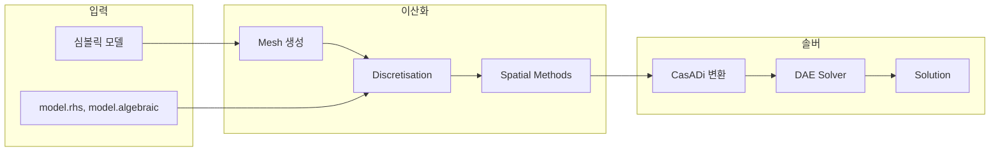
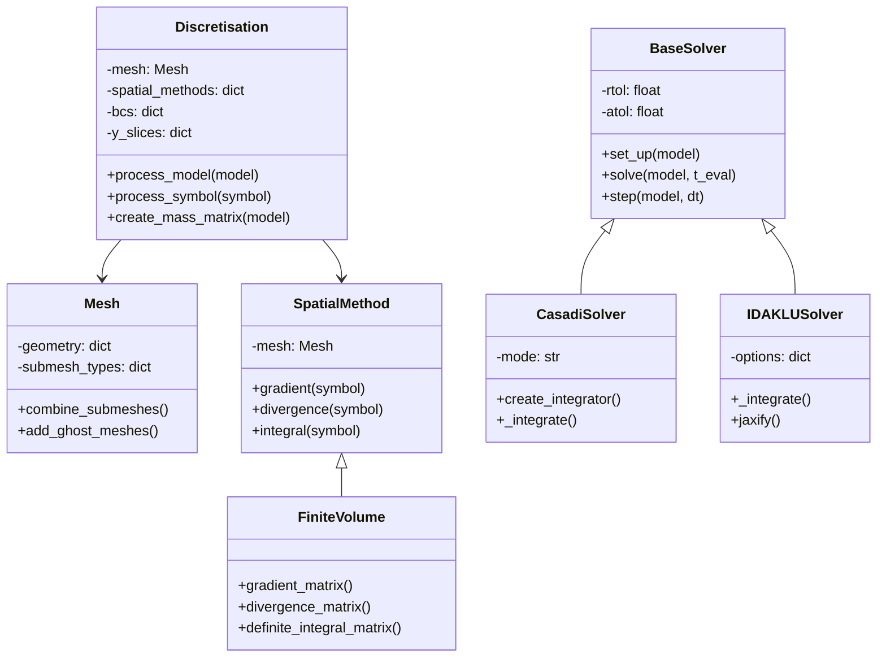
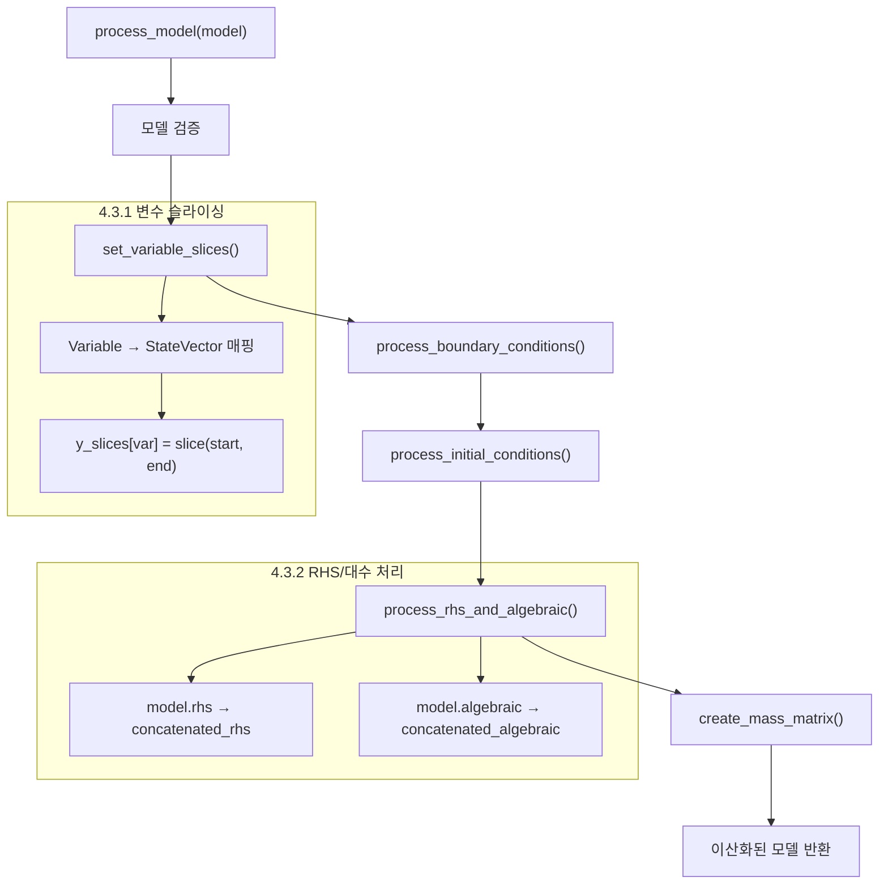
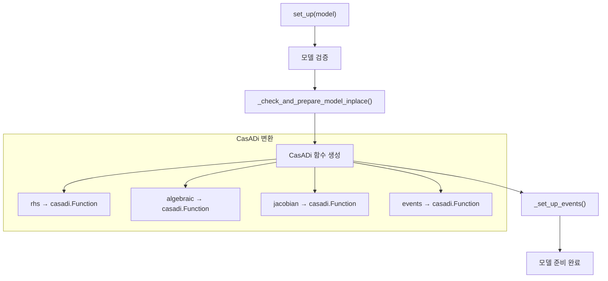
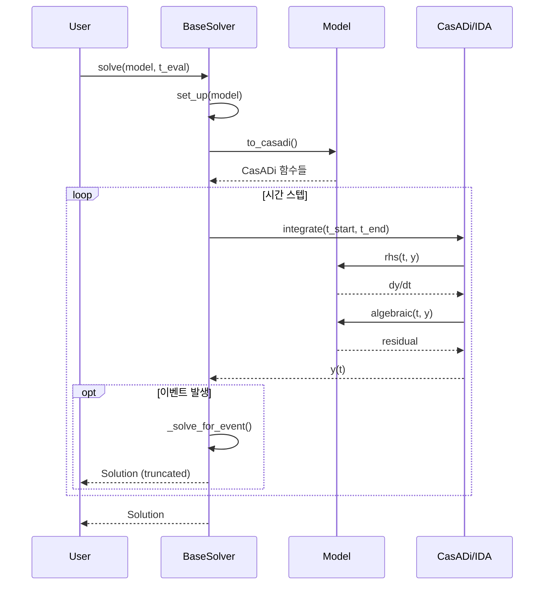
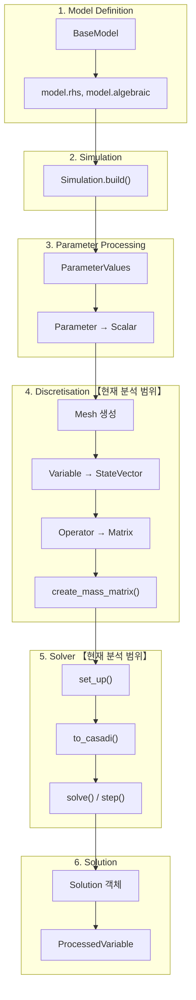
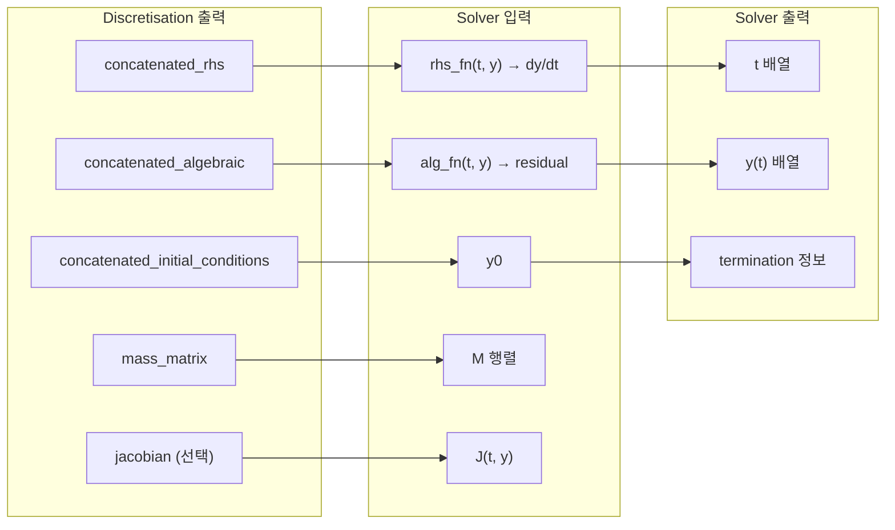

# Phase 3: 이산화 (Discretisation) & 솔버 (Solver) 분석

> **분석 대상**: PyBaMM의 이산화 및 솔버 시스템
> **분석 목적**: 심볼릭 모델이 수치 해로 변환되는 전 과정 이해
> **작성일**: 2026-01-13

---

## 목차

1. [개요](#1-개요)
2. [파일 구조](#2-파일-구조)
3. [Mesh 시스템](#3-mesh-시스템)
4. [Discretisation 클래스](#4-discretisation-클래스)
5. [Spatial Methods](#5-spatial-methods)
6. [Solver 시스템](#6-solver-시스템)
7. [Solution 클래스](#7-solution-클래스)
8. [Mathematical Mapping](#8-mathematical-mapping)
9. [Core Methods & Logic](#9-core-methods--logic)
10. [Variables & Parameters](#10-variables--parameters)
11. [Architecture Context](#11-architecture-context)

---

## 1. 개요

PyBaMM의 이산화 및 솔버 시스템은 심볼릭으로 정의된 PDE/DAE 모델을 수치적으로 풀 수 있는 형태로 변환합니다.



**핵심 변환:**

| 단계 | 변환 | 예시 |
|:----|:-----|:-----|
| Mesh | 연속 공간 → 이산 그리드 | $x \in [0, L] \rightarrow \{x_0, x_1, ..., x_n\}$ |
| Variable | 함수 → 벡터 | $c(x,t) \rightarrow \mathbf{c}(t) = [c_0, c_1, ..., c_n]^T$ |
| Gradient | 미분 → 행렬곱 | $\nabla c \rightarrow G \cdot \mathbf{c}$ |
| Divergence | 발산 → 행렬곱 | $\nabla \cdot \mathbf{N} \rightarrow D \cdot \mathbf{N}$ |
| Integral | 적분 → 내적 | $\int c \, dx \rightarrow \mathbf{w}^T \cdot \mathbf{c}$ |

---

## 2. 파일 구조

### 2.1 디렉토리 구조

```
src/pybamm/
├── discretisations/
│   ├── __init__.py
│   └── discretisation.py        # 1,391줄 - Discretisation 클래스
│
├── meshes/
│   ├── meshes.py                 # 461줄 - Mesh, SubMesh 클래스
│   ├── one_dimensional_submeshes.py
│   ├── two_dimensional_submeshes.py
│   └── zero_dimensional_submesh.py
│
├── spatial_methods/
│   ├── spatial_method.py         # 기본 SpatialMethod 클래스
│   ├── finite_volume.py          # 1,777줄 - FiniteVolume
│   ├── finite_volume_2d.py       # 2D FVM
│   ├── spectral_volume.py        # Spectral Volume Method
│   └── scikit_finite_element.py  # FEM (skfem)
│
└── solvers/
    ├── base_solver.py            # 1,843줄 - BaseSolver
    ├── casadi_solver.py          # 727줄 - CasadiSolver
    ├── idaklu_solver.py          # 1,013줄 - IDAKLUSolver
    ├── scipy_solver.py           # SciPy 백엔드
    ├── solution.py               # Solution 클래스
    └── processed_variable.py     # 후처리 변수
```

### 2.2 핵심 클래스 관계



---

## 3. Mesh 시스템

**파일**: [meshes.py](file:///c:/Users/Ryu/Python_project/data/PyBaMM-develop/src/pybamm/meshes/meshes.py)

### 3.1 Mesh 클래스

Mesh는 여러 SubMesh의 컨테이너로, 전체 계산 도메인을 관리합니다.

```python
class Mesh:
    def __init__(self, geometry, submesh_types, var_pts):
        """
        Parameters
        ----------
        geometry : dict
            기하학 정보 (예: {"negative electrode": {"x_n": {"min": 0, "max": l_n}}})
        submesh_types : dict
            각 도메인별 서브메쉬 생성기
        var_pts : dict
            각 차원별 메쉬 포인트 수 (예: {"x_n": 20, "r_n": 10})
        """
```

### 3.2 서브메쉬 유형

| SubMesh 유형 | 차원 | 설명 |
|:------------|:---:|:-----|
| `SubMesh0D` | 0D | 점(Lumped) 모델용 |
| `Uniform1DSubMesh` | 1D | 균일 간격 1D 그리드 |
| `Exponential1DSubMesh` | 1D | 지수 간격 (전극 표면 리파인) |
| `User1DSubMesh` | 1D | 사용자 정의 노드 |
| `SubMesh2D` | 2D | 2차원 그리드 |

### 3.3 메쉬 구조 수학적 정의

**1D 균일 메쉬:**

$$
x_i = x_{min} + i \cdot \Delta x, \quad i = 0, 1, ..., n
$$

$$
\Delta x = \frac{x_{max} - x_{min}}{n}
$$

**노드 (Nodes)**: 셀 중심점 $(x_{i+1/2})$
**엣지 (Edges)**: 셀 경계 $(x_i)$

```python
# 메쉬 구조
submesh.nodes    # 셀 중심점 배열 (길이 n)
submesh.edges    # 셀 경계 배열 (길이 n+1)
submesh.d_nodes  # 노드 간 거리 (길이 n-1)
submesh.d_edges  # 노드에서 경계까지 거리 (길이 n)
```

### 3.4 도메인별 기본 메쉬 포인트

```python
default_var_pts = {
    "x_n": 20,   # 음극 x 방향
    "x_s": 20,   # 분리막 x 방향
    "x_p": 20,   # 양극 x 방향
    "r_n": 20,   # 음극 입자 r 방향
    "r_p": 20,   # 양극 입자 r 방향
    "y": 10,     # 2D y 방향
    "z": 10,     # 3D z 방향
}
```

---

## 4. Discretisation 클래스

**파일**: [discretisation.py](file:///c:/Users/Ryu/Python_project/data/PyBaMM-develop/src/pybamm/discretisations/discretisation.py)  
**크기**: 1,391줄

### 4.1 클래스 구조

```python
class Discretisation:
    def __init__(
        self,
        mesh=None,
        spatial_methods=None,
        check_model=True,
        remove_independent_variables_from_rhs=False,
        resolve_coupled_variables=False,
    ):
        self._mesh = mesh
        self._spatial_methods = spatial_methods
        self._bcs = {}           # 경계 조건
        self.y_slices = {}       # 상태 벡터 슬라이스
        self._discretised_symbols = {}  # 캐시
```

### 4.2 핵심 메서드

| 메서드 | 라인 | 설명 |
|:------|-----:|:-----|
| `process_model()` | 117-299 | **핵심** - 전체 모델 이산화 |
| `set_variable_slices()` | 344-450 | 상태 벡터 인덱싱 설정 |
| `process_boundary_conditions()` | 549-597 | 경계 조건 처리 |
| `process_initial_conditions()` | 519-547 | 초기 조건 처리 |
| `process_rhs_and_algebraic()` | 654-695 | RHS/대수 방정식 처리 |
| `create_mass_matrix()` | 697-783 | 질량 행렬 생성 |
| `process_symbol()` | (이하) | 개별 심볼 이산화 |

### 4.3 process_model() 흐름



### 4.4 Variable → StateVector 변환

**변환 전 (심볼릭):**
```python
c_s = pybamm.Variable("Particle concentration", domain="negative particle")
```

**변환 후 (이산화):**
```python
# y = [c_s_n[0], c_s_n[1], ..., c_s_n[19], c_s_p[0], ..., c_e[0], ...]
# y_slices["Particle concentration"] = slice(0, 20)

# 이산화된 변수 = StateVector
c_s_disc = pybamm.StateVector(slice(0, 20))
```

### 4.5 질량 행렬 (Mass Matrix)

DAE 시스템 $M \cdot \dot{y} = f(t, y)$에서 질량 행렬 $M$:

$$
M = \begin{bmatrix}
I_{rhs} & 0 \\
0 & 0_{alg}
\end{bmatrix}
$$

- **ODE 변수** (rhs): $M_{ii} = 1$
- **대수 변수** (algebraic): $M_{ii} = 0$

```python
def create_mass_matrix(self, model):
    # RHS 변수: 단위 행렬 블록
    for var in sorted_model_variables:
        if var.domain == []:
            mass = 1.0
        else:
            mass = spatial_method.mass_matrix(var, self.bcs)
        mass_list.append(mass)
    
    # 대수 변수: 영 행렬 블록
    if model.algebraic.keys():
        mass_algebraic = csr_matrix((n_alg, n_alg))
        mass_list.append(mass_algebraic)
    
    return block_diag(mass_list)
```

---

## 5. Spatial Methods

### 5.1 SpatialMethod 기본 클래스

**파일**: [spatial_method.py](file:///c:/Users/Ryu/Python_project/data/PyBaMM-develop/src/pybamm/spatial_methods/spatial_method.py)

```python
class SpatialMethod:
    """공간 이산화 메서드의 기본 클래스"""
    
    def gradient(self, symbol, discretised_symbol, boundary_conditions):
        """그래디언트 연산자 이산화"""
        raise NotImplementedError
    
    def divergence(self, symbol, discretised_symbol, boundary_conditions):
        """발산 연산자 이산화"""
        raise NotImplementedError
    
    def integral(self, child, discretised_child, ...):
        """적분 연산자 이산화"""
        raise NotImplementedError
    
    def mass_matrix(self, symbol, boundary_conditions):
        """질량 행렬 생성"""
        return eye(npts)
```

### 5.2 FiniteVolume 클래스

**파일**: [finite_volume.py](file:///c:/Users/Ryu/Python_project/data/PyBaMM-develop/src/pybamm/spatial_methods/finite_volume.py)  
**크기**: 1,777줄

#### 5.2.1 Gradient Matrix

노드 값에서 엣지 값으로의 그래디언트 근사:

$$
\left(\nabla c\right)_{i+1/2} = \frac{c_{i+1} - c_i}{\Delta x_i}
$$

**행렬 형태:**
$$
\nabla c \approx G \cdot \mathbf{c}
$$

$$
G = \frac{1}{\Delta x} \begin{bmatrix}
-1 & 1 & 0 & \cdots \\
0 & -1 & 1 & \cdots \\
\vdots & & \ddots & \\
\end{bmatrix}_{(n-1) \times n}
$$

```python
def gradient_matrix(self, domain, domains):
    """
    Gradient matrix: grad(y) = (y[1:] - y[:-1])/dx
    """
    n = submesh.npts
    e = 1 / submesh.d_nodes  # 1/Δx
    
    sub_matrix_minus = diags([-1], [0], shape=(n-1, n))
    sub_matrix_plus = diags([1], [1], shape=(n-1, n))
    sub_matrix = (sub_matrix_minus + sub_matrix_plus) * e
    
    return sub_matrix
```

#### 5.2.2 Divergence Matrix

엣지 플럭스에서 노드로의 발산 근사:

$$
\left(\nabla \cdot N\right)_i = \frac{N_{i+1/2} - N_{i-1/2}}{\Delta x_i}
$$

**행렬 형태:**
$$
\nabla \cdot N \approx D \cdot \mathbf{N}
$$

$$
D = \frac{1}{\Delta x} \begin{bmatrix}
-1 & 1 & 0 & \cdots \\
0 & -1 & 1 & \cdots \\
\vdots & & \ddots & \\
\end{bmatrix}_{n \times (n+1)}
$$

```python
def divergence_matrix(self, domains):
    """
    Divergence matrix: div(N) = (N[1:] - N[:-1])/dx
    """
    n = submesh.npts + 1  # 엣지 개수
    e = 1 / submesh.d_edges
    
    sub_matrix_minus = diags([-1], [0], shape=(n-1, n))
    sub_matrix_plus = diags([1], [1], shape=(n-1, n))
    sub_matrix = (sub_matrix_minus + sub_matrix_plus) * e
    
    return sub_matrix
```

#### 5.2.3 구형 좌표계 처리

**구형 좌표계 발산:**
$$
\nabla \cdot \mathbf{N} = \frac{1}{r^2} \frac{\partial}{\partial r} \left( r^2 N_r \right)
$$

```python
def divergence(self, symbol, discretised_symbol, boundary_conditions):
    if submesh.coord_sys == "spherical polar":
        r_edges = submesh.edges
        # r^2 스케일링
        out = divergence_matrix @ ((r_edges**2) * discretised_symbol)
    elif submesh.coord_sys == "cylindrical polar":
        out = divergence_matrix @ (r_edges * discretised_symbol)
    else:
        out = divergence_matrix @ discretised_symbol
    return out
```

#### 5.2.4 정적분 행렬

$$
\int_a^b f(x) \, dx \approx \sum_{i=1}^{n} f_i \cdot \Delta x_i = \mathbf{w}^T \cdot \mathbf{f}
$$

```python
def definite_integral_matrix(self, child, ...):
    """
    Integration weights: w = d_edges (셀 폭)
    """
    d = submesh.d_edges
    if submesh.coord_sys == "spherical polar":
        # ∫ f r² dr
        r_edges = submesh.edges
        d = (r_edges[1:]**3 - r_edges[:-1]**3) / 3
    
    return Matrix(d.T)  # 행 벡터
```

#### 5.2.5 경계 조건 처리

**Ghost Node 방법:**

Neumann 조건 $\frac{\partial c}{\partial x}\big|_{x=0} = g$:
$$
\frac{c_1 - c_{ghost}}{\Delta x} = g \Rightarrow c_{ghost} = c_1 - g \cdot \Delta x
$$

Dirichlet 조건 $c|_{x=0} = c_0$:
$$
\frac{c_1 + c_{ghost}}{2} = c_0 \Rightarrow c_{ghost} = 2c_0 - c_1
$$

### 5.3 SpectralVolume 클래스

**파일**: [spectral_volume.py](file:///c:/Users/Ryu/Python_project/data/PyBaMM-develop/src/pybamm/spatial_methods/spectral_volume.py)

고차 정확도를 위한 Chebyshev 다항식 기반 이산화:
- 입자 도메인에서 주로 사용
- FVM보다 적은 노드로 높은 정확도

---

## 6. Solver 시스템

### 6.1 BaseSolver 클래스

**파일**: [base_solver.py](file:///c:/Users/Ryu/Python_project/data/PyBaMM-develop/src/pybamm/solvers/base_solver.py)  
**크기**: 1,843줄

```python
class BaseSolver:
    def __init__(
        self,
        method=None,
        rtol=1e-6,           # 상대 허용오차
        atol=1e-6,           # 절대 허용오차
        root_method=None,    # 이벤트 검출 방법
        root_tol=1e-6,       # 이벤트 허용오차
        extrap_tol=None,     # 외삽 허용오차
        output_variables=None,
    ):
```

#### 6.1.1 주요 메서드

| 메서드 | 라인 | 설명 |
|:------|-----:|:-----|
| `set_up()` | 151-318 | 모델 준비 (Jacobian 등) |
| `solve()` | (이하) | 전체 시간 구간 풀이 |
| `step()` | (이하) | 단일 시간 스텝 |
| `_set_up_events()` | 484-644 | 이벤트 함수 설정 |
| `_set_consistent_initialization()` | 646-671 | 일관된 초기화 |

#### 6.1.2 set_up() 흐름



### 6.2 CasadiSolver

**파일**: [casadi_solver.py](file:///c:/Users/Ryu/Python_project/data/PyBaMM-develop/src/pybamm/solvers/casadi_solver.py)  
**크기**: 727줄

#### 6.2.1 솔버 모드

```python
class CasadiSolver(BaseSolver):
    def __init__(
        self,
        mode="safe",  # "fast", "safe", "old safe", "fast with events"
        rtol=1e-6,
        atol=1e-6,
        root_method="casadi",
        max_step_decrease_count=5,
        dt_max=None,
        ...
    ):
```

| 모드 | 설명 | 사용 시기 |
|:----|:-----|:---------|
| `"fast"` | 이벤트 무시, 직접 적분 | 성능 중요, 이벤트 없음 |
| `"safe"` | 이벤트 검출 + 적응 스텝 | **기본값**, 안정적 |
| `"old safe"` | 레거시 safe 모드 | 호환성 |
| `"fast with events"` | 빠른 이벤트 처리 | 실험적 |

#### 6.2.2 create_integrator()

CasADi의 `integrator` 함수 생성:

```python
def create_integrator(self, model, inputs, t_eval=None, use_event_switch=False):
    """
    DAE 시스템 정의:
        x' = rhs(t, x, z, p)
        0  = alg(t, x, z, p)
    """
    # CasADi 심볼 정의
    t = casadi.MX.sym("t")
    x = casadi.MX.sym("x", model.len_rhs)
    z = casadi.MX.sym("z", model.len_alg)
    p = casadi.MX.sym("p", n_inputs)
    
    # RHS 함수
    rhs = model.casadi_rhs(t, x, z, p)
    algebraic = model.casadi_algebraic(t, x, z, p)
    
    # DAE 정의
    dae = {
        "t": t,
        "x": x,
        "z": z,
        "p": p,
        "ode": rhs,
        "alg": algebraic,
    }
    
    # 적분기 생성 (IDAS 솔버 사용)
    integrator = casadi.integrator("solver", "idas", dae, options)
    return integrator
```

### 6.3 IDAKLUSolver

**파일**: [idaklu_solver.py](file:///c:/Users/Ryu/Python_project/data/PyBaMM-develop/src/pybamm/solvers/idaklu_solver.py)  
**크기**: 1,013줄

#### 6.3.1 특징

- **SUNDIALS IDA** 솔버 + **KLU** 희소 선형 솔버
- C++ 구현으로 높은 성능
- JAX 백엔드 지원 (자동 미분)

```python
class IDAKLUSolver(BaseSolver):
    def __init__(
        self,
        rtol=1e-4,
        atol=1e-6,
        root_method="casadi",
        output_variables=None,
        options=None,
    ):
        # 기본 옵션
        self._options = {
            "print_stats": False,
            "jacobian": "dense",  # "dense", "sparse", "matrix-free"
            "num_threads": 1,
            "linear_solver": "SUNLinSol_KLU",
            ...
        }
```

#### 6.3.2 옵션 상세

| 옵션 | 기본값 | 설명 |
|:----|:------|:-----|
| `jacobian` | `"dense"` | Jacobian 계산 방식 |
| `linear_solver` | `"SUNLinSol_KLU"` | 선형 솔버 |
| `num_threads` | 1 | 병렬 스레드 수 |
| `max_num_steps` | 500 | 최대 스텝 수 |
| `max_order_bdf` | 5 | BDF 최대 차수 |

#### 6.3.3 _integrate() 흐름

```python
def _integrate(self, model, t_eval, inputs_list=None, ...):
    # 1. 초기 조건 설정
    y0 = model.y0
    ydot0 = self._rhs_dot_consistent_initialization(y0, model, t0)
    
    # 2. 솔버 호출 (C++ 바인딩)
    sol = idaklu.solve(
        t_eval=t_eval,
        y0=y0,
        ydot0=ydot0,
        rhs=model.casadi_rhs,
        jac=model.casadi_jacobian,
        inputs=inputs,
        options=self._options,
    )
    
    # 3. 후처리
    return self._post_process_solution(sol, model)
```

### 6.4 솔버 비교

| 특성 | CasadiSolver | IDAKLUSolver | ScipySolver |
|:----|:------------|:-------------|:------------|
| **백엔드** | CasADi IDAS | SUNDIALS IDA + KLU | SciPy ode |
| **언어** | Python + C | C++ | Python |
| **DAE 지원** | ✅ | ✅ | ⚠️ (ODE만) |
| **희소 행렬** | ✅ | ✅ (KLU) | ❌ |
| **자동 미분** | ✅ | ✅ (JAX) | ❌ |
| **병렬화** | ❌ | ✅ | ❌ |
| **상대 속도** | 중간 | **빠름** | 느림 |

---

## 7. Solution 클래스

**파일**: [solution.py](file:///c:/Users/Ryu/Python_project/data/PyBaMM-develop/src/pybamm/solvers/solution.py)

### 7.1 클래스 구조

```python
class Solution:
    def __init__(
        self,
        t,                    # 시간 배열
        y,                    # 상태 벡터 배열 (n_states x n_times)
        model,                # 모델 참조
        inputs_dict,          # 입력 파라미터
        t_event=None,         # 이벤트 시간
        y_event=None,         # 이벤트 시 상태
        termination=None,     # 종료 이유
    ):
```

### 7.2 변수 접근

```python
# 변수 이름으로 접근
voltage = sol["Voltage [V]"]

# 시간에 따른 값
voltage_values = voltage(t=np.linspace(0, 3600, 100))

# 공간-시간에 따른 값 (2D 변수)
c_e = sol["Electrolyte concentration [mol.m-3]"]
c_e_values = c_e(t=1800, x=np.linspace(0, 1e-4, 50))
```

### 7.3 ProcessedVariable

**파일**: [processed_variable.py](file:///c:/Users/Ryu/Python_project/data/PyBaMM-develop/src/pybamm/solvers/processed_variable.py)

```python
class ProcessedVariable:
    """
    솔루션에서 추출한 처리된 변수.
    시간/공간 보간 지원.
    """
    
    def __call__(self, t=None, x=None, r=None, y=None, z=None):
        """변수 값 평가"""
        # 시간 보간
        # 공간 보간 (필요시)
        return interpolated_values
```

---

## 8. Mathematical Mapping

### 8.1 이산화 수학 요약

| 연속 연산자 | 코드 | 이산화 형태 | 행렬 크기 |
|:----------|:-----|:----------|:---------|
| $c(x)$ | `Variable` | $\mathbf{c} \in \mathbb{R}^n$ | (n,) |
| $\nabla c$ | `pybamm.grad(c)` | $G \cdot \mathbf{c}$ | (n-1, n) |
| $\nabla \cdot \mathbf{N}$ | `pybamm.div(N)` | $D \cdot \mathbf{N}$ | (n, n+1) |
| $\nabla^2 c$ | `pybamm.laplacian(c)` | $D \cdot G \cdot \mathbf{c}$ | (n, n) |
| $\int_a^b c \, dx$ | `pybamm.Integral(c)` | $\mathbf{w}^T \cdot \mathbf{c}$ | (1, n) |
| $\frac{\partial c}{\partial t}$ | `VariableDot` | $\dot{\mathbf{c}}$ (솔버 내부) | (n,) |

### 8.2 DAE 시스템 형태

**일반형:**
$$
M \cdot \frac{d\mathbf{y}}{dt} = \mathbf{f}(t, \mathbf{y}, \mathbf{p})
$$

**Semi-explicit 형:**
$$
\frac{d\mathbf{y}_d}{dt} = \mathbf{f}(t, \mathbf{y}_d, \mathbf{y}_a, \mathbf{p})
$$
$$
\mathbf{0} = \mathbf{g}(t, \mathbf{y}_d, \mathbf{y}_a, \mathbf{p})
$$

**PyBaMM 구현:**
```python
# 상태 벡터 분할
y_d = y[:model.len_rhs]        # 미분 변수
y_a = y[model.len_rhs:]        # 대수 변수

# 방정식 평가
rhs = model.concatenated_rhs(t, y, inputs)       # f(t, y)
algebraic = model.concatenated_algebraic(t, y, inputs)  # g(t, y)
```

### 8.3 Jacobian 행렬

솔버 수렴을 위한 Jacobian:

$$
J = \frac{\partial}{\partial \mathbf{y}} \begin{bmatrix} \mathbf{f} \\ \mathbf{g} \end{bmatrix}
= \begin{bmatrix}
\frac{\partial \mathbf{f}}{\partial \mathbf{y}_d} & \frac{\partial \mathbf{f}}{\partial \mathbf{y}_a} \\
\frac{\partial \mathbf{g}}{\partial \mathbf{y}_d} & \frac{\partial \mathbf{g}}{\partial \mathbf{y}_a}
\end{bmatrix}
$$

```python
# CasADi 자동 미분
jacobian_rhs = casadi.jacobian(rhs, y)
jacobian_alg = casadi.jacobian(algebraic, y)
jacobian = casadi.vertcat(jacobian_rhs, jacobian_alg)
```

### 8.4 경계 조건 수학

| 조건 유형 | 수학 형태 | Ghost Node |
|:---------|:---------|:-----------|
| **Dirichlet** | $c\big|_{x=0} = c_0$ | $c_{ghost} = 2c_0 - c_1$ |
| **Neumann** | $\frac{\partial c}{\partial x}\big|_{x=0} = g$ | $c_{ghost} = c_1 - g \cdot \Delta x$ |
| **Robin** | $a \cdot c + b \cdot \frac{\partial c}{\partial x} = g$ | 조합 |

---

## 9. Core Methods & Logic

### 9.1 Discretisation.process_model() 상세

```python
def process_model(self, model, inplace=True, ...):
    """
    전체 모델 이산화 파이프라인
    
    1. 사전 검증
    2. 변수 슬라이싱 설정
    3. 경계 조건 처리
    4. 초기 조건 이산화
    5. RHS/대수 방정식 이산화
    6. 질량 행렬 생성
    """
    
    # 1. 변수 슬라이싱 - 상태 벡터에서 각 변수의 위치 결정
    variables = list(model.rhs.keys()) + list(model.algebraic.keys())
    self.set_variable_slices(variables)
    # 결과: y_slices = {c_s_n: slice(0, 20), c_s_p: slice(20, 40), ...}
    
    # 2. 경계 조건 처리
    self._bcs = self.process_boundary_conditions(model)
    
    # 3. 초기 조건 이산화
    ics, concat_ics = self.process_initial_conditions(model)
    model_disc.concatenated_initial_conditions = concat_ics
    
    # 4. RHS/대수 이산화 (핵심!)
    rhs, concat_rhs, alg, concat_alg = self.process_rhs_and_algebraic(model)
    model_disc.concatenated_rhs = concat_rhs      # dy/dt = f
    model_disc.concatenated_algebraic = concat_alg # 0 = g
    
    # 5. 길이 저장
    model_disc.len_rhs = concat_rhs.size
    model_disc.len_alg = concat_alg.size
    
    # 6. 질량 행렬 생성
    model_disc.mass_matrix, model_disc.mass_matrix_inv = self.create_mass_matrix(model_disc)
    
    return model_disc
```

### 9.2 process_symbol() 재귀 처리

```python
def process_symbol(self, symbol):
    """
    개별 심볼의 이산화 (재귀적)
    """
    # 캐시 확인
    if symbol in self._discretised_symbols:
        return self._discretised_symbols[symbol]
    
    # Variable → StateVector
    if isinstance(symbol, pybamm.Variable):
        return pybamm.StateVector(self.y_slices[symbol])
    
    # Gradient → gradient_matrix @ discretised_child
    elif isinstance(symbol, pybamm.Gradient):
        disc_child = self.process_symbol(symbol.child)
        return self.spatial_methods[domain].gradient(symbol, disc_child, self.bcs)
    
    # Divergence → divergence_matrix @ discretised_child
    elif isinstance(symbol, pybamm.Divergence):
        disc_child = self.process_symbol(symbol.child)
        return self.spatial_methods[domain].divergence(symbol, disc_child, self.bcs)
    
    # BinaryOperator → 재귀 처리
    elif isinstance(symbol, pybamm.BinaryOperator):
        left = self.process_symbol(symbol.left)
        right = self.process_symbol(symbol.right)
        return symbol._binary_new_copy(left, right)
    
    # ... 기타 심볼 유형
```

### 9.3 BaseSolver.solve() 흐름



### 9.4 BaseSolver.step() 메서드

연속 시뮬레이션 또는 Experiment에서 사용:

```python
def step(self, old_solution, model, dt, npts=2, save=True, inputs=None):
    """
    단일 시간 스텝 수행
    
    Parameters
    ----------
    old_solution : Solution
        이전 시간 스텝의 솔루션 (초기 조건으로 사용)
    model : BaseModel
        시뮬레이션할 모델
    dt : float
        시간 스텝 크기 (초)
    npts : int
        출력 포인트 수
    """
    # 이전 솔루션에서 초기 조건 설정
    y0 = old_solution.y[:, -1]
    t_start = old_solution.t[-1]
    t_end = t_start + dt
    
    # 새 t_eval 생성
    t_eval = np.linspace(t_start, t_end, npts)
    
    # 단일 구간 적분
    new_solution = self._integrate(model, t_eval, inputs)
    
    # 솔루션 병합
    if save:
        return old_solution + new_solution
    else:
        return new_solution
```

### 9.5 병렬 solve (IDAKLUSolver)

```python
# 여러 입력 세트로 병렬 실행
inputs_list = [
    {"C-rate": 0.5},
    {"C-rate": 1.0},
    {"C-rate": 2.0},
]

# nproc 지정 시 병렬 실행
solutions = solver.solve(model, t_eval, inputs=inputs_list, nproc=4)
# → 4개 프로세스로 3개 시뮬레이션 병렬 수행
```

---

## 10. Variables & Parameters

### 10.1 Discretisation 파라미터

| 파라미터 | 타입 | 기본값 | 설명 |
|:--------|:----|:------|:-----|
| `mesh` | Mesh | None | 공간 메쉬 |
| `spatial_methods` | dict | {} | 도메인별 이산화 방법 |
| `check_model` | bool | True | 모델 검증 수행 여부 |
| `remove_independent_variables` | bool | False | 독립 변수 RHS 제거 |

### 10.2 Solver 파라미터

| 파라미터 | CasadiSolver | IDAKLUSolver | 설명 |
|:--------|:------------|:-------------|:-----|
| `rtol` | 1e-6 | 1e-4 | 상대 허용오차 |
| `atol` | 1e-6 | 1e-6 | 절대 허용오차 |
| `root_method` | `"casadi"` | `"casadi"` | 이벤트 검출 방법 |
| `mode` | `"safe"` | - | 솔버 모드 |
| `dt_max` | 600 | - | 최대 시간 스텝 (초) |

### 10.3 허용오차 설정 가이드

| 정확도 요구 | rtol | atol | 사용 시기 |
|:----------|:-----|:-----|:---------|
| **빠른 추정** | 1e-3 | 1e-4 | 파라미터 탐색 |
| **표준** | 1e-6 | 1e-6 | 일반 시뮬레이션 |
| **고정밀** | 1e-8 | 1e-10 | 검증, 민감도 분석 |

---

## 11. Architecture Context

### 11.1 전체 파이프라인에서의 위치



### 11.2 Discretisation-Solver 인터페이스



### 11.3 도메인별 메쉬-이산화-솔버 연결

| 도메인 | 메쉬 유형 | Spatial Method | 변수 예시 |
|:------|:---------|:--------------|:---------|
| 음극 | Uniform1D | FiniteVolume | $c_e$, $\phi_s$, $\phi_e$ |
| 분리막 | Uniform1D | FiniteVolume | $c_e$, $\phi_e$ |
| 양극 | Uniform1D | FiniteVolume | $c_e$, $\phi_s$, $\phi_e$ |
| 음극 입자 | Uniform1D (r) | FiniteVolume/SpectralVolume | $c_s$ |
| 양극 입자 | Uniform1D (r) | FiniteVolume/SpectralVolume | $c_s$ |
| 전류 집전체 | SubMesh0D/1D/2D | ZeroDimensional/FVM | $\phi_{cc}$, $T$ |

---

## 파일 참조

| 파일 | 라인 수 | 핵심 내용 |
|:----|-------:|:---------|
| [discretisation.py](file:///c:/Users/Ryu/Python_project/data/PyBaMM-develop/src/pybamm/discretisations/discretisation.py) | 1,391 | Discretisation 클래스 |
| [meshes.py](file:///c:/Users/Ryu/Python_project/data/PyBaMM-develop/src/pybamm/meshes/meshes.py) | 461 | Mesh, SubMesh |
| [finite_volume.py](file:///c:/Users/Ryu/Python_project/data/PyBaMM-develop/src/pybamm/spatial_methods/finite_volume.py) | 1,777 | FiniteVolume |
| [base_solver.py](file:///c:/Users/Ryu/Python_project/data/PyBaMM-develop/src/pybamm/solvers/base_solver.py) | 1,843 | BaseSolver |
| [casadi_solver.py](file:///c:/Users/Ryu/Python_project/data/PyBaMM-develop/src/pybamm/solvers/casadi_solver.py) | 727 | CasadiSolver |
| [idaklu_solver.py](file:///c:/Users/Ryu/Python_project/data/PyBaMM-develop/src/pybamm/solvers/idaklu_solver.py) | 1,013 | IDAKLUSolver |
| [solution.py](file:///c:/Users/Ryu/Python_project/data/PyBaMM-develop/src/pybamm/solvers/solution.py) | ~1,000 | Solution |

---

**이전 분석**: [Phase2_모델_정의_분석.md](file:///c:/Users/Ryu/Python_project/data/PyBaMM-develop/examples/ryu/Phase2_모델_정의_분석.md)  
**다음 분석**: Phase 4 - 파라미터 및 실험 (Parameters & Experiment)
