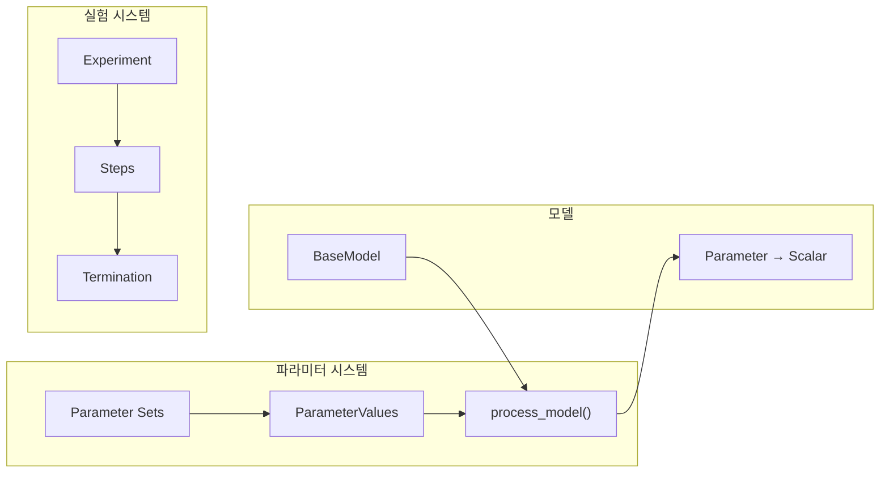
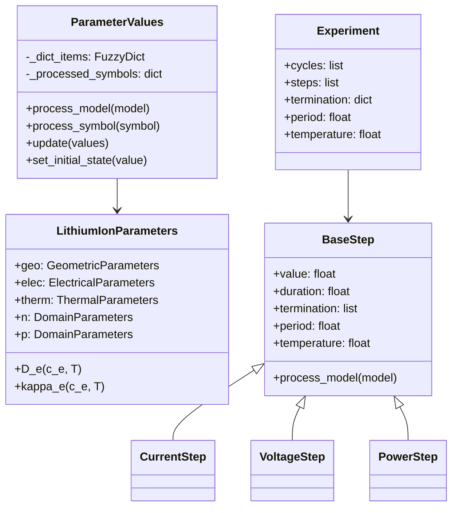
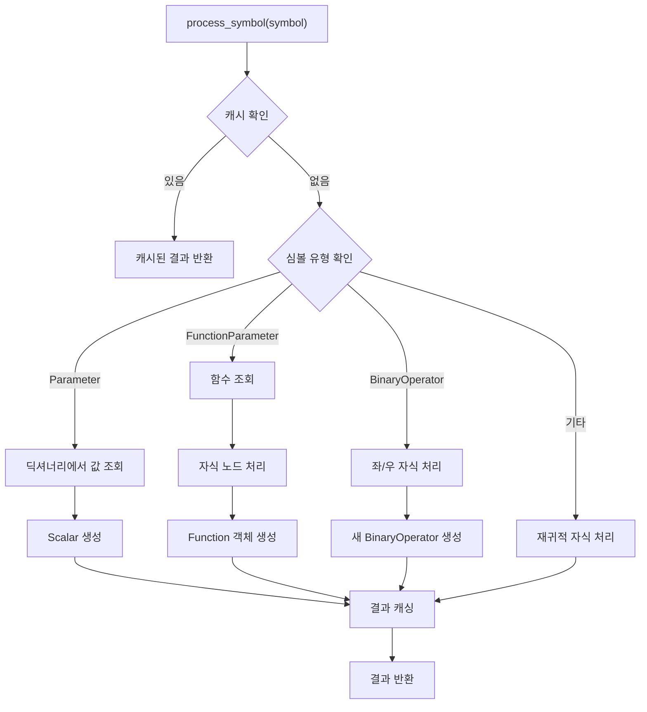
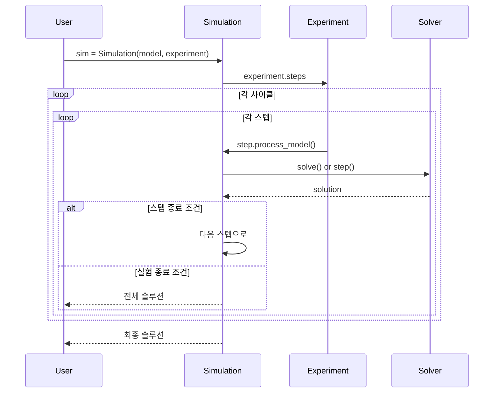
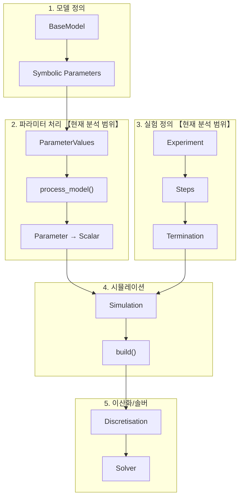
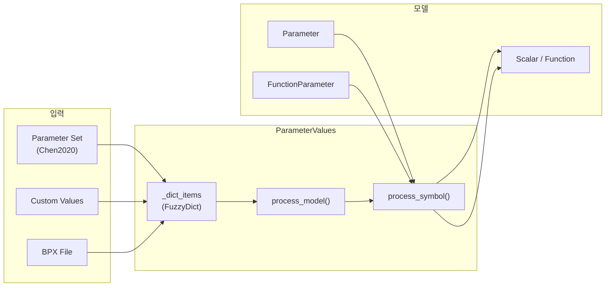
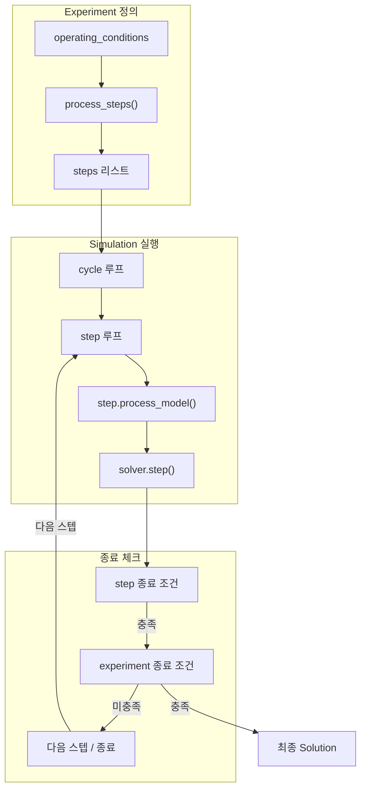

# Phase 4: 파라미터 (Parameters) & 실험 (Experiment) 분석

> **분석 대상**: PyBaMM의 파라미터 관리 및 실험 정의 시스템
> **분석 목적**: 물리 파라미터 설정과 실험 프로토콜 정의 방법 이해
> **작성일**: 2026-01-13

---

## 목차

1. [개요](#1-개요)
2. [파일 구조](#2-파일-구조)
3. [ParameterValues 클래스](#3-parametervalues-클래스)
4. [파라미터 세트 (Parameter Sets)](#4-파라미터-세트-parameter-sets)
5. [LithiumIonParameters 클래스](#5-lithiumionparameters-클래스)
6. [Experiment 클래스](#6-experiment-클래스)
7. [Step 시스템](#7-step-시스템)
8. [Mathematical Mapping](#8-mathematical-mapping)
9. [Core Methods & Logic](#9-core-methods--logic)
10. [Variables & Parameters](#10-variables--parameters)
11. [Architecture Context](#11-architecture-context)

---

## 1. 개요

PyBaMM의 파라미터 및 실험 시스템은 배터리 시뮬레이션의 입력을 관리합니다.



**핵심 구성:**

| 구성 요소 | 역할 | 예시 |
|:---------|:-----|:-----|
| **ParameterValues** | 모든 물리 파라미터 관리 | `"Electrode thickness [m]": 100e-6` |
| **Parameter Sets** | 사전 정의된 파라미터 조합 | `"Chen2020"`, `"Marquis2019"` |
| **Experiment** | 실험 프로토콜 정의 | CC-CV 충전, 방전 사이클 |
| **Step** | 개별 실험 단계 | `"Discharge at 1C for 1 hour"` |

---

## 2. 파일 구조

### 2.1 디렉토리 구조

```
src/pybamm/
├── parameters/
│   ├── parameter_values.py          # 1,493줄 - ParameterValues 클래스
│   ├── lithium_ion_parameters.py    # 849줄 - 리튬이온 파라미터 정의
│   ├── geometric_parameters.py      # 기하 파라미터
│   ├── thermal_parameters.py        # 열 파라미터
│   ├── electrical_parameters.py     # 전기 파라미터
│   ├── bpx.py                        # BPX 표준 지원
│   └── constants.py                  # 물리 상수
│
├── input/
│   └── parameters/
│       ├── lithium_ion/              # 25개 파라미터 세트
│       │   ├── Chen2020.py
│       │   ├── Marquis2019.py
│       │   └── ...
│       ├── lead_acid/
│       └── sodium_ion/
│
└── experiment/
    ├── experiment.py                 # 242줄 - Experiment 클래스
    └── step/
        ├── base_step.py              # 646줄 - BaseStep 클래스
        ├── steps.py                  # 스텝 함수들
        └── step_termination.py       # 종료 조건
```

### 2.2 핵심 클래스 관계



---

## 3. ParameterValues 클래스

**파일**: [parameter_values.py](file:///c:/Users/Ryu/Python_project/data/PyBaMM-develop/src/pybamm/parameters/parameter_values.py)  
**크기**: 1,493줄

### 3.1 클래스 구조

```python
class ParameterValues:
    """시뮬레이션을 위한 파라미터 값 관리"""
    
    # 물리 상수 (deprecated, pybamm.constants 사용 권장)
    _DEPRECATED_CONSTANTS = {
        "Ideal gas constant [J.K-1.mol-1]": "pybamm.constants.R",
        "Faraday constant [C.mol-1]": "pybamm.constants.F",
        "Boltzmann constant [J.K-1]": "pybamm.constants.k_b",
        "Electron charge [C]": "pybamm.constants.q_e",
    }
    
    def __init__(self, values):
        # 물리 상수 기본값 설정
        self._dict_items = pybamm.FuzzyDict({
            "Ideal gas constant [J.K-1.mol-1]": pybamm.constants.R.value,
            "Faraday constant [C.mol-1]": pybamm.constants.F.value,
            ...
        })
        
        # 파라미터 세트 또는 딕셔너리로 초기화
        if isinstance(values, dict):
            self.update(values, check_already_exists=False)
        elif values in pybamm.parameter_sets.keys():
            self.update(pybamm.parameter_sets[values])
```

### 3.2 주요 메서드

| 메서드 | 라인 | 설명 |
|:------|-----:|:-----|
| `__init__()` | 60-98 | 파라미터 딕셔너리 초기화 |
| `process_model()` | 485-613 | **핵심** - 모델에 파라미터 적용 |
| `process_symbol()` | 725-749 | 개별 심볼 파라미터 처리 |
| `update()` | 281-359 | 파라미터 업데이트 |
| `set_initial_state()` | 361-378 | 초기 상태 설정 |
| `create_from_bpx()` | 175-194 | BPX 파일에서 생성 |

### 3.3 파라미터 접근 방식

```python
# 1. 파라미터 세트로 초기화
param = pybamm.ParameterValues("Chen2020")

# 2. 개별 값 접근
thickness = param["Negative electrode thickness [m]"]

# 3. 퍼지 검색 (유사 키 찾기)
param.search("thickness")  # 관련된 모든 파라미터 출력

# 4. 파라미터 업데이트
param.update({"Negative electrode thickness [m]": 85e-6})

# 5. 입력 파라미터로 설정 (런타임 변경 가능)
param.update({
    "Current function [A]": "[input]"
}, check_already_exists=False)
```

### 3.4 BPX 표준 지원

[BPX (Battery Parameterisation Exchange)](https://bpxstandard.com/) 표준 파일 지원:

```python
# BPX 파일에서 ParameterValues 생성
param = pybamm.ParameterValues.create_from_bpx("my_battery.json")

# 또는 BPX 딕셔너리에서 직접 생성
param = pybamm.ParameterValues.create_from_bpx_obj(bpx_dict, target_soc=0.8)
```

---

## 4. 파라미터 세트 (Parameter Sets)

### 4.1 사전 정의된 파라미터 세트

**디렉토리**: `src/pybamm/input/parameters/lithium_ion/`

| 파라미터 세트 | 전극 화학 | 특징 |
|:------------|:---------|:-----|
| `Chen2020` | NMC/Graphite | 실험 검증, 완전한 파라미터 |
| `Marquis2019` | LCO/Graphite | 학술 논문 기반 |
| `Ecker2015` | NMC/Graphite | 온도 의존성 포함 |
| `Ai2020` | LFP/Graphite | 기능 기반 파라미터 |
| `OKane2022` | NMC/Graphite/SiOx | 실리콘 복합 음극 |
| `MSMR_Example` | - | MSMR 모델 예시 |

### 4.2 파라미터 세트 구조

```python
# 예: Chen2020.py
def get_parameter_values():
    return {
        # 전극 기하학
        "Negative electrode thickness [m]": 85.2e-6,
        "Separator thickness [m]": 12e-6,
        "Positive electrode thickness [m]": 75.6e-6,
        
        # 입자 크기
        "Negative particle radius [m]": 5.86e-6,
        "Positive particle radius [m]": 5.22e-6,
        
        # 전기화학 파라미터
        "Maximum concentration in negative electrode [mol.m-3]": 33133,
        "Maximum concentration in positive electrode [mol.m-3]": 63104,
        
        # 수송 특성 (함수로 정의)
        "Negative particle diffusivity [m2.s-1]": diffusivity_function,
        "Electrolyte diffusivity [m2.s-1]": electrolyte_diffusivity,
        
        # OCP 함수
        "Negative electrode OCP [V]": negative_ocp_function,
        "Positive electrode OCP [V]": positive_ocp_function,
        
        # 온도
        "Reference temperature [K]": 298.15,
        
        # 인용
        "citations": ["Chen2020"],
    }
```

### 4.3 사용 가능한 파라미터 세트 목록

```python
# 모든 파라미터 세트 확인
print(list(pybamm.parameter_sets.keys()))
```

---

## 5. LithiumIonParameters 클래스

**파일**: [lithium_ion_parameters.py](file:///c:/Users/Ryu/Python_project/data/PyBaMM-develop/src/pybamm/parameters/lithium_ion_parameters.py)  
**크기**: 849줄

### 5.1 클래스 구조

심볼릭 파라미터 객체를 제공하여 모델 정의에 사용됩니다.

```python
class LithiumIonParameters:
    """리튬이온 배터리 모델용 표준 파라미터"""
    
    def __init__(self, options=None):
        self.options = options or {}
        
        # 하위 파라미터 객체
        self.geo = GeometricParameters(self.options)    # 기하 파라미터
        self.elec = ElectricalParameters()              # 전기 파라미터
        self.therm = ThermalParameters(self.options)    # 열 파라미터
        
        # 도메인별 파라미터
        self.n = DomainLithiumIonParameters("negative", self)  # 음극
        self.s = DomainLithiumIonParameters("separator", self) # 분리막
        self.p = DomainLithiumIonParameters("positive", self)  # 양극
        
        self._set_parameters()
```

### 5.2 핵심 파라미터 정의

```python
def _set_parameters(self):
    # 전해질 초기 농도
    self.c_e_init = pybamm.Parameter(
        "Initial concentration in electrolyte [mol.m-3]"
    )
    
    # 온도
    self.T_ref = pybamm.Parameter("Reference temperature [K]")
    self.T_amb = pybamm.Parameter("Ambient temperature [K]")
    self.T_init = pybamm.Parameter("Initial temperature [K]")
    
    # 셀 용량
    self.Q = pybamm.Parameter("Nominal cell capacity [A.h]")
    
    # 전류 함수
    self.current = pybamm.FunctionParameter(
        "Current function [A]", {"Time [s]": pybamm.t}
    )
```

### 5.3 도메인별 파라미터 (DomainLithiumIonParameters)

```python
class DomainLithiumIonParameters:
    """전극 도메인별 파라미터"""
    
    def __init__(self, domain, main_param):
        self.domain = domain
        
        # 기하 파라미터 참조
        self.geo = getattr(main_param.geo, domain[0])
        
        # 입자 파라미터
        self.prim = ParticleLithiumIonParameters("primary", self)
        if options["particle phases"] == 2:
            self.sec = ParticleLithiumIonParameters("secondary", self)
```

### 5.4 물리량 함수

| 함수 | 수학 | 설명 |
|:----|:-----|:-----|
| `D_e(c_e, T)` | $D_e(c_e, T)$ | 전해질 확산 계수 |
| `kappa_e(c_e, T)` | $\kappa_e(c_e, T)$ | 전해질 이온 전도도 |
| `t_plus(c_e, T)` | $t_+^0(c_e, T)$ | 양이온 이동수 |
| `chi(c_e, T)` | $\chi(c_e, T)$ | 열역학 인자 |

---

## 6. Experiment 클래스

**파일**: [experiment.py](file:///c:/Users/Ryu/Python_project/data/PyBaMM-develop/src/pybamm/experiment/experiment.py)  
**크기**: 242줄

### 6.1 클래스 구조

```python
class Experiment:
    """실험 조건 정의"""
    
    def __init__(
        self,
        operating_conditions: list[str | BaseStep],
        period: str | None = None,       # 출력 주기 (e.g., "1 minute")
        temperature: float | None = None, # 실험 온도
        termination: list[str] | None = None,  # 전체 종료 조건
    ):
        # 사이클로 그룹화
        cycles = []
        for cycle in operating_conditions:
            if not isinstance(cycle, tuple):
                cycle = (cycle,)
            cycles.append(cycle)
        self.cycles = cycles
        
        # 스텝 처리
        self.steps = self.process_steps(steps_unprocessed, period, temperature)
        
        # 종료 조건 파싱
        self.termination = self.read_termination(termination)
```

### 6.2 실험 정의 예시

```python
# 기본 CC-CV 충전
experiment = pybamm.Experiment([
    "Discharge at 1C until 2.5 V",
    "Rest for 30 minutes",
    "Charge at 0.5C until 4.2 V",
    "Hold at 4.2 V until C/50",
    "Rest for 30 minutes",
])

# 사이클 반복
experiment = pybamm.Experiment([
    (
        "Discharge at 1C until 2.5 V",
        "Charge at 1C until 4.2 V",
        "Hold at 4.2 V until C/20",
    )
] * 100)  # 100 사이클 반복

# 온도 및 종료 조건 포함
experiment = pybamm.Experiment(
    operating_conditions=[
        "Discharge at 2C until 2.5 V",
        "Charge at 1C until 4.2 V",
    ],
    temperature=298.15,  # 25°C
    termination=["80% capacity"],  # 80% 용량 도달 시 종료
)
```

### 6.3 종료 조건

| 조건 유형 | 예시 | 설명 |
|:---------|:-----|:-----|
| **용량** | `"80% capacity"` | 초기 용량의 80%까지 감소 |
| **용량** | `"4 Ah capacity"` | 4 Ah 용량 도달 |
| **전압** | `"2.5 V"` | 전압 도달 |
| **시간** | `"2 hours"` | 시간 경과 |

```python
@staticmethod
def read_termination(termination):
    """종료 조건 파싱"""
    termination_dict = {}
    
    for term in termination:
        if term.endswith("capacity"):
            if term.endswith("%"):
                termination_dict["capacity"] = (float(value), "%")
            else:
                termination_dict["capacity"] = (float(value), "Ah")
        elif term.endswith("V"):
            termination_dict["voltage"] = (float(value), "V")
    
    return termination_dict
```

---

## 7. Step 시스템

**파일**: [base_step.py](file:///c:/Users/Ryu/Python_project/data/PyBaMM-develop/src/pybamm/experiment/step/base_step.py)  
**크기**: 646줄

### 7.1 BaseStep 클래스

```python
class BaseStep:
    """실험 스텝 기반 클래스"""
    
    def __init__(
        self,
        value,              # 스텝 값 (전류, 전압, 전력 등)
        duration=None,      # 지속 시간
        termination=None,   # 종료 조건
        period=None,        # 출력 주기
        temperature=None,   # 온도
        tags=None,          # 태그 (분석용)
        start_time=None,    # 시작 시간
        description=None,   # 설명
        direction=None,     # 충전/방전 방향
        skip_ok=True,       # 스킵 허용 여부
    ):
```

### 7.2 스텝 유형

| 스텝 함수 | 설명 | 예시 |
|:---------|:-----|:-----|
| `pybamm.step.current()` | 정전류 스텝 | `pybamm.step.current(-1.0, duration="1 hour")` |
| `pybamm.step.c_rate()` | C-rate 스텝 | `pybamm.step.c_rate(-1, duration="1 hour")` |
| `pybamm.step.voltage()` | 정전압 스텝 | `pybamm.step.voltage(4.2, duration="2 hours")` |
| `pybamm.step.power()` | 정전력 스텝 | `pybamm.step.power(-10, duration="30 min")` |
| `pybamm.step.resistance()` | 정저항 스텝 | `pybamm.step.resistance(100)` |
| `pybamm.step.string()` | 문자열 파싱 | `pybamm.step.string("Discharge at 1C")` |

### 7.3 스텝 문자열 문법

```python
# 기본 형식: "[Action] at [Value] [for Duration] [or] [until Termination]"

# 전류 기반
"Discharge at 1C for 1 hour"
"Charge at 2 A until 4.2 V"
"Discharge at C/3 for 2 hours or until 2.5 V"

# 전압 기반
"Hold at 4.2 V until C/50"
"Hold at 4.2 V for 30 minutes"

# 전력 기반
"Discharge at 10 W for 20 minutes"
"Charge at 200 mW for 45 minutes"

# 휴식
"Rest for 10 minutes"
"Rest for 1 hour"
```

### 7.4 스텝 종료 조건

**파일**: [step_termination.py](file:///c:/Users/Ryu/Python_project/data/PyBaMM-develop/src/pybamm/experiment/step/step_termination.py)

| 종료 조건 | 문법 | 예시 |
|:---------|:-----|:-----|
| **전압** | `until X V` | `"until 4.2 V"` |
| **전류** | `until X A` or `until C/X` | `"until C/50"`, `"until 100 mA"` |
| **시간** | `for X hours/minutes/seconds` | `"for 2 hours"` |
| **조합** | `for X or until Y` | `"for 1 hour or until 2.5 V"` |

---

## 8. Mathematical Mapping

### 8.1 파라미터 → 스칼라 변환

`process_symbol()`에서 `Parameter` → `Scalar` 변환:

$$
\text{Parameter}(\text{"name"}) \rightarrow \text{Scalar}(\text{value})
$$

```python
# 심볼릭 파라미터
l_n = pybamm.Parameter("Negative electrode thickness [m]")

# 파라미터 처리 후
l_n_processed = param.process_symbol(l_n)
# → pybamm.Scalar(85e-6, name="Negative electrode thickness [m]")
```

### 8.2 FunctionParameter 처리

함수형 파라미터 변환:

$$
\text{FunctionParameter}(D_s, [c_s, T]) \rightarrow D_s(c_s, T)
$$

```python
# 심볼릭 함수 파라미터
D_s = pybamm.FunctionParameter(
    "Negative particle diffusivity [m2.s-1]",
    {"Particle concentration [mol.m-3]": c_s, "Temperature [K]": T}
)

# 파라미터 처리 후 - 실제 함수로 대체
D_s_processed = param.process_symbol(D_s)
# → pybamm.Function(diffusivity_func, c_s, T)
```

### 8.3 초기 상태 계산

SOC 기반 초기 stoichiometry 계산:

$$
x_{0\%} + \text{SOC} \cdot (x_{100\%} - x_{0\%}) = x_{\text{init}}
$$

```python
# 초기 상태 설정 (SOC 80%)
param.set_initial_state(0.8)
# → Initial concentration 자동 계산
```

### 8.4 실험 스텝의 수학적 제약

**전류 제어:**
$$
I(t) = I_{\text{set}} \quad \text{for } t \in [t_0, t_f]
$$

**전압 제어:**
$$
V(t) = V_{\text{set}} \quad \text{(algebraic constraint)}
$$

**전력 제어:**
$$
P(t) = I(t) \cdot V(t) = P_{\text{set}}
$$

**C-rate 변환:**
$$
I = \text{C-rate} \times Q_{\text{nominal}}
$$

---

## 9. Core Methods & Logic

### 9.1 ParameterValues.process_model() 상세

```python
def process_model(self, unprocessed_model, inplace=True):
    """
    모델에 파라미터 값 적용
    
    1. RHS 방정식 파라미터 처리
    2. 대수 방정식 파라미터 처리
    3. 초기 조건 파라미터 처리
    4. 경계 조건 파라미터 처리
    5. 변수 파라미터 처리
    6. 이벤트 파라미터 처리
    """
    
    # 1. RHS 처리
    new_rhs = {}
    for variable, equation in unprocessed_model.rhs.items():
        new_variable = self.process_symbol(variable)
        new_rhs[new_variable] = self.process_symbol(equation)
    model.rhs = new_rhs
    
    # 2. 대수 방정식 처리
    new_algebraic = {}
    for variable, equation in unprocessed_model.algebraic.items():
        new_variable = self.process_symbol(variable)
        new_algebraic[new_variable] = self.process_symbol(equation)
    model.algebraic = new_algebraic
    
    # 3-6. 유사하게 처리...
    
    model.is_parameterised = True
    return model
```

### 9.2 process_symbol() 재귀 처리



### 9.3 Experiment 실행 흐름



### 9.4 BaseStep.process_model()

```python
def process_model(self, model, parameter_values):
    """스텝별 모델 처리"""
    
    # 1. 스텝에 맞는 operating_mode 설정
    if self.type == "current":
        # 정전류 모드 - Current 변수 = 스텝 값
        new_parameter_values = parameter_values.copy()
        new_parameter_values.update({
            "Current function [A]": self.value
        })
    elif self.type == "voltage":
        # 정전압 모드 - 전압 제약 추가
        ...
    
    # 2. 온도 설정 (스텝에 지정된 경우)
    if self.temperature is not None:
        new_parameter_values.update({
            "Ambient temperature [K]": self.temperature
        })
    
    # 3. 모델에 파라미터 적용
    new_model = new_parameter_values.process_model(model.new_copy())
    
    # 4. 스텝 종료 이벤트 추가
    self.update_model_events(new_model)
    
    return new_model, new_parameter_values
```

---

## 10. Variables & Parameters

### 10.1 핵심 파라미터 카테고리

| 카테고리 | 예시 파라미터 | 단위 |
|:--------|:------------|:-----|
| **기하** | `Negative electrode thickness [m]` | m |
| | `Negative particle radius [m]` | m |
| | `Electrode width [m]` | m |
| **전기화학** | `Maximum concentration in negative electrode [mol.m-3]` | mol/m³ |
| | `Negative electrode conductivity [S.m-1]` | S/m |
| | `Negative electrode exchange-current density [A.m-2]` | A/m² |
| **수송** | `Electrolyte diffusivity [m2.s-1]` | m²/s |
| | `Electrolyte conductivity [S.m-1]` | S/m |
| | `Cation transference number` | - |
| **열** | `Reference temperature [K]` | K |
| | `Thermal conductivity [W.m-1.K-1]` | W/(m·K) |
| | `Specific heat capacity [J.kg-1.K-1]` | J/(kg·K) |
| **셀 수준** | `Nominal cell capacity [A.h]` | Ah |
| | `Lower voltage cut-off [V]` | V |
| | `Upper voltage cut-off [V]` | V |

### 10.2 함수형 파라미터

온도/농도 의존성을 갖는 파라미터:

```python
# 확산 계수 (농도, 온도 의존)
def negative_particle_diffusivity(sto, T):
    """
    Parameters
    ----------
    sto : stoichiometry (dimensionless)
    T : temperature [K]
    
    Returns
    -------
    D_s : diffusivity [m2/s]
    """
    D_ref = 3.3e-14
    E_a = 35000  # 활성화 에너지 [J/mol]
    return D_ref * np.exp(-E_a / pybamm.constants.R / T * (1 - T_ref/T))
```

### 10.3 Experiment 파라미터

| 파라미터 | 타입 | 기본값 | 설명 |
|:--------|:----|:------|:-----|
| `period` | str | `"1 minute"` | 출력 샘플링 주기 |
| `temperature` | float | None | 실험 온도 [K] |
| `termination` | list[str] | None | 전체 종료 조건 |

### 10.4 Step 파라미터

| 파라미터 | 타입 | 설명 |
|:--------|:----|:-----|
| `value` | float/function | 스텝 값 (전류, 전압 등) |
| `duration` | str | 지속 시간 |
| `termination` | str/list | 종료 조건 |
| `period` | str | 출력 주기 |
| `temperature` | float | 스텝별 온도 |
| `tags` | list[str] | 분석용 태그 |
| `direction` | str | `"charge"` 또는 `"discharge"` |

---

## 11. Architecture Context

### 11.1 전체 파이프라인에서의 위치



### 11.2 파라미터 흐름



### 11.3 실험 실행 흐름



### 11.4 스텝별 모델 처리

| 스텝 유형 | 모델 변경 | Operating Mode |
|:---------|:---------|:--------------|
| **Current** | Current function 설정 | Explicit (ODE) |
| **C-rate** | Current = C-rate × Q | Explicit (ODE) |
| **Voltage** | 전압 제약 추가 | Algebraic constraint |
| **Power** | 전력 제약 추가 | Algebraic constraint |
| **Resistance** | 저항 제약 추가 | Algebraic constraint |

---

## 파일 참조

| 파일 | 라인 수 | 핵심 내용 |
|:----|-------:|:---------|
| [parameter_values.py](file:///c:/Users/Ryu/Python_project/data/PyBaMM-develop/src/pybamm/parameters/parameter_values.py) | 1,493 | ParameterValues 클래스 |
| [lithium_ion_parameters.py](file:///c:/Users/Ryu/Python_project/data/PyBaMM-develop/src/pybamm/parameters/lithium_ion_parameters.py) | 849 | LithiumIonParameters |
| [experiment.py](file:///c:/Users/Ryu/Python_project/data/PyBaMM-develop/src/pybamm/experiment/experiment.py) | 242 | Experiment 클래스 |
| [base_step.py](file:///c:/Users/Ryu/Python_project/data/PyBaMM-develop/src/pybamm/experiment/step/base_step.py) | 646 | BaseStep 클래스 |
| [steps.py](file:///c:/Users/Ryu/Python_project/data/PyBaMM-develop/src/pybamm/experiment/step/steps.py) | ~500 | 스텝 함수들 |

---

**이전 분석**: [Phase3_이산화_솔버_분석.md](file:///c:/Users/Ryu/Python_project/data/PyBaMM-develop/examples/ryu/Phase3_이산화_솔버_분석.md)  
**전체 분석 완료**: Phase 1-4 PyBaMM 아키텍처 완전 분석
